<div align="center">

<!-- Animated Typing SVG Header -->


<br>

# 🧠 BizRadar AI

### AI-Powered Startup Intelligence & Business Analysis Agent

<br>

<!-- Animated Badge Row -->
<a href="https://python.org"></a>
<a href="https://groq.com"></a>
<a href="https://groq.com/llama3"></a>
<a href="https://ai.google.dev"></a>
<a href="https://tavily.com"></a>
<a href="https://www.trychroma.com"></a>

<br><br>

<a href="LICENSE"></a>


<br><br>

**Transform any startup idea into a structured business intelligence report — powered by a hand-built ReAct agent, parallel tool execution, real-time web search, and RAG-grounded document analysis.**

<br>

[Getting Started](#-getting-started) • [Features](#-features) • [Architecture](#-architecture) • [Roadmap](#-roadmap) • [Contact](#-contact)

---

</div>

## 🎯 The Problem This Solves

You have a startup idea. You need answers — fast, cited, and trustworthy.

The problem with generic AI tools: they hallucinate. They produce confident market statistics that don't exist. They cite reports that were never written. You can't put that in an investor pitch deck.

BizRadar AI solves this with three layers of grounding:

- **Real-time web search** via Tavily — every market claim has a source URL
- **Document-grounded RAG** via ChromaDB — answers from your own pitch deck, not the LLM's memory
- **ReAct reasoning loop** — the agent reasons about what it needs before acting, not after

> **Example:** `"AI-powered tiffin service for students"`
>
> **Output:** A complete startup analysis — market potential, competitors, MVP features, tech stack, risk assessment — every claim cited, every document answer grounded.

---

## ✨ Features

| Feature | Description | Status |
|---|---|---|
| ⚡ Groq LPU Inference | Ultra-fast token generation via purpose-built LPUs | ✅ Live |
| 🔁 ReAct Agent Loop | LLM reasons → calls tools → observes → loops to final answer | ✅ Live |
| 🧵 Parallel Tool Execution | Tools run simultaneously via `ThreadPoolExecutor` | ✅ Live |
| 🧠 Sliding Window Memory | Remembers last 6 conversation turns | ✅ Live |
| 🔍 Real-Time Web Search | Live market analysis via Tavily API with cited sources | ✅ Live |
| 📊 Startup Analysis | Structured business intelligence report | ✅ Live |
| 💡 MVP Recommendations | Core feature suggestions via Gemini 2.5 Flash | ✅ Live |
| 🏗️ Tech Stack Advisor | CTO-level stack recommendations via Gemini 2.5 Flash | ✅ Live |
| ⚠️ Risk Analysis | Fatal flaw identification and mitigation strategies | ✅ Live |
| 📄 PDF Document Ingestion | Ingest pitch decks and business documents | ✅ Live |
| 🗄️ Vector Search (RAG) | Semantic search over ingested documents via ChromaDB | ✅ Live |
| 🔒 Hallucination Prevention | Document answers grounded in retrieved chunks only | ✅ Live |
| 🤝 Multi-Agent System | Specialized agents working in parallel | 🔜 Phase 5 |
| 🧩 Multi-PDF Support | Compare multiple documents in one session | 🔜 Phase 4 |

---

## 📁 Project Structure

```
bizradar-ai/
│
├── 🤖 agent.py                # ReAct agent — Groq LLM + parallel tool execution loop
├── 🖥️  app.py                  # CLI entry point + PDF ingestion trigger
├── 🧠 context_manager.py      # Conversation memory — last 6 turns sliding window
├── 🛠️  tools.py                # Tool layer — Tavily search + Gemini analysis + RAG search
├── 📋 tools_description.py    # Tool schemas for LLM tool-calling (JSON format)
├── 📝 prompts.py              # System prompt + output format templates
├── 🗄️  rag.py                  # RAG pipeline — ingest, embed, store, query
│
├── 📁 database/
│   └── chroma_db/             # Persistent ChromaDB vector store (local, gitignored)
│
├── 📦 requirements.txt        # Python dependencies
├── 🔒 .env                    # API keys (never committed)
├── 🚫 .gitignore              # Ignores .env, database, and local files
├── 📖 README.md               # This file
├── 🧭 ROADMAP.md              # Phase-by-phase build and learning path
├── 🏗️  ARCHITECTURE.md         # Deep dive into every design decision
├── 📓 LEARNING_LOG.md         # Personal learning tracker and mistake log
└── 📋 CHANGELOG.md            # Version history
```

---


## 🔁 ReAct Pattern — How The Agent Thinks

<div align="center">
  
</div>

---

## 🏗️ System Architecture

```
┌─────────────────────────────────────────────┐
│                   USER INPUT                │
│         "AI tiffin service for students"    │
└──────────────────────┬──────────────────────┘
                       │
                       ▼
┌─────────────────────────────────────────────┐
│           CLI INTERFACE  (app.py)           │
│     PDF ingestion trigger at startup        │
└──────────────────────┬──────────────────────┘
                       │
                       ▼
┌──────────────────────────────────────────────────────┐
│              ReAct AGENT LOOP  (agent.py)            │
│                                                      │
│  ┌──────────────┐     ┌────────────────────────────┐ │
│  │   Context    │     │       Groq LLM             │ │
│  │   Manager   │────▶│    Llama 3.3 70B           │ │
│  │  Last 6 msgs │     │  Reason → Act → Observe   │ │
│  └──────────────┘     └────────────┬───────────────┘ │
│                                    │                  │
│                    ┌───────────────▼─────────────┐   │
│                    │    ThreadPoolExecutor        │   │
│                    │    (Parallel Execution)      │   │
│                    │                             │   │
│                    │  analyze_market()            │   │
│                    │  search_knowledge_base()     │   │
│                    │  suggest_mvp()               │   │
│                    │  recommend_tech_stack()      │   │
│                    │  risk_analysis()             │   │
│                    │  search_documents() ← RAG    │   │
│                    │                             │   │
│                    │  Tavily · Gemini · ChromaDB  │   │
│                    └───────────────┬─────────────┘   │
└────────────────────────────────────┼─────────────────┘
                                     │
               ┌─────────────────────┴──────────────────┐
               │                                        │
               ▼                                        ▼
┌──────────────────────────┐           ┌───────────────────────────┐
│   STRUCTURED REPORT      │           │   RAG PIPELINE (rag.py)   │
│                          │           │                           │
│  # Market Potential      │           │  ingest_pdf()             │
│  # Competitors           │           │  embed_and_store()        │
│  # Suggested MVP         │           │  query_rag()              │
│  # Tech Stack            │           │                           │
│  # Risks                 │           │  ChromaDB Persistent      │
│  # Cited Sources         │           │  text-embedding-004       │
└──────────────────────────┘           └───────────────────────────┘
```

---

## ⚙️ Tech Stack

| Layer | Technology | Purpose |
|---|---|---|
| Language | Python 3.10+ | Core runtime |
| LLM Inference | Groq — Llama 3.3 70B | Ultra-fast ReAct reasoning via LPU |
| Analysis Tools | Gemini 2.5 Flash | MVP, tech stack, risk generation |
| Embeddings | Google text-embedding-004 | Text → vectors for semantic search |
| Web Search | Tavily API | Real-time market research + citations |
| Vector Store | ChromaDB Persistent | Document chunk storage and retrieval |
| PDF Parsing | pdfplumber | Text extraction from pitch decks |
| Parallel Execution | ThreadPoolExecutor | Simultaneous tool execution |
| Memory | Sliding window list | Conversation context — last 6 turns |
| Tool Schemas | JSON function definitions | LLM tool-calling interface |
| Config | python-dotenv | Environment variable management |

---

## 🚀 Getting Started

### Prerequisites

- Python 3.10+
- [Groq API Key](https://console.groq.com) — free tier available
- [Tavily API Key](https://tavily.com) — free tier available
- [Gemini API Key](https://aistudio.google.com) — free tier available

### 1. Clone the Repository

```bash
git clone https://github.com/ankush-poonia007/STARTUP-AI-AGENT.git
cd STARTUP-AI-AGENT
```

### 2. Install Dependencies

```bash
pip install -r requirements.txt
```

### 3. Configure Environment Variables

```bash
# Create .env file in project root
GROQ_API_KEY=your_groq_key_here
TAVILY_API_KEY=your_tavily_key_here
GEMINI_API_KEY=your_gemini_key_here
```

> ⚠️ **Never commit your `.env` file. It is gitignored by default.**

### 4. Run BizRadar AI

```bash
python app.py
```

---

## 💬 Example Session

```
🚀 BizRadar AI Started
Type 'exit' to quit.

Do you have a document to upload? (YES / NO): yes
Enter Your File Path: ./pitch_deck.pdf
✅ Data ingestion complete. Data saved successfully.

You: What is the revenue projection in my pitch deck?

🤖 Thinking...
🔧 Calling tool: search_documents

📊 BizRadar AI:
Based on your uploaded pitch deck, the revenue projection for Year 3
is ₹4.2 Cr, driven by a subscription model targeting 12,000 active users.
[Source: pitch_deck.pdf, Page 8]

---

You: AI-powered tiffin service for students

🤖 Thinking...
🔧 Calling tool: analyze_market
🔧 Calling tool: search_knowledge_base
🔧 Calling tool: suggest_mvp
🔧 Calling tool: recommend_tech_stack
🔧 Calling tool: risk_analysis

📊 BizRadar AI:

## Market Potential
High demand in tier-1 college cities. [Source: economictimes.com]

## Suggested MVP
- User registration & meal preferences
- Daily menu with AI personalization
- Subscription billing

## Recommended Tech Stack
- Backend: FastAPI  |  Frontend: React
- Database: PostgreSQL  |  AI Layer: Gemini API

## Risks
- High CAC in student market
- Competition from Swiggy/Zomato

## Final Verdict
Viable niche opportunity with strong MVP potential.
```

---

## 🧭 Roadmap

| Phase | Title | Status |
|---|---|---|
| Phase 1 | Foundation Agent — Ollama + Context + Tools | ✅ Complete |
| Phase 2 | Real Tools — Groq + ReAct + Parallel Execution | ✅ Complete |
| Phase 3 | RAG Pipeline — PDF Ingestion + ChromaDB + Vector Search | ✅ Complete |
| Phase 4 | Multi-PDF + Advanced RAG + Evaluation | 🔜 Next |
| Phase 5 | Multi-Agent Architecture | 📋 Planned |
| Phase 6 | Autonomous Research Platform | 📋 Planned |

---

## 🏛️ Design Philosophy

<div align="center">

> *"Architecture First. Frameworks Later."*

</div>

BizRadar is intentionally built **without LangChain or LlamaIndex** to deeply understand how AI agents work at the foundational level. Every component — the ReAct loop, tool calling, parallel execution, RAG pipeline, vector store — is implemented manually.

When you eventually use a framework, you will understand exactly what it is abstracting and why.

---

## 🎯 Learning Objectives

- ✅ Prompt Engineering & System Design
- ✅ Context Window Management
- ✅ Tool-Augmented AI Agents
- ✅ ReAct Agent Pattern
- ✅ Parallel Tool Execution
- ✅ OOP Architecture for AI Systems
- ✅ Multi-Provider LLM Integration
- ✅ Vector Embeddings & Semantic Search
- ✅ RAG Pipeline from Scratch
- ✅ ChromaDB & Persistent Vector Storage
- 🔜 Multi-Document RAG & Evaluation
- 📋 Multi-Agent Orchestration
- 📋 Production AI Engineering

---

## 📜 License

MIT License — free to use, modify, and build on.

---

<div align="center">

Built as an AI Engineering learning project — no frameworks, full understanding.

⭐ **Star this repo if you found it useful.**

<br>

## 👤 Contact

**Ankush Poonia**
<br>
B.Tech AI/ML · Arya College of Engineering · Jaipur

<br>

[](https://github.com/ankush-poonia007)
[](https://www.linkedin.com/in/ankush-poonia007/)
[](mailto:poonaiankush007@gmail.com)

</div>