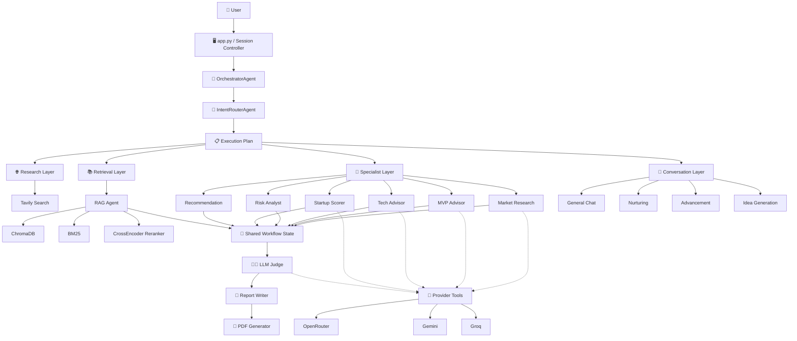
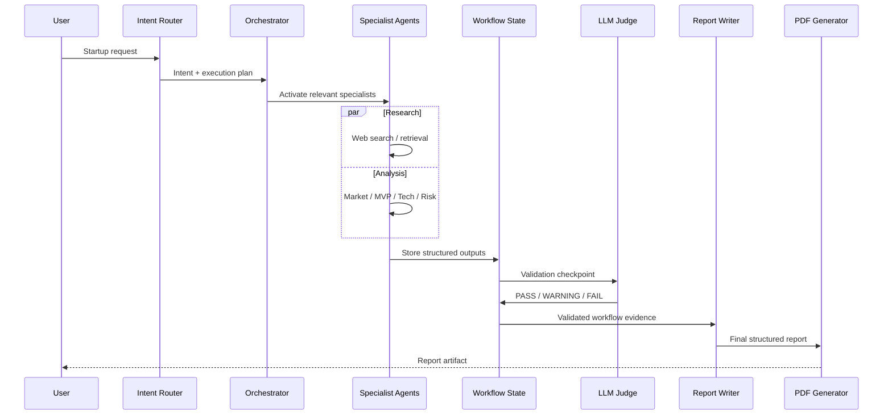
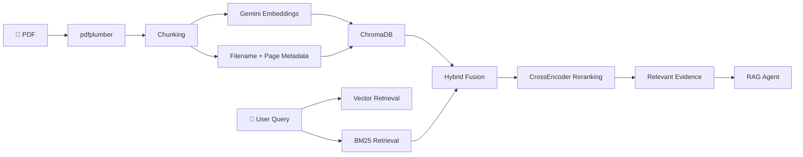

<div align="center">

<!-- Animated Hero -->
<a href="https://github.com/ankush-poonia007/STARTUP-AI-AGENT">
  
</a>


<br>

[](https://www.python.org/)
[](https://openrouter.ai/)
[](https://ai.google.dev/)
[](https://groq.com/)
[](https://tavily.com/)
[](https://www.trychroma.com/)

[](https://github.com/ankush-poonia007/STARTUP-AI-AGENT/releases)
[](https://github.com/ankush-poonia007/STARTUP-AI-AGENT)
[](https://github.com/ankush-poonia007/STARTUP-AI-AGENT)
[](LICENSE)

<br>

**A framework-free, multi-agent startup intelligence system built from first principles.**

<p>
  <a href="#-what-is-cofoundr-ai">What is it?</a> •
  <a href="#-architecture">Architecture</a> •
  <a href="#-agent-workflows">Workflows</a> •
  <a href="#-rag--document-intelligence">RAG</a> •
  <a href="#-verification">Verification</a> •
  <a href="#-quick-start">Quick Start</a> •
  <a href="#-phase-6--autonomous-research-platform">Roadmap</a>
</p>

</div>

---

## ⚡ At a Glance

<div align="center">

| 🧠 Architecture | 🔎 Retrieval | 🌐 Research | 🧪 Verification |
|---|---|---|---|
| Multi-Agent | Hybrid RAG | Tavily | 7/7 intents PASS |
| Shared State | BM25 + Vector + Reranking | Live Web | 0 workflow errors |

</div>

> **Current release:** `v5.9.0` · **Phase 5:** Complete · **Phase 6:** Started

## 🧭 What is CoFoundr AI?

**CoFoundr AI** turns a startup-related request into a structured, evidence-driven workflow.

Instead of sending every question through one large prompt, the system:

```text
User Request
     │
     ▼
Intent Router
     │
     ▼
Workflow Plan
     │
     ├───────────────┬────────────────┬────────────────┐
     ▼               ▼                ▼                ▼
 Research          RAG             Analysis        Conversation
 Agents            Agents          Agents           Agents
     │               │                │                │
     └───────────────┴────────────────┴────────────────┘
                             │
                             ▼
                     Shared Workflow State
                             │
                             ▼
                       LLM Validation
                             │
                             ▼
                      Report Assembly
                             │
                             ▼
                         PDF Output
```

The important idea is **separation of responsibility**.

Research researches.  
RAG retrieves.  
Specialists analyze.  
Judges validate.  
Writers assemble.  
PDF generation formats.

---

## 🎯 The Problem

Startup analysis usually requires several different information sources:

- 🌐 Current market information
- 📄 User-provided business documents
- 🧠 Structured startup reasoning
- 🛠️ MVP and technology decisions
- ⚠️ Risk analysis
- 📊 Scoring
- 💡 Recommendations
- 📝 Final report generation

A single general-purpose chatbot can answer these questions, but it does not naturally provide a controlled workflow with explicit ownership, retrieval boundaries, validation checkpoints, and failure visibility.

**CoFoundr AI is designed around those engineering constraints.**

---

## ✨ Core Capabilities

| Capability | What CoFoundr AI Does |
|---|---|
| 🧭 Intent routing | Maps the request to the appropriate workflow |
| 🤖 Multi-agent orchestration | Coordinates focused specialist agents |
| 🔗 Shared workflow state | Provides the communication contract between agents |
| 🌐 Web research | Uses Tavily for live external research |
| 📄 PDF ingestion | Extracts information from uploaded startup documents |
| 🧠 RAG | Retrieves relevant document evidence through ChromaDB |
| 🔎 Hybrid retrieval | Combines vector retrieval, BM25, and reranking |
| 💼 Market research | Produces evidence-backed market analysis |
| 🧪 MVP analysis | Identifies core MVP scope and priorities |
| 🏗️ Technology advising | Recommends architecture and technology choices |
| ⚠️ Risk analysis | Identifies risks and mitigation directions |
| 📊 Startup scoring | Scores market, MVP, technology, and risk dimensions |
| 💡 Recommendations | Generates evidence-based improvement suggestions |
| 🧑‍⚖️ LLM judging | Validates intermediate and final workflow outputs |
| 📝 Report writing | Converts workflow evidence into structured reports |
| 📑 PDF generation | Produces final report artifacts |
| 🔐 Provider abstraction | Keeps SDK/provider details below agent logic |
| 🔁 API-key rotation | Rotates configured provider keys through reusable infrastructure |
| 🧪 Intent integration tests | Verifies complete workflow paths |

---

## 🏗️ Architecture

### High-Level System


```mermaid
flowchart TB
    U["👤 User"] --> APP["🖥️ app.py / Session Controller"]
    APP --> ORCH["🧠 OrchestratorAgent"]

    ORCH --> ROUTER["🧭 IntentRouterAgent"]
    ROUTER --> PLAN["📋 Execution Plan"]

    PLAN --> RESEARCH["🌐 Research Layer"]
    PLAN --> RETRIEVAL["📚 Retrieval Layer"]
    PLAN --> SPECIALISTS["🧩 Specialist Layer"]
    PLAN --> CONVERSATION["💬 Conversation Layer"]

    RESEARCH --> TAVILY["Tavily Search"]
    RETRIEVAL --> RAG["RAG Agent"]
    RAG --> CHROMA["ChromaDB"]
    RAG --> BM25["BM25"]
    RAG --> RERANK["CrossEncoder Reranker"]

    SPECIALISTS --> MARKET["Market Research"]
    SPECIALISTS --> MVP["MVP Advisor"]
    SPECIALISTS --> TECH["Tech Advisor"]
    SPECIALISTS --> RISK["Risk Analyst"]
    SPECIALISTS --> SCORE["Startup Scorer"]
    SPECIALISTS --> RECOMMEND["Recommendation"]

    CONVERSATION --> GENERAL["General Chat"]
    CONVERSATION --> NURTURE["Nurturing"]
    CONVERSATION --> ADVANCE["Advancement"]
    CONVERSATION --> IDEAS["Idea Generation"]

    MARKET --> STATE["🔗 Shared Workflow State"]
    MVP --> STATE
    TECH --> STATE
    RISK --> STATE
    SCORE --> STATE
    RECOMMEND --> STATE
    RAG --> STATE

    STATE --> JUDGE["🧑‍⚖️ LLM Judge"]
    JUDGE --> WRITER["📝 Report Writer"]
    WRITER --> PDF["📄 PDF Generator"]

    PROVIDERS["🔌 Provider Tools"] --> OPENROUTER["OpenRouter"]
    PROVIDERS --> GEMINI["Gemini"]
    PROVIDERS --> GROQ["Groq"]
    MARKET -.-> PROVIDERS
    MVP -.-> PROVIDERS
    TECH -.-> PROVIDERS
    SCORE -.-> PROVIDERS
    JUDGE -.-> PROVIDERS
```

### The Architecture in One Sentence

> **Intent determines the workflow; agents own responsibilities; shared state carries evidence; providers remain behind tool boundaries.**

---

## 🔄 Agent Workflow


```mermaid
sequenceDiagram
    participant User
    participant Router as Intent Router
    participant Orch as Orchestrator
    participant Agents as Specialist Agents
    participant State as Workflow State
    participant Judge as LLM Judge
    participant Writer as Report Writer
    participant PDF as PDF Generator

    User->>Router: Startup request
    Router->>Orch: Intent + execution plan
    Orch->>Agents: Activate relevant specialists

    par Research
        Agents->>Agents: Web search / retrieval
    and Analysis
        Agents->>Agents: Market / MVP / Tech / Risk
    end

    Agents->>State: Store structured outputs
    State->>Judge: Validation checkpoint
    Judge->>State: PASS / WARNING / FAIL

    State->>Writer: Validated workflow evidence
    Writer->>PDF: Final structured report
    PDF-->>User: Report artifact
```

---

## 💡 What Makes This Project Interesting

- **Custom orchestration:** The workflow is implemented without an agent framework.
- **Specialized responsibilities:** Each agent owns a bounded reasoning task.
- **Retrieval diversity:** Semantic, lexical, and reranked retrieval work together.
- **Provider boundaries:** Agent code does not own provider-specific recovery logic.
- **Validation checkpoints:** Workflow output is judged before final report assembly.
- **Failure visibility:** Agent failures remain observable in shared workflow state.
- **Evaluation-driven development:** Intent workflows are verified end-to-end.

## 🧩 Agent Map

| Layer | Agent | Responsibility |
|---|---|---|
| Routing | `IntentRouterAgent` | Classify request and select workflow |
| Orchestration | `OrchestratorAgent` | Coordinate execution and handoffs |
| Research | `WebSearchAgent` | External web research |
| Research | `MarketResearchAgent` | Market-focused analysis |
| Retrieval | `RAGAgent` | Document-grounded retrieval |
| Analysis | `MVPAdvisorAgent` | MVP definition and prioritization |
| Analysis | `TechAdvisorAgent` | Technology and architecture advice |
| Analysis | `RiskAnalystAgent` | Risk identification |
| Analysis | `StartupScorerAgent` | Structured startup scoring |
| Generation | `RecommendationAgent` | Evidence-based recommendations |
| Generation | `IdeaGenerationAgent` | Startup idea exploration |
| Conversation | `GeneralChatAgent` | General conversational requests |
| Conversation | `NurturingAgent` | Improve existing startups |
| Conversation | `AdvancementAgent` | Scale and advancement workflows |
| Validation | `LLMJudgeAgent` | Workflow quality validation |
| Output | `ReportWriterAgent` | Final report assembly |
| Output | `PDFGeneratorAgent` | PDF artifact generation |

---

## 🔌 Provider Architecture

Provider SDKs are intentionally **not exposed directly to agents**.

```text
Agent
  │
  ▼
Provider Tool Interface
  │
  ├── Request construction
  ├── Structured output handling
  ├── Retry behavior
  └── Key rotation
  │
  ▼
Provider API
```

### Current Provider Roles

| Provider | Role |
|---|---|
| **OpenRouter** | Large-context reasoning workload |
| **Gemini** | Supported analysis workloads and embeddings |
| **Groq** | Retained for supported fast-inference workloads |
| **Tavily** | External web search |

This separation was strengthened during **Phase 5** because provider limitations and credential handling should not leak into agent responsibilities.

---

## 📚 RAG & Document Intelligence

CoFoundr AI evolved from basic vector retrieval into a more controlled retrieval pipeline.


```mermaid
flowchart LR
    PDF["📄 PDF"] --> EXTRACT["pdfplumber"]
    EXTRACT --> CHUNK["Chunking"]
    CHUNK --> EMBED["Gemini Embeddings"]
    CHUNK --> META["Filename + Page Metadata"]

    EMBED --> VECTOR["ChromaDB"]
    META --> VECTOR

    QUERY["🔎 User Query"] --> VECQ["Vector Retrieval"]
    QUERY --> LEX["BM25 Retrieval"]

    VECTOR --> FUSION["Hybrid Fusion"]
    LEX --> FUSION

    FUSION --> RERANK["CrossEncoder Reranking"]
    RERANK --> CONTEXT["Relevant Evidence"]
    CONTEXT --> AGENT["RAG Agent"]
```

### Retrieval Features

- **ChromaDB** persistent vector storage
- **Gemini embeddings**
- **BM25 lexical retrieval**
- **Hybrid vector + lexical fusion**
- **CrossEncoder reranking**
- **Filename metadata filtering**
- **Page-level metadata**
- **Document-scoped retrieval**
- **RAG evaluation methodology**
- **Citation-aware workflow evidence**

Phase 4 recorded **100% Recall@3** on its documented evaluation dataset and retrieval benchmarks. fileciteturn50file0

---

## 🧠 Shared Workflow State

The shared workflow state is the primary data contract between agents.

```text
workflow_state
│
├── user_input
├── intent
├── execution_plan
├── research_outputs
├── retrieval_outputs
├── specialist_outputs
├── validation_results
├── errors
├── pipeline_status
└── final_report
```

### Why it matters

Without shared state, agents start depending directly on each other's implementations.

With shared state:

```text
Agent A ──┐
Agent B ──┤
Agent C ──┼──> workflow_state ──> downstream agents
Agent D ──┤
Agent E ──┘
```

This creates a **data contract** rather than a chain of implementation dependencies.

---

## 🧑‍⚖️ Quality Control

Phase 5 introduced explicit workflow validation.

```text
Specialist Outputs
        │
        ▼
Mid-Pipeline Judge
        │
   ┌────┼────┐
   ▼    ▼    ▼
 PASS WARNING FAIL
   │
   ▼
Continue Workflow
   │
   ▼
Report Writer
   │
   ▼
Final Judge
   │
   ▼
Validated Report
```

Structured validation uses:

- `judgment`
- `reason`
- `issues`

The important engineering lesson is simple:

> **Correct routing does not automatically mean correct execution.**

Phase 5 therefore treats recorded workflow errors as part of the test result. fileciteturn51file4

---

## 🧪 Verification

Phase 5 closed only after focused intent workflows passed end-to-end.

| Intent | Result |
|---|---|
| `general_chat` | ✅ PASS |
| `full_analysis` | ✅ PASS |
| `partial_idea` | ✅ PASS |
| `idea_exploration` | ✅ PASS |
| `nurturing` | ✅ PASS |
| `advancement` | ✅ PASS |
| `pdf_request` | ✅ PASS |
| **Total** | **7/7 PASS** |

Final verification:

```text
Test     : FULL_ANALYSIS
Expected : full_analysis
Actual   : full_analysis
Result   : ✅ PASS
Errors   : 0
```

**Phase 5 release state: **complete and verified at v5.9.0**.** fileciteturn50file6

---

## 📈 Engineering Evolution

| Phase | Capability | Result |
|---|---|---|
| **Phase 1** | Foundation agent | Conversation + context + manual tools |
| **Phase 2** | Real tool integrations | ReAct + parallel execution |
| **Phase 3** | RAG pipeline | PDF ingestion + semantic retrieval |
| **Phase 4** | RAG hardening | Multi-PDF + hybrid retrieval + reranking + evaluation |
| **Phase 5** | Multi-agent architecture | Routing + specialists + validation + provider abstraction |
| **Phase 6** | Autonomous platform | 🚀 Started |

### Phase 5 Release Progression

| Version | Focus | Status |
|---|---|---|
| `v5.0–v5.6` | Specialist agents and workflow construction | ✅ Complete |
| `v5.7` | LLM judging and validation | ✅ Complete |
| `v5.8` | Provider hardening, OpenRouter migration, Gemini integration, key rotation | ✅ Complete |
| `v5.9` | Final verification and Phase 5 closure | ✅ Complete |

fileciteturn51file0

---

## 📊 Project Maturity

```text
Foundation        ████████████████████  Complete
RAG               ████████████████████  Complete
Multi-Agent       ████████████████████  Complete
Validation        ████████████████████  Complete
Provider Layer    ████████████████████  Hardened
Production API    ██████░░░░░░░░░░░░░░  Phase 6
Memory            ████░░░░░░░░░░░░░░░░  Phase 6
Observability     ███░░░░░░░░░░░░░░░░░  Phase 6
```

## 🚀 Phase 6 — Autonomous Research Platform

**Status: Started**

Phase 6 moves CoFoundr AI from a controlled multi-agent workflow toward a more autonomous system.

### Current Priorities

| Priority | Objective | Direction |
|---|---|---|
| 1 | Persistent memory | SQLite-backed long-term memory |
| 2 | Autonomous planning | Goal → subtasks → execution |
| 3 | Startup scoring | Formal scoring dimensions and aggregation |
| 4 | Async execution | Evaluate event-loop based concurrency |
| 5 | Streaming | Incremental workflow output |
| 6 | Service layer | FastAPI boundary |
| 7 | Reliability | Standard retries, timeouts, circuit breakers |
| 8 | Observability | Latency, errors, retries, execution traces |

These are the documented Phase 6 starting priorities. fileciteturn51file0

---

## 📁 Project Structure

```text
CoFoundr AI/
│
├── app.py
├── requirements.txt
├── README.md
│
├── assets/
│   └── ReAct_pattern_architecture.svg
│
├── docs/
│   ├── ARCHITECTURE.md
│   ├── CHANGELOG.md
│   ├── LEARNING_LOG.md
│   ├── ROADMAP.md
│   └── PHASE5_ENGINEERING_AUDIT.md
│
├── src/
│   ├── agents/
│   │   ├── orchestrator_agent.py
│   │   ├── intent_router_agent.py
│   │   ├── market_research_agent.py
│   │   ├── rag_agent.py
│   │   ├── mvp_advisor_agent.py
│   │   ├── tech_advisor_agent.py
│   │   ├── risk_analyst_agent.py
│   │   ├── startup_scorer_agent.py
│   │   ├── recommendation_agent.py
│   │   ├── idea_generation_agent.py
│   │   ├── nurturing_agent.py
│   │   ├── advancement_agent.py
│   │   ├── general_chat_agent.py
│   │   ├── llm_judge_agent.py
│   │   ├── report_writer_agent.py
│   │   └── pdf_generator_agent.py
│   │
│   ├── core/
│   │   ├── context_manager.py
│   │   ├── decorators.py
│   │   ├── exceptions.py
│   │   └── key_rotator.py
│   │
│   ├── rag/
│   │   ├── rag.py
│   │   └── reranker.py
│   │
│   ├── tools/
│   │   ├── bm25_tool.py
│   │   ├── chroma_tool.py
│   │   ├── gemini_tool.py
│   │   ├── groq_tool.py
│   │   ├── pdf_tool.py
│   │   ├── reranker_tool.py
│   │   └── tavily_tool.py
│   │
│   ├── evaluation/
│   ├── prompts/
│   ├── memory/
│   ├── planning/
│   └── config/
│
└── tests/
```

> The repository tree above highlights the application architecture; local databases, uploaded PDFs, generated reports, caches, and Python bytecode are environment artifacts.

---

## 🛠️ Technology Stack

| Layer | Technology | Role |
|---|---|---|
| Runtime | Python 3.10+ | Application runtime |
| Orchestration | Custom Python architecture | Workflow coordination |
| Large-context LLM | OpenRouter | Large-context reasoning |
| Analysis LLM | Gemini | Specialist analysis |
| Fast inference | Groq | Supported inference workloads |
| Web research | Tavily | Real-time external search |
| Embeddings | Gemini Embeddings | Document vectorization |
| Vector DB | ChromaDB | Persistent semantic retrieval |
| Lexical search | BM25 | Keyword retrieval |
| Reranking | CrossEncoder | Candidate precision |
| PDF parsing | pdfplumber | Document extraction |
| Concurrency | `concurrent.futures` | Parallel execution |
| Configuration | python-dotenv | Environment management |
| Validation | LLM Judge | Workflow quality control |

---

## 🚀 Quick Start

### Prerequisites

- Python 3.10+
- API credentials for the providers enabled in your local configuration
- Git

### 1. Clone

```bash
git clone https://github.com/ankush-poonia007/STARTUP-AI-AGENT.git
cd STARTUP-AI-AGENT
```

### 2. Install

```bash
pip install -r requirements.txt
```

### 3. Configure Environment

Create `.env` in the project root.

```env
OPENROUTER_API_KEY=your_key
GEMINI_API_KEY=your_key
GROQ_API_KEY=your_key
TAVILY_API_KEY=your_key
```

> Never commit `.env`. It is local configuration and should remain gitignored.

### 4. Run

```bash
python app.py
```

### 5. Run Focused Integration Tests

```bash
python app.py --test full_analysis
```

A successful `full_analysis` run should report:

```text
Actual   : full_analysis
Result   : ✅ PASS
Errors   : 0
```

Other supported intent-level tests include:

```text
general_chat
full_analysis
partial_idea
idea_exploration
nurturing
advancement
pdf_request
```

---

## 🎬 Demo

### Run the complete startup-analysis workflow

```bash
python app.py --test full_analysis
```

Expected verification shape:

```text
🧪 [FULL_ANALYSIS]
Expected : full_analysis
Actual   : full_analysis
Result   : ✅ PASS
Errors   : 0
```

For an interactive run:

```bash
python app.py
```

## 💬 Example Workflow

### Input

```text
I have a startup idea for an AI-powered tiffin delivery
service for college students. Analyze the market, MVP,
technology stack, competition, and major risks.
```

### Internal workflow

```text
full_analysis
     │
     ├── Market Research
     ├── Web Search
     ├── RAG / Documents
     ├── MVP Advisor
     ├── Tech Advisor
     ├── Risk Analyst
     ├── Startup Scorer
     ├── Recommendations
     ├── LLM Validation
     └── Report Assembly
```

### Output direction

```text
Market
   ↓
Competition
   ↓
MVP
   ↓
Technology
   ↓
Risks
   ↓
Score
   ↓
Recommendations
   ↓
Validated Report
   ↓
PDF
```

---

## 🧠 Why No LangChain?

CoFoundr AI deliberately started without LangChain or LlamaIndex.

The goal was to understand:

- Agent loops
- Tool calling
- Context management
- Parallel execution
- Retrieval
- Reranking
- State passing
- Provider abstraction
- Validation
- Error propagation
- Workflow orchestration

Only after understanding these primitives does framework abstraction become meaningful.

> **Architecture first. Frameworks later.**

---

## 🔬 Engineering Principles

<div align="center">

| Principle | Implementation |
|---|---|
| **Single Responsibility** | Specialist agents own narrow tasks |
| **Separation of Concerns** | Agents, tools, RAG, validation, and output remain separate |
| **Provider Abstraction** | SDK details stay inside provider tools |
| **State as Contract** | Agents communicate through structured workflow state |
| **Evidence Before Generation** | Reports consume collected workflow evidence |
| **Explicit Validation** | Judge checkpoints validate workflow quality |
| **Failure Visibility** | Errors remain available downstream |
| **Integration Over Assumption** | Complete intent paths are tested end-to-end |

</div>

---

## 🔍 Where to Start

**If you have 2 minutes:** read the architecture and verification sections.

**If you are reviewing the code:** start with `src/agents/orchestrator_agent.py`.

**If you are reviewing retrieval:** inspect `src/rag/` and `src/tools/bm25_tool.py`.

**If you are reviewing provider abstraction:** inspect `src/tools/`, `src/core/key_rotator.py`, and provider configuration.

**If you are reviewing engineering decisions:** read `docs/ARCHITECTURE.md`, `docs/CHANGELOG.md`, and `docs/LEARNING_LOG.md`.

## 📚 Documentation

| Document | Purpose |
|---|---|
| [`ARCHITECTURE.md`](docs/ARCHITECTURE.md) | Detailed architecture and design decisions |
| [`ROADMAP.md`](docs/ROADMAP.md) | Phase-by-phase development roadmap |
| [`CHANGELOG.md`](docs/CHANGELOG.md) | Version history and release changes |
| [`LEARNING_LOG.md`](docs/LEARNING_LOG.md) | Engineering learning and mistakes |
| [`PHASE5_ENGINEERING_AUDIT.md`](docs/PHASE5_ENGINEERING_AUDIT.md) | Phase 5 engineering audit |
| [`REVISION_GUIDE.md`](docs/REVISION_GUIDE.md) | Revision and maintenance guidance |

---

## 🔗 Useful Links

- 🐙 **Repository:** https://github.com/ankush-poonia007/STARTUP-AI-AGENT
- 📘 **Python:** https://www.python.org/
- 🧠 **OpenRouter:** https://openrouter.ai/
- ✨ **Gemini API:** https://ai.google.dev/
- ⚡ **Groq:** https://groq.com/
- 🌐 **Tavily:** https://tavily.com/
- 🗄️ **ChromaDB:** https://www.trychroma.com/

---

## 🔐 Configuration & Security

- API keys belong in `.env`, never in source files.
- `.env` is expected to remain gitignored.
- Local databases, uploaded PDFs, generated reports, caches, and bytecode should remain environment-specific.
- Do not paste provider credentials into issues, commits, or README examples.
- Rotate exposed credentials immediately if they are accidentally committed.

## ⚠️ Current Engineering Scope

CoFoundr AI is an **engineering and learning project**, not yet a production SaaS platform.

Phase 6 explicitly targets:

- Persistent memory
- Autonomous planning
- Async execution
- Streaming
- FastAPI service boundaries
- Reliability controls
- Observability
- Production-oriented execution

The current release should therefore be evaluated primarily as a **demonstration of AI-system architecture and engineering depth**.

---

## 🧱 Current Limitations

- **CLI-first interface:** A web UI is not yet the primary interface.
- **Local persistence:** Production-grade managed storage is not yet implemented.
- **Phase 6 work:** Persistent memory and autonomous planning are still being developed.
- **Observability:** Production tracing and metrics remain Phase 6 priorities.
- **Deployment:** The current repository is primarily an engineering demonstration.

## 🏁 Current Release State

<div align="center">

| Release | State |
|---|---|
| `v5.9.0` | ✅ Phase 5 complete |
| Multi-agent orchestration | ✅ Verified |
| Hybrid RAG | ✅ Implemented |
| Provider abstraction | ✅ Hardened |
| Focused intent tests | ✅ 7/7 passing |
| Phase 6 | 🚀 Started |

</div>

## 👤 Author

<div align="center">

### Ankush Poonia

**B.Tech AI/ML Student · AI Engineering · Web Development**

<a href="https://github.com/ankush-poonia007">
  
</a>
<a href="https://www.linkedin.com/in/ankush-poonia007/">
  
</a> 
<a href="mailto:you@example.com">

</a>

<br><br>

⭐ **If the architecture is useful, consider starring the repository.**

<br>

<sub>CoFoundr AI v5.9.0 · Phase 5 Complete · Phase 6 Started</sub>

<br>

<a href="#-architecture">Architecture</a> ·
<a href="#-rag--document-intelligence">RAG</a> ·
<a href="#-verification">Verification</a> ·
<a href="#-phase-6--autonomous-research-platform">Roadmap</a> ·
<a href="#-quick-start">Quick Start</a>

</div>
