<div align="center">

# 🏗️ CoFoundr AI — Architecture Deep Dive

### From manual agent loops to a validated multi-agent startup intelligence platform

[]()
[]()
[]()
[]()
[]()
[]()
[]()

<br>

**Framework-independent • Multi-agent • Hybrid RAG • Structured validation • Provider resilient**

</div>

---

## 🧭 Architecture at a Glance

CoFoundr AI analyzes startup ideas through specialized agents, shared workflow state, grounded retrieval, live research, and validation.

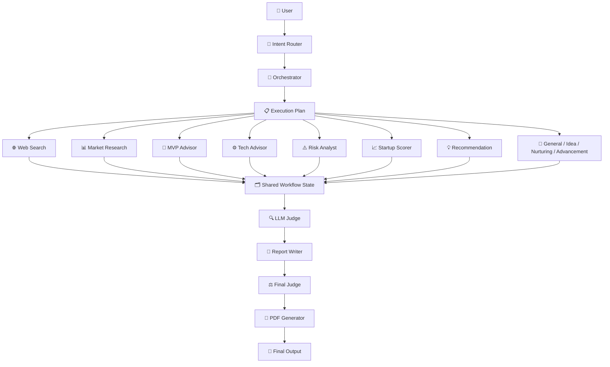

> **Core principle:** agents reason independently; workflow state connects them; validators protect the final output.

---

## 📚 Table of Contents

- [Design Philosophy](#-design-philosophy)
- [Architecture Evolution](#-architecture-evolution)
- [Current Component Map](#-current-component-map)
- [Orchestration Architecture](#-orchestration-architecture)
- [Intent Routing](#-intent-routing)
- [Specialist Agents](#-specialist-agent-layer)
- [Shared Workflow State](#-shared-workflow-state)
- [Provider Architecture](#-provider-architecture)
- [Reliability and Key Rotation](#-reliability-and-key-rotation)
- [Validation and Structured Outputs](#-validation-and-structured-outputs)
- [RAG Architecture](#-rag-architecture)
- [Evaluation](#-evaluation)
- [Phase 5 Verification](#-phase-5-verification)
- [Design Tradeoffs](#-design-tradeoffs)
- [Known Limitations](#-known-limitations)
- [Phase 6 Direction](#-phase-6-direction)

---

## 🎯 Design Philosophy

<div align="center">

> **Architecture First. Frameworks Later.**

</div>

CoFoundr AI deliberately implements important agentic primitives directly instead of hiding them behind an orchestration framework.

The project uses this approach to understand:

- Agent orchestration internals.
- Tool execution boundaries.
- Context and state management.
- Retrieval pipelines.
- Provider abstraction.
- Failure propagation.
- Structured output contracts.
- Evaluation and verification.

### Architectural boundaries

| Layer | Owns | Does not own |
|---|---|---|
| **Agents** | Reasoning and domain decisions | Provider SDK details |
| **Tools** | External integrations | Workflow planning |
| **Core** | Orchestration, state, errors | Domain reasoning |
| **RAG** | Retrieval and reranking | Final report generation |
| **Evaluation** | Ground truth and verification | Production orchestration |
| **Prompts** | Behavioral instructions | Runtime state |

---

# 🧬 Architecture Evolution

CoFoundr AI evolved incrementally rather than jumping directly into the current architecture.

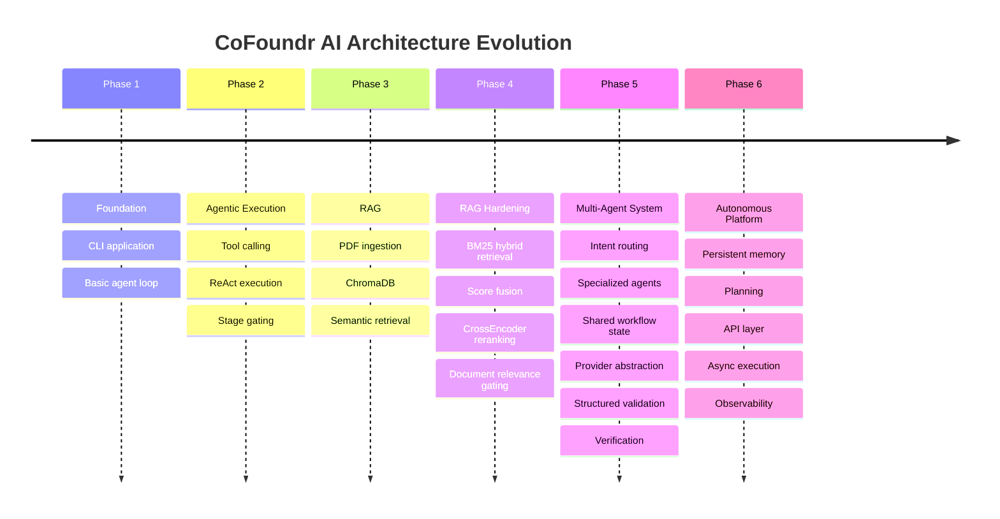

### Current milestone

| Phase | Status | Architectural role |
|---|---|---|
| Phase 1 | ✅ Complete | Foundation |
| Phase 2 | ✅ Complete | Agentic execution |
| Phase 3 | ✅ Complete | Document intelligence |
| Phase 4 | ✅ Complete | Retrieval hardening |
| Phase 5 | ✅ Complete | Multi-agent orchestration |
| Phase 6 | 🚀 Started | Autonomous platform evolution |

---

# 📁 Current Component Map

```text
CoFoundr AI
│
├── app.py
│   └── CLI interface + pipeline execution + testing
│
├── src/
│   │
│   ├── agents/
│   │   ├── intent_router_agent.py
│   │   ├── orchestrator_agent.py
│   │   ├── web_search_agent.py
│   │   ├── market_research_agent.py
│   │   ├── rag_agent.py
│   │   ├── mvp_advisor_agent.py
│   │   ├── tech_advisor_agent.py
│   │   ├── risk_analyst_agent.py
│   │   ├── startup_scorer_agent.py
│   │   ├── recommendation_agent.py
│   │   ├── llm_judge_agent.py
│   │   ├── report_writer_agent.py
│   │   ├── pdf_generator_agent.py
│   │   ├── general_chat_agent.py
│   │   ├── idea_generation_agent.py
│   │   ├── nurturing_agent.py
│   │   ├── advancement_agent.py
│   │   └── workflow_state.py
│   │
│   ├── core/
│   │   ├── orchestrator.py
│   │   ├── context_manager.py
│   │   ├── decorators.py
│   │   ├── exceptions.py
│   │   └── key_rotator.py
│   │
│   ├── tools/
│   │   ├── openrouter/provider integrations
│   │   ├── gemini_tool.py
│   │   ├── groq_tool.py
│   │   ├── tavily_tool.py
│   │   ├── chroma_tool.py
│   │   ├── bm25_tool.py
│   │   ├── reranker_tool.py
│   │   └── pdf_tool.py
│   │
│   ├── rag/
│   │   ├── rag.py
│   │   └── reranker.py
│   │
│   ├── evaluation/
│   │   ├── evaluator.py
│   │   ├── ground_truth.py
│   │   ├── classifier_evaluator.py
│   │   ├── classifier_ground_truth.py
│   │   └── datasets/
│   │
│   ├── prompts/
│   ├── config/
│   ├── memory/        ← Phase 6 expansion
│   └── planning/      ← Phase 6 expansion
│
├── data/
│   ├── uploads/
│   ├── chroma_db/
│   ├── BM25/
│   └── outputs/
│
└── docs/
    ├── ARCHITECTURE.md
    ├── CHANGELOG.md
    ├── LEARNING_LOG.md
    └── ROADMAP.md
```

---

# 🧠 Orchestration Architecture

The current system no longer depends on one monolithic agent performing every startup-analysis task.

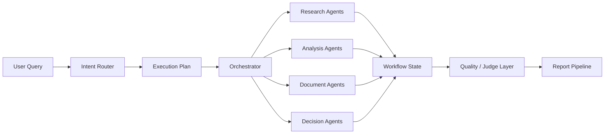

### Orchestrator responsibilities

The orchestrator coordinates execution rather than owning every domain decision.

It handles:

- Execution-plan coordination.
- Agent invocation.
- Workflow-state propagation.
- Failure visibility.
- Retry boundaries.
- Downstream dependency handling.
- Final pipeline coordination.

### Why specialization?

A single agent performing market research, RAG, scoring, recommendations, and report writing creates:

- Large prompts.
- Mixed responsibilities.
- Poor failure isolation.
- Harder testing.
- Weak observability.
- Difficult provider optimization.

Specialized agents make each responsibility independently testable.

---

# 🎯 Intent Routing

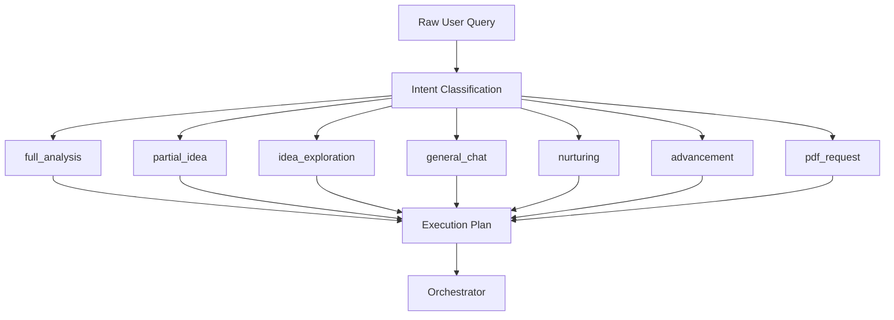

The router separates **what the user wants** from **how that request is executed**.

This prevents every request from triggering the full startup-analysis pipeline.

---

# 🤖 Specialist Agent Layer

| Agent | Primary responsibility |
|---|---|
| `WebSearchAgent` | Live external research |
| `MarketResearchAgent` | Market-focused analysis |
| `RAGAgent` | Uploaded-document retrieval |
| `MVPAdvisorAgent` | MVP definition and prioritization |
| `TechAdvisorAgent` | Technology-stack analysis |
| `RiskAnalystAgent` | Risk identification and analysis |
| `StartupScorerAgent` | Startup scoring |
| `RecommendationAgent` | Evidence-linked recommendations |
| `LLMJudgeAgent` | Intermediate quality validation |
| `ReportWriterAgent` | Final report composition |
| `PDFGeneratorAgent` | Report artifact generation |
| `GeneralChatAgent` | General conversational requests |
| `IdeaGenerationAgent` | Startup idea exploration |
| `NurturingAgent` | Follow-up and development flow |
| `AdvancementAgent` | Advancement-oriented workflows |

### Specialist-agent contract

```text
Input
  ↓
Agent-specific reasoning
  ↓
Structured / normalized output
  ↓
Workflow State
  ↓
Downstream consumer
```

The contract keeps agent implementations replaceable.

---

# 🗂️ Shared Workflow State

The workflow state is the main communication boundary between agents.

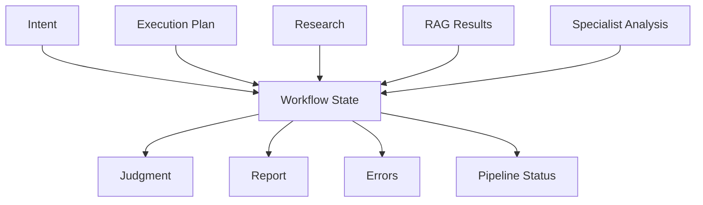

Conceptually, the state contains:

```text
workflow_state
├── user_query
├── intent
├── execution_plan
├── stage / agent outputs
├── validation results
├── errors
├── pipeline_status
└── final report data
```

### Why shared state?

It avoids direct coupling such as:

```text
Agent A → imports Agent B → calls Agent B
```

Instead:

```text
Agent A
   ↓
Workflow State
   ↓
Agent B
```

This makes dependencies explicit and easier to inspect.

---

# 🌐 Provider Architecture

Provider access is isolated behind tool-level integrations.

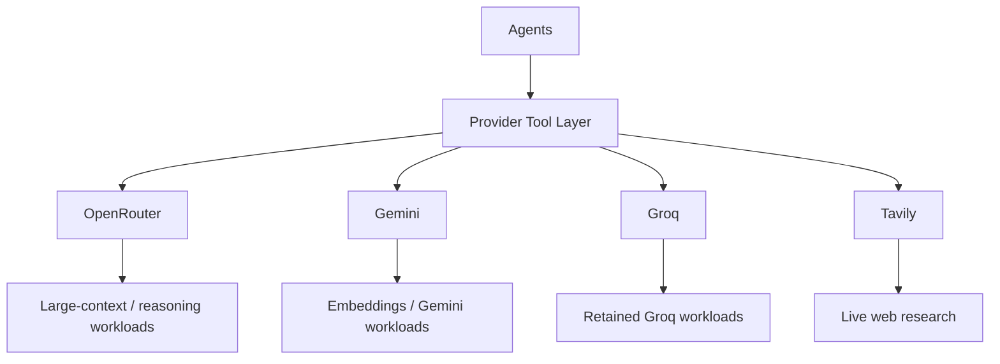

## Why OpenRouter?

The migration from Groq was driven by **input-context limitations**.

Phase 5 increased the amount of workflow information passed into later agent calls.

```text
Before
User input
  ↓
Small agent context
  ↓
Groq

After
User input
  ↓
Multi-agent outputs
  ↓
Shared workflow state
  ↓
Larger downstream context
  ↓
OpenRouter
```

The important architectural change was therefore not simply changing an API endpoint.

It was separating **agent logic from model-provider constraints**.

### Provider abstraction principle

```text
Agent
  │
  └──> Provider Tool
          │
          ├──> Provider A
          ├──> Provider B
          └──> Provider C
```

Agents should not need to know provider-specific SDK details.

---

# 🔄 Reliability and Key Rotation

Phase 5 introduced reusable provider key-rotation infrastructure.

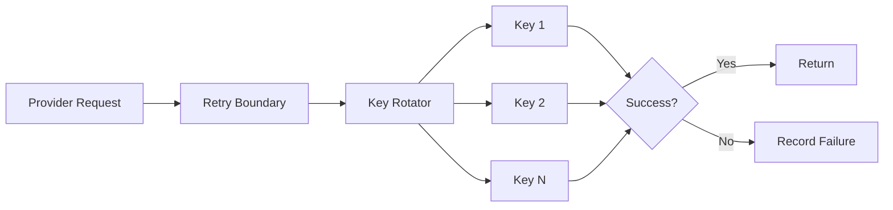

`src/core/key_rotator.py` centralizes rotation behavior.

This avoids duplicating key-selection logic across provider tools.

### Failure visibility

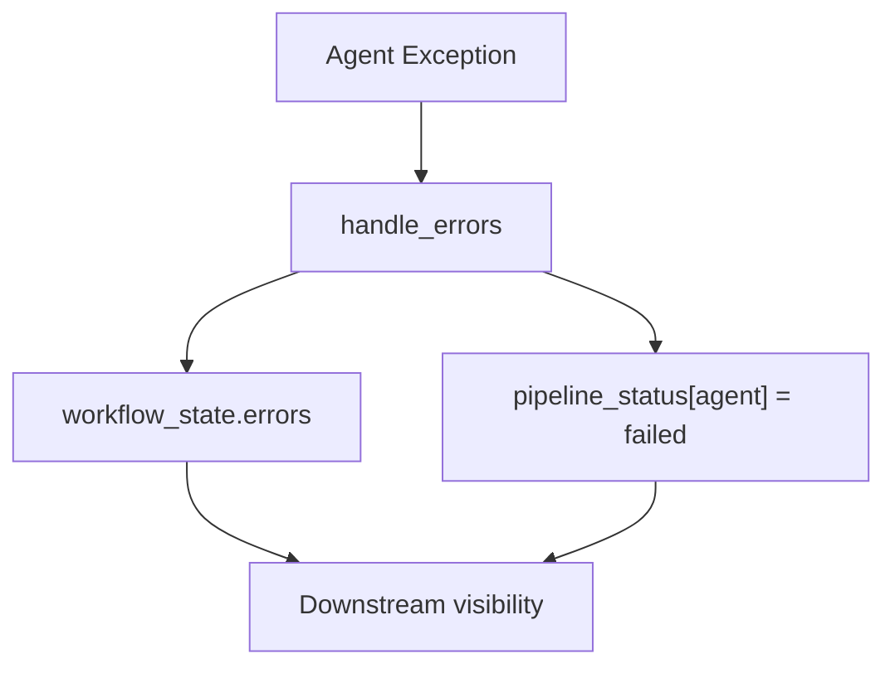

A failed agent should remain visible as failed.

It should not silently look like an agent that produced no output.

---

# 🧾 Validation and Structured Outputs

Phase 5 introduced stronger output contracts.

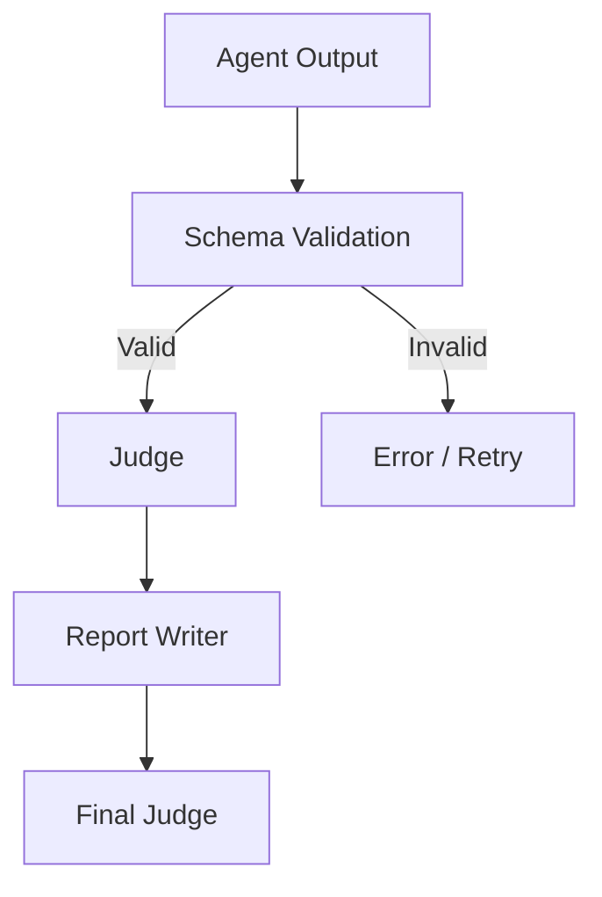

Structured response formats are used for important contracts, including:

- Recommendations.
- Intermediate judgments.
- Final judgments.
- Startup scoring.

### Example scoring contract

```text
reasoning
breakdown
├── market
├── mvp
├── tech
└── risk
highest_risk_flag
```

Scores are constrained to the expected numeric range.

Judgment outputs use:

```text
PASS
WARNING
FAIL
```

This makes downstream processing deterministic.

---

# 🔎 RAG Architecture

RAG remains one of CoFoundr AI's core architectural subsystems.

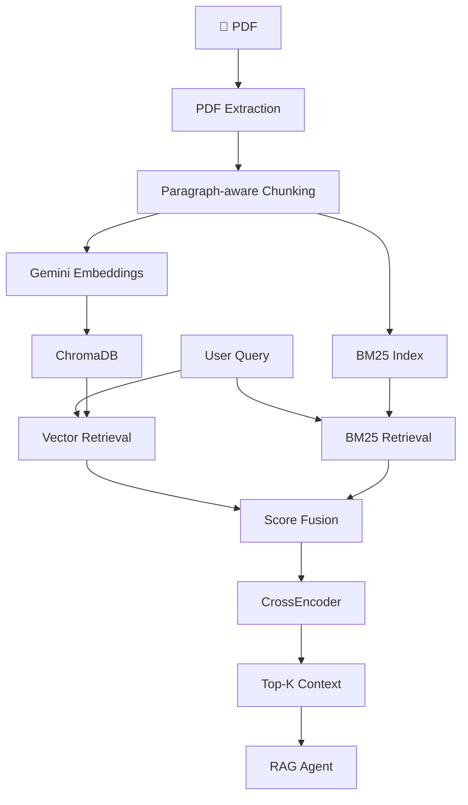

## Retrieval stages

### 1. Ingestion

```text
PDF
 ↓
pdfplumber
 ↓
paragraph-aware chunks
 ↓
Gemini embeddings
 ↓
ChromaDB
```

Current chunking uses:

```text
CHUNK_SIZE = 250
OVERLAP    = 50
STEP       = 200
```

Large paragraphs use sliding windows.

Smaller paragraphs remain intact.

---

### 2. Hybrid retrieval

```text
User Query
├── Vector Search → ChromaDB
└── Lexical Search → BM25
          ↓
       Fusion
```

Current retrieval uses a balanced fusion concept:

```text
fusion_score =
    0.5 × vector_similarity
  + 0.5 × normalized_BM25
```

The approach combines:

- Semantic similarity.
- Exact lexical matching.

---

### 3. CrossEncoder reranking

```text
Fused top-10
    ↓
BAAI/bge-reranker-v2-m3
    ↓
Top-3
```

The CrossEncoder improves ranking precision without running over the entire document collection.

---

## 📄 Document relevance gating

Uploaded documents are not automatically searched for every request.

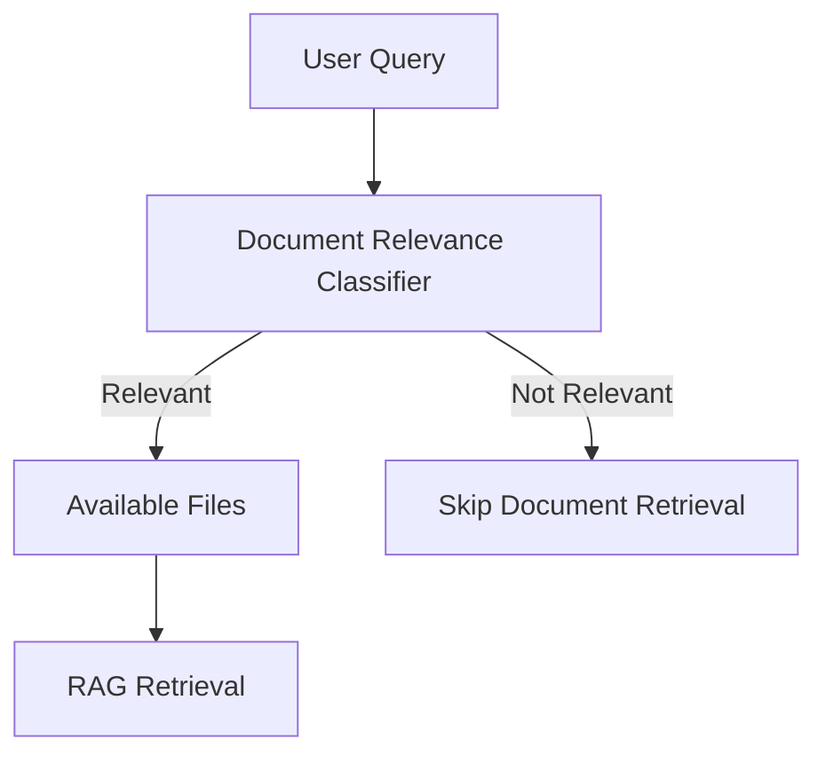

This prevents irrelevant document retrieval and unnecessary model calls.

---

# 🧪 Evaluation

The project separates system evaluation from production execution.

```text
Evaluation
├── Classifier evaluation
├── Ground-truth datasets
├── RAG evaluation
├── Document QA
├── Document search
├── Startup analysis
├── MVP
├── Tech stack
├── Ambiguous queries
├── Adversarial inputs
└── General knowledge
```

The evaluation layer provides repeatable datasets rather than relying only on manual testing.

---

# ✅ Phase 5 Verification

Phase 5 ended with focused workflow verification.

The final full-analysis test reached:

```text
Expected : full_analysis
Actual   : full_analysis
Result   : ✅ PASS
Errors   : 0
```

The seven primary intent workflows were verified as part of the Phase 5 testing process.

```text
Intent classification
        ↓
Expected intent
        ↓
Actual intent
        ↓
Error count
```

### Important performance observation

The full-analysis workflow was observed taking approximately **15 minutes** during testing.

This is classified as a **performance optimization target**, not a functional correctness failure.

Likely contributors include:

- Multiple provider calls.
- External web-search latency.
- Retry boundaries.
- Specialist-agent execution.
- Validation calls.
- Large downstream contexts.

Phase 6 should therefore focus on execution efficiency.

---

# ⚖️ Design Tradeoffs

| Decision | Benefit | Tradeoff |
|---|---|---|
| Framework-independent architecture | Deep control and learning | More implementation work |
| Specialized agents | Better separation of concerns | More orchestration complexity |
| Shared workflow state | Explicit handoffs | State schema becomes important |
| OpenRouter | Larger-context provider access | Additional provider dependency |
| Gemini | Embeddings and selected model workloads | API/quota dependency |
| Groq | Fast retained workloads | Context limitations |
| Provider abstraction | Easier provider replacement | Extra integration layer |
| Key rotation | Reduces single-key bottlenecks | Pool-management complexity |
| ThreadPoolExecutor | Parallel sync workloads | Not fully asynchronous |
| In-memory context | Simple and fast | Lost after process exit |
| Hybrid RAG | Semantic + lexical recall | Additional indexing complexity |
| CrossEncoder | Better ranking precision | Adds inference latency |
| Top-10 → Top-3 | Balances recall and context size | Some answers may need more chunks |
| Document classifier | Avoids unnecessary retrieval | Classifier can misclassify ambiguous requests |

---

# ⚠️ Known Limitations

### Current system

- CLI-first interface.
- Session memory remains non-persistent.
- Local ChromaDB storage.
- Local BM25 index.
- Thread-based execution.
- Provider APIs remain external dependencies.
- Full analysis can have high end-to-end latency.
- RAG fusion weight remains fixed at `0.5`.
- CrossEncoder adds retrieval latency.
- Prompt-based relevance classification can make mistakes.

### Architectural debt

```text
Current
    ↓
Strong multi-agent orchestration
    ↓
But execution is still largely synchronous
    ↓
Phase 6
    ↓
Async + persistent + observable platform
```

---

# 🚀 Phase 6 Direction

Phase 6 has **started**.

The target is to evolve CoFoundr AI from a strong multi-agent pipeline into a more autonomous platform.

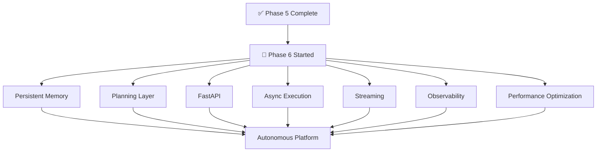

## Priority direction

| Area | Current | Phase 6 direction |
|---|---|---|
| Architecture | Multi-agent | More autonomous |
| Memory | In-memory | Persistent |
| Planning | Execution-plan based | Dedicated planning |
| API | CLI | FastAPI |
| Execution | ThreadPoolExecutor | Async execution |
| Output | Batch-oriented | Streaming |
| Monitoring | Basic status/errors | Observability |
| Performance | Functional but slow | Latency optimization |
| Retrieval | Hybrid fixed fusion | Adaptive retrieval |

---

# 🧩 Core Architectural Principles

```text
1. Agents own reasoning.
2. Tools own integrations.
3. Workflow state owns handoffs.
4. Validators own quality.
5. Providers remain replaceable.
6. Retrieval remains independently testable.
7. Failures remain observable.
8. Phase history remains traceable.
```

The architecture is intentionally modular so individual components can evolve without rewriting the entire system.

---

<div align="center">

### 🏁 v5.9.0 — Phase 5 Complete

**Multi-agent orchestration • OpenRouter migration • Gemini integration • Hybrid RAG • Structured validation • Provider resilience**

<br>

### 🚀 Phase 6 Started

**Persistence • Planning • Async execution • APIs • Streaming • Observability • Performance**

<br>

<sub>CoFoundr AI — Architecture Deep Dive | v5.9.0</sub>

</div>
