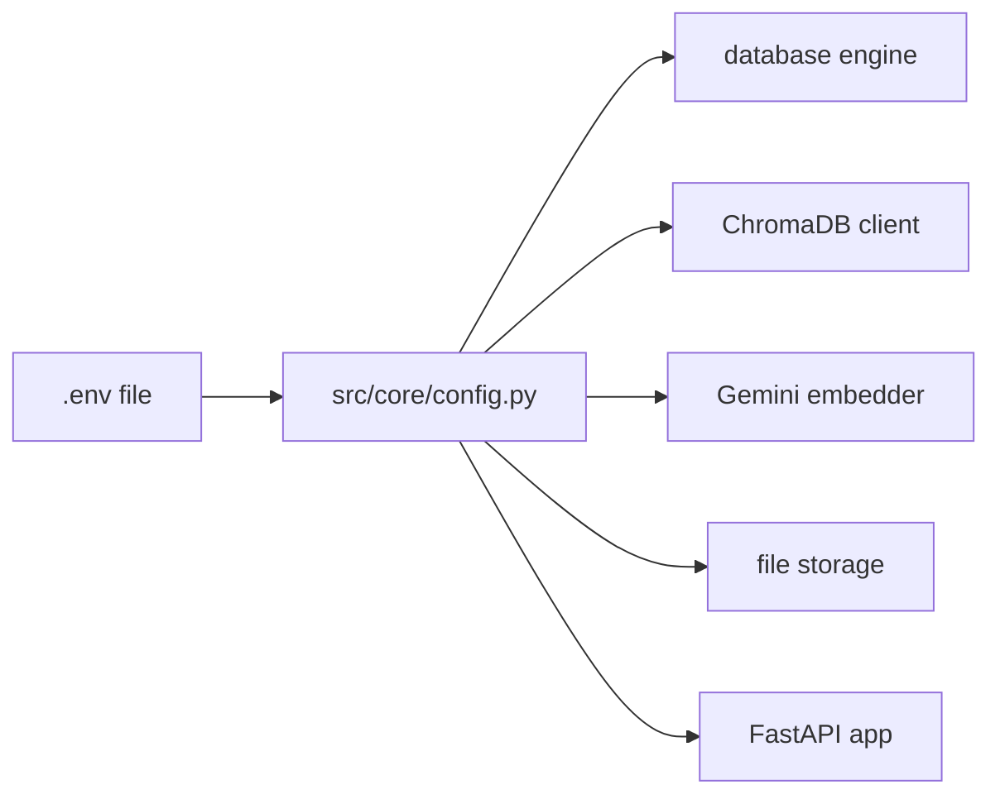
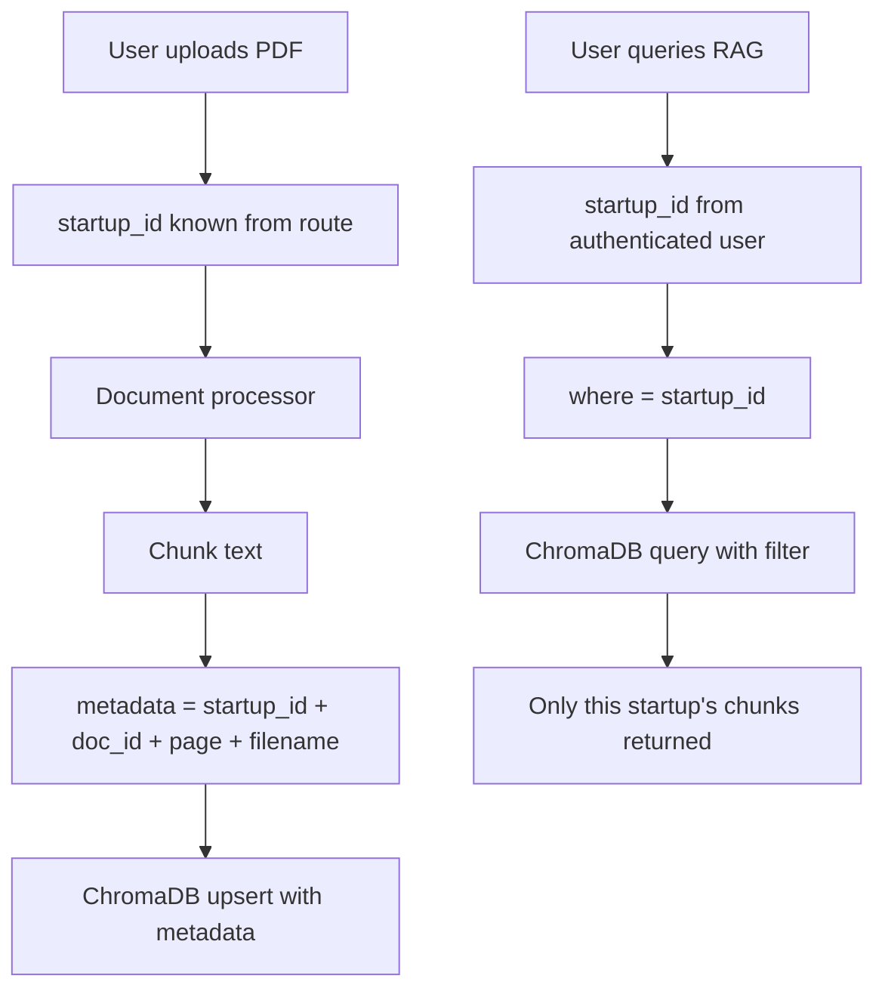
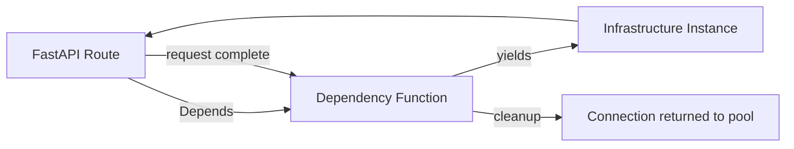
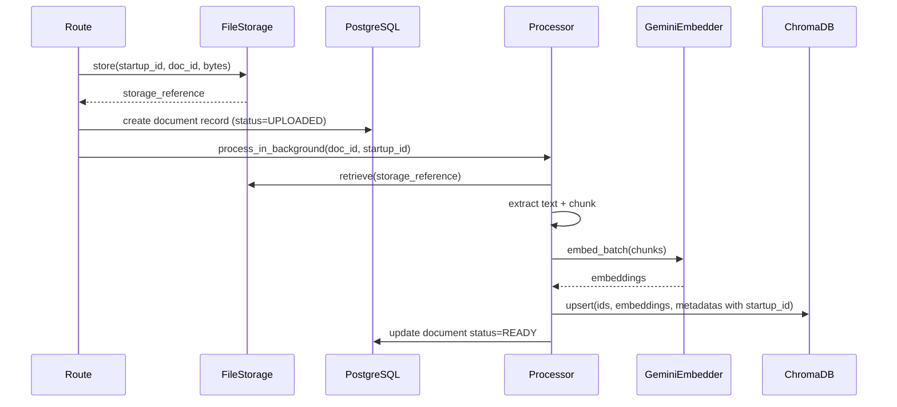
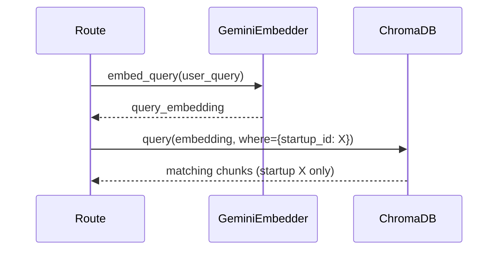

# SP-02 — Infrastructure Layer
## Config · ChromaDB Isolation · File Storage · Dependency Injection

**Status:** Not started  
**Duration:** 6 hours (Days 2.5–3.5)  
**Depends on:** SP-01 (database engine must exist)  
**Enables:** SP-03, SP-05  

---

## START HERE

**Before touching any file, answer these:**
1. Where does `os.getenv()` currently appear in Phase 5 code?
2. What metadata does your Phase 5 ChromaDB currently store per chunk?
3. What is the difference between a FastAPI dependency and a regular function?

If you cannot answer all three, read Section 2 and Section 5 first.

**First concept to understand:** pydantic-settings — Section 2  
**First existing file to inspect:** `src/config/settings.py` — your Phase 5 config  
**First file to create:** `src/core/config.py` (replaces Phase 5 settings)  
**First implementation decision:** Does ChromaDB need a new collection or does the existing one get startup_id added to existing chunks?  

> **DESIGN DECISION REQUIRED**  
> Your Phase 5 ChromaDB collection has existing chunks without startup_id in metadata. You must decide: wipe and re-ingest all documents with startup_id, OR create a new collection. For a portfolio project, wiping and re-ingesting is the correct choice — cleaner isolation, no legacy data confusion.

**First verification:** Import `settings` anywhere in the project — missing `.env` variable raises `ValidationError` immediately at startup, not at runtime.

**Recommended implementation order:**
```
config.py → chromadb client → chromadb collection → 
gemini embedder → file storage → dependency wrappers → 
integration tests
```

---

## CONCEPTS TO UNDERSTAND

### What you must learn for SP-02

🟢 **BASIC — Environment Variables**  
You already use `.env` + `python-dotenv`. pydantic-settings is the same idea but with type validation. If `DATABASE_URL` is missing, the app refuses to start. No silent failures.

🟡 **INTERMEDIATE — pydantic-settings**  
What it means: A Pydantic model where field values come from environment variables automatically.  
Why this project needs it: Centralizes all config in one place. No `os.getenv()` scattered across files. One import gives you all settings.  
What you need to understand: Declare fields with types. pydantic-settings reads them from `.env` automatically. Required fields with no default raise `ValidationError` if missing.  
Common mistake: Still calling `os.getenv()` in other files after creating `config.py`. The rule is: `config.py` is the only place env vars are read.  

🟡 **INTERMEDIATE — FastAPI Dependency Injection**  
What it means: `Depends()` tells FastAPI to run a function and pass its return value into your route. Used for DB sessions, auth, and infrastructure access.  
Why this project needs it: Routes need ChromaDB, file storage, and DB sessions. Dependency injection gives each request its own clean instance without global variables.  
What you need to understand: Dependencies can yield (like a context manager) or return. Yielding dependencies run cleanup code after the request completes.  
Common mistake: Creating infrastructure clients at module level as globals. This breaks testing and creates shared state.

🔴 **ADVANCED — startup_id Isolation in ChromaDB**  
See Section 3. This is a correctness requirement, not an optimization. Getting this wrong means User A can see User B's documents. Read it carefully.

🟢 **BASIC — File Storage Security**  
User uploads a file named `../../etc/passwd`. If you use their filename as a path, you write to a system file. See Section 4 for the fix — it is simple but must not be forgotten.

---

## 1. Configuration Architecture

### Philosophy
One file. One import. All config. No `os.getenv()` anywhere else in the codebase.



### Required environment variables

| Variable | Type | Required | Default | Purpose |
|---|---|---|---|---|
| DATABASE_URL | str | YES | — | PostgreSQL async connection string |
| CHROMA_PERSIST_DIRECTORY | str | YES | — | ChromaDB data directory path |
| CHROMA_COLLECTION_NAME | str | NO | cofoundr_documents | Collection name |
| FILE_STORAGE_PATH | str | YES | — | Directory for uploaded PDFs |
| MAX_FILE_SIZE_BYTES | int | NO | 52428800 | 50MB limit |
| GEMINI_API_KEY | str | YES | — | Gemini embedding API key |
| GEMINI_EMBEDDING_MODEL | str | NO | models/text-embedding-004 | Embedding model |
| JWT_SECRET_KEY | str | YES | — | JWT signing secret |
| ENVIRONMENT | str | NO | development | development/production |
| CORS_ORIGINS | list[str] | NO | ["http://localhost:3000"] | Allowed frontend origins |

**Phase 5 keys that must be preserved:**

| Variable | Purpose |
|---|---|
| OPENROUTER_API_KEY | Large-context reasoning (agents) |
| GROQ_API_KEY | Fast inference (agents) |
| TAVILY_API_KEY | Web search (agents) |

### pydantic-settings structure

Your `config.py` defines a `Settings` class that inherits from `BaseSettings`. pydantic-settings automatically reads matching env vars. A single `settings = Settings()` instance at the bottom of the file is imported everywhere.

**What belongs in config.py:** All environment variable declarations, type annotations, defaults.  
**What does NOT belong in config.py:** Business logic, client initialization, database connections.

---

## 2. ChromaDB Integration

### Phase 5 vs Phase 6 difference

| Aspect | Phase 5 | Phase 6 |
|---|---|---|
| Users | Single user (CLI) | Multiple users |
| Isolation | None needed | startup_id required on every chunk |
| Collection | Shared, flat | Same collection, filtered by startup_id |
| Queries | No where clause | Always include where={"startup_id": "..."} |

### startup_id Isolation

🔴 **ADVANCED / CRITICAL**

**The problem:**  
ChromaDB stores all chunks in one collection. Without filtering, a query for startup A's documents returns chunks from startup B's documents. This is a multi-user correctness failure.

**The rule:**  
Every ChromaDB write must include `startup_id` in the chunk's metadata.  
Every ChromaDB query must include `where={"startup_id": str(startup_id)}`.  
No exceptions. Ever.

**How startup_id flows:**



**Required metadata per chunk:**
```
startup_id    → string UUID of the startup
document_id   → string UUID of the document
filename      → original filename for citation
page_number   → integer for citation
chunk_index   → integer ordering within document
is_active     → boolean (True when current, False when document deleted)
```

**Isolation test (conceptual):**  
1. Create startup A, upload a PDF, index its chunks with `startup_id = A`  
2. Create startup B, upload a different PDF, index with `startup_id = B`  
3. Query ChromaDB with `where={"startup_id": str(A)}` → only startup A chunks returned  
4. Query ChromaDB with `where={"startup_id": str(B)}` → only startup B chunks returned  
5. Query ChromaDB with no where clause → returns both (proves isolation is enforced by the query, not the data)  

**Common mistake:**  
Storing `startup_id` in metadata but forgetting the `where` clause in queries. The data is correct but queries ignore the filter. Always verify the where clause is present on every `collection.query()` call.

**Verify after implementing:**  
Write chunk with startup_id=A. Query with startup_id=B. Result must be empty. Zero results proves isolation works.

### ChromaDB Configuration

- Use `PersistentClient` — data survives process restarts
- Cosine similarity for semantic search — `metadata={"hnsw:space": "cosine"}`
- `get_or_create_collection` — safe for repeated initialization
- Embeddings supplied externally (Gemini API) — do not use ChromaDB's built-in embedding function

---

## 3. Gemini Embedding Configuration

Phase 5 already has Gemini embedding logic. SP-02 wires it under the new config system.

**What changes:**  
- API key read from `settings.gemini_api_key` not `os.getenv()`  
- Model read from `settings.gemini_embedding_model`  
- Client initialized inside a function, not at module level

**Two embedding modes:**

| Mode | task_type | When used |
|---|---|---|
| Document embedding | `retrieval_document` | When indexing PDF chunks into ChromaDB |
| Query embedding | `retrieval_query` | When embedding a user's search query |

Using the wrong task_type degrades retrieval quality. Always match the mode to the use case.

**Batch embedding:**  
Gemini embedding API has rate limits. When indexing a PDF with many chunks, embed in batches of 20-50, not all at once. Add a small delay between batches in development.

---

## 4. File Storage

### Purpose
Store uploaded PDF files on the local filesystem. Retrieve them later for processing.

### Security — Path Traversal Protection

🟡 **INTERMEDIATE**

**The problem:**  
A user uploads a file named `../../etc/passwd` or `../config/.env`. If your code uses their filename directly as a file path, you write to that location. This is a path traversal attack.

**The fix:**  
Never use the user's filename as the filesystem path. Instead:
1. Generate a server-controlled path from UUIDs: `{startup_id}/{document_id}/{uuid}.pdf`
2. Extract only the file extension from the user's filename (`.pdf`, `.txt`)
3. Validate the extension against an allowlist
4. Discard everything else about the user's filename

**Storage path structure:**
```
FILE_STORAGE_PATH/
  {startup_id}/
    {document_id}/
      {version_uuid}.pdf
```

The user's original filename is stored in the database for display purposes only. It never touches the filesystem path.

**Common mistake:**  
Using `Path(user_filename)` as the storage path. Always use `Path(user_filename).suffix` to extract only the extension, then construct the path from server-controlled UUIDs.

### File storage operations

| Operation | Input | Output | Notes |
|---|---|---|---|
| store | startup_id, document_id, filename, bytes | storage_reference (string path) | Creates directories as needed |
| retrieve | storage_reference | bytes | Raises FileNotFoundError if missing |
| delete | storage_reference | None | Silent if already deleted |

**Storage reference:**  
A string path like `/storage/startup-uuid/doc-uuid/version-uuid.pdf`. Store this string in the database. Use it to retrieve the file later.

---

## 5. Dependency Injection

### Why dependencies instead of globals



Global variables share state across requests. Dependencies give each request its own clean instance and run cleanup automatically after the request.

### Required dependencies

| Dependency | Returns | Scope | Cleanup needed |
|---|---|---|---|
| `get_db()` | AsyncSession | Per request | Yes — commit/rollback/close |
| `get_chroma_collection()` | ChromaDB Collection | App lifetime | No |
| `get_file_storage()` | FileStorage instance | App lifetime | No |
| `get_embedder()` | GeminiEmbedder instance | App lifetime | No |

### Session dependency pattern (conceptual)

`get_db()` must:
1. Create a new AsyncSession
2. `yield` it to the route
3. On success: commit
4. On exception: rollback
5. Always: close the session

This is an async generator function with try/except/finally. The `yield` is the dividing line between setup and cleanup.

### App-lifetime dependencies

ChromaDB client, file storage, and embedder are initialized once at application startup and reused across all requests. They are stored as application state, not recreated per request.

---

## 6. Data Flow

### PDF upload flow (end to end)



### RAG query flow



---

## 7. File Map

| Order | File | Status | Action | Responsibility | Depends On |
|---|---|---|---|---|---|
| 1 | `src/core/config.py` | NEW | Create | All settings via pydantic-settings | Nothing |
| 2 | `.env.example` | NEW | Create | Template for required env vars | config.py |
| 3 | `src/infrastructure/chroma/client.py` | NEW | Create | PersistentClient initialization | config.py |
| 4 | `src/infrastructure/chroma/collection.py` | NEW | Create | get_or_create_collection with cosine | client.py |
| 5 | `src/infrastructure/embedding/gemini_embedder.py` | MODIFY | Rewire to config | embed_text, embed_query, embed_batch | config.py |
| 6 | `src/infrastructure/storage/file_storage.py` | NEW | Create | store, retrieve, delete with path safety | config.py |
| 7 | `src/infrastructure/database/session.py` | MODIFY | Already created in SP-01 | Add get_db dependency | engine.py |
| 8 | `src/infrastructure/chroma/dependency.py` | NEW | Create | get_chroma_collection() | collection.py |
| 9 | `src/infrastructure/embedding/dependency.py` | NEW | Create | get_embedder() | gemini_embedder.py |
| 10 | `src/infrastructure/storage/dependency.py` | NEW | Create | get_file_storage() | file_storage.py |
| 11 | `tests/integration/test_infrastructure.py` | NEW | Create | All SP-02 tests | all above |

**Phase 5 files — DO NOT MODIFY:**
```
src/config/settings.py     → keep until all Phase 5 agents migrated in SP-06
src/rag/rag.py             → untouched until SP-05
src/tools/chroma_tool.py   → untouched until SP-05
src/tools/gemini_tool.py   → untouched until SP-06
src/agents/                → all agents untouched
```

> **Note on Phase 5 settings.py:**  
> Do not delete `src/config/settings.py` yet. Phase 5 agents still import from it. SP-02 creates the new `src/core/config.py` in parallel. SP-06 migrates agents to the new config. Only then is the old file removed.

---

## 8. Security Considerations

| Risk | Location | Mitigation |
|---|---|---|
| Path traversal | File storage | Use UUID-based paths, never user filename |
| API key exposure | Config | Never log settings object, never commit .env |
| Cross-startup data leak | ChromaDB | startup_id in every write + every query |
| Missing env var at runtime | Config | pydantic-settings raises at startup not runtime |
| Oversized file upload | File storage | Check len(bytes) against MAX_FILE_SIZE_BYTES before storing |

---

## 9. Failure Scenarios

| Scenario | Expected behavior |
|---|---|
| Missing required env var | `ValidationError` at application startup |
| ChromaDB directory missing | Create it automatically on first use |
| Gemini API key invalid | `Exception` on first embed call — surface as 500 with error envelope |
| File storage path missing | Create directories automatically with `mkdir(parents=True)` |
| File not found on retrieve | Raise `FileNotFoundError` — caller handles as 404 |
| ChromaDB query without startup_id filter | Allowed at infrastructure level — enforced by caller (repository/service) |

---

## 10. Tests

| Test | Action | Expected result |
|---|---|---|
| Config loads | Import `settings` with complete `.env` | No error |
| Missing required var | Remove `DATABASE_URL` from env | `ValidationError` at import |
| ChromaDB persistence | Write chunk, restart client, query | Chunk still present |
| startup_id isolation write | Write chunk with startup_id=A | Metadata contains startup_id=A |
| startup_id isolation query | Query with startup_id=B after writing A | Zero results returned |
| startup_id isolation proof | Query with startup_id=A | Chunk returned |
| File store + retrieve | Store bytes, retrieve by reference | Bytes identical |
| File path traversal | Filename = `../../etc/passwd` | Stored safely under UUID path |
| File size limit | Upload file larger than MAX_FILE_SIZE_BYTES | Rejected before storing |
| Embedder document mode | Call embed_text on a string | Returns list of floats, non-empty |
| Embedder query mode | Call embed_query on a string | Returns list of floats, same dimensions |
| DB session cleanup | Route raises exception | Session rolls back, no commit |
| App-lifetime dependency | Two requests use get_chroma_collection() | Same collection object returned |

---

## NOT IN THIS SUBPHASE

- Redis — not in Phase 6 scope at all
- JWT / Auth — SP-03
- FastAPI routes — SP-03
- Memory extraction logic — SP-05
- RAG hybrid retrieval — SP-05
- PDF processing pipeline — SP-05
- Document chunking — SP-05
- Any agent modifications — SP-06
- Streaming — not in Phase 6 scope

---

## DO NOT CHANGE

```
src/agents/                    → all 17 Phase 5 agents
src/tools/                     → all Phase 5 tools
src/rag/                       → Phase 5 RAG pipeline
src/config/settings.py         → Phase 5 config (keep parallel until SP-06)
workflow_state.py              → Phase 5 state contract
src/core/key_rotator.py        → Phase 5 key rotation
```

---

## SUBPHASE VALIDATION GATE

**Required files completed:**
- [ ] `src/core/config.py` with all variables
- [ ] `.env.example` committed to repo
- [ ] ChromaDB client + collection files
- [ ] Gemini embedder rewired to config
- [ ] File storage with path traversal protection
- [ ] All dependency wrappers

**Required behavior:**
- [ ] Missing env var raises at startup not runtime
- [ ] ChromaDB persists across process restarts
- [ ] Query with startup_id=B returns zero results for startup_id=A data
- [ ] File store → retrieve round-trip produces identical bytes
- [ ] Path traversal filename stored safely under UUID path
- [ ] Oversized file rejected before writing to disk

**Required tests passing:**
- [ ] All 13 tests from Section 10 pass
- [ ] SP-01 tests still pass (no regressions)

**Failure conditions:**
- startup_id isolation test fails → fix before moving on
- Config still uses `os.getenv()` anywhere → fix before moving on
- Phase 5 agents broken by changes → you modified something in DO NOT CHANGE

**Freeze criteria:**  
All checkboxes checked. Zero test failures. SP-01 tests still green.  
PASS → freeze SP-02 → move to SP-03.
