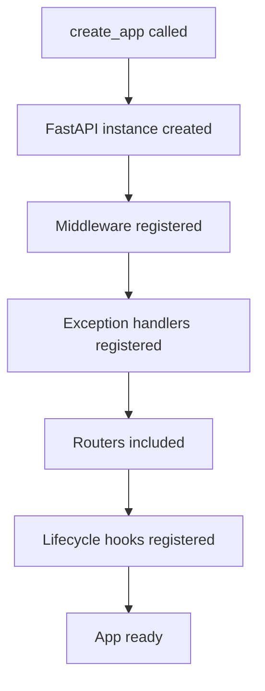
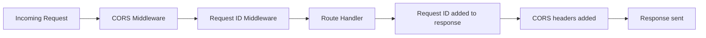
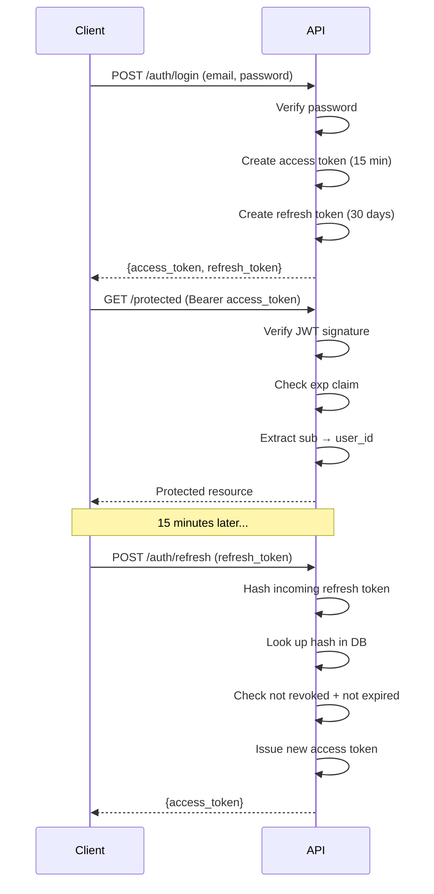
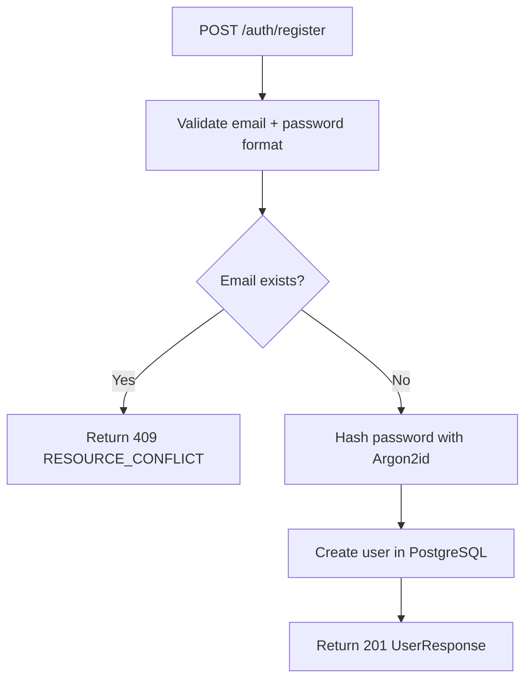
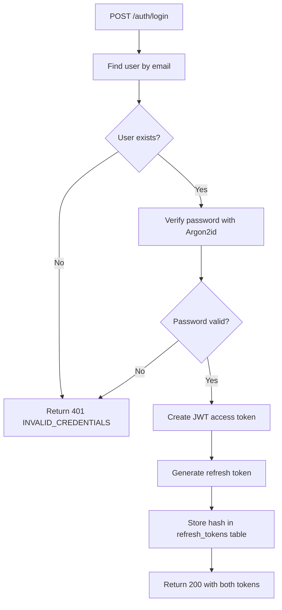

# SP-03 — Auth + FastAPI Bootstrap
## Application Factory · JWT · Refresh Tokens · Middleware · Health

**Status:** Not started  
**Duration:** 12 hours (Days 3.5–6)  
**Depends on:** SP-01 (users table), SP-02 (config, dependencies)  
**Enables:** SP-04 (all protected routes)  

---

## START HERE

**Before touching any file, answer these:**
1. What are the three parts of a JWT and what does each contain?
2. Why do we store the hash of a refresh token, not the raw token?
3. What is the difference between authentication and authorization?

If you cannot answer all three, read Section 4 first.

**First concept to understand:** JWT structure + refresh token pattern — Section 4  
**First existing file to inspect:** `src/infrastructure/database/session.py` (SP-01 output)  
**First file to create:** `src/core/exceptions.py`  
**First implementation decision:** Where does the refresh token table live?

> **DESIGN DECISION REQUIRED**  
> Refresh tokens need a database table. You have two options:  
> Option A: Add a `refresh_tokens` table via a new Alembic migration in SP-03.  
> Option B: Store refresh token hash directly on the `users` table as a nullable column.  
> **Recommended:** Option A — a separate table allows multiple active sessions and clean revocation. Create a new migration `002_refresh_tokens.py` in SP-03.

**First verification:** `GET /api/v1/health/live` returns `{"status": "ok"}` with status 200.

**Recommended implementation order:**
```
exceptions.py → security.py → app.py (factory) → 
middleware → health router → refresh_token model + migration → 
auth service → auth router → tests
```

---

## CONCEPTS TO UNDERSTAND

### What you must learn for SP-03

🟢 **BASIC — Password Hashing**  
Passwords are never stored as plaintext. They are hashed using Argon2id — a one-way function. You cannot reverse a hash to get the password. Verification works by hashing the input again and comparing the result.

🟡 **INTERMEDIATE — JWT Structure**  
See Section 4.1. You need to understand what each part contains and why the signature makes tampering detectable.

🟡 **INTERMEDIATE — Refresh Token Pattern**  
See Section 4.3. Access tokens are short-lived (15 min). Refresh tokens are long-lived (30 days). This separation limits exposure if a token is stolen.

🔴 **ADVANCED — Token Security**  
See Section 5. Multiple security rules interact here. Getting any one wrong creates a vulnerability.

🟡 **INTERMEDIATE — FastAPI Application Factory**  
Instead of creating the `FastAPI()` app at module level, wrap it in a `create_app()` function. This allows testing with different configs and clean initialization order.

🟢 **BASIC — Middleware**  
Middleware runs before and after every request. Order matters — outermost middleware runs first on the way in and last on the way out.

---

## 1. FastAPI Application Architecture

### Application factory pattern



`create_app()` lives in `src/app.py`. It is called once. The resulting `app` object is what uvicorn serves.

### Lifecycle hooks

**Startup hook runs:** init database engine → init ChromaDB → init file storage → init embedder  
**Shutdown hook runs:** close DB connections → close any open clients  

Everything initialized here uses `settings` from `src/core/config.py`.

### API prefix structure

All routes live under `/api/v1/`. This allows future versioning without breaking existing clients.

```
/api/v1/auth/register
/api/v1/auth/login
/api/v1/auth/refresh
/api/v1/auth/logout
/api/v1/health/live
/api/v1/health/ready
```

---

## 2. Middleware Architecture

Middleware order matters. Register in this order (outermost first):



### CORS Middleware

| Setting | Value | Reason |
|---|---|---|
| allow_origins | From `settings.cors_origins` | Never hardcode |
| allow_credentials | True | Needed for cookies/auth headers |
| allow_methods | GET, POST, PATCH, DELETE | Only what the API uses |
| allow_headers | * | Allows Authorization header |

**Never use `allow_origins=["*"]` with `allow_credentials=True`** — browsers reject this combination.

### Request ID Middleware

Every request gets a unique ID. This ID:
- Is read from `X-Request-ID` header if client provides one
- Is generated as a UUID if client does not provide one
- Is stored on `request.state.request_id`
- Is returned in the `X-Request-ID` response header
- Appears in every error response envelope

Purpose: when something goes wrong, the client reports the request ID and you can trace exactly what happened.

---

## 3. Error Handling Architecture

### Standard error envelope

Every error response — without exception — uses this shape:

```
{
  "error": {
    "code": "MACHINE_READABLE_CODE",
    "message": "Human readable message.",
    "request_id": "uuid-of-the-request"
  }
}
```

**Why this matters for portfolio:** Inconsistent error shapes are a sign of unprofessional API design. Consistent envelopes show you think about API consumers.

### Exception hierarchy

All custom exceptions inherit from one `AppException` base class. Each exception has:
- `status_code` — HTTP status
- `code` — machine-readable string
- `message` — human-readable string

```
AppException
├── AuthenticationRequired   (401)
├── InvalidCredentials       (401)
├── InvalidToken             (401)
├── TokenExpired             (401)
├── TokenRevoked             (401)
├── Forbidden                (403)
├── ResourceNotFound         (404)
├── ResourceConflict         (409)
└── RateLimited              (429)
```

### Exception handlers

Register three handlers on the FastAPI app:
1. `AppException` handler → standard envelope
2. `RequestValidationError` handler → 422 with envelope
3. Generic `Exception` handler → 500 with envelope (never expose stack trace to client)

**Rule:** Stack traces never reach the client. Log them internally. Return a generic 500 envelope.

---

## 4. Authentication Architecture

### 4.1 JWT Structure

🟡 **INTERMEDIATE**

A JWT has three parts separated by dots: `header.payload.signature`

| Part | Content | Readable? |
|---|---|---|
| Header | Algorithm + token type | Yes (base64) |
| Payload | Claims: sub, exp, iat, token_type | Yes (base64) |
| Signature | HMAC of header + payload using secret | No — verification only |

**Claims you must include:**

| Claim | Value | Purpose |
|---|---|---|
| sub | user_id (UUID string) | Who this token belongs to |
| token_type | "access" | Prevent refresh tokens being used as access tokens |
| iat | current timestamp | Issued at |
| exp | iat + 15 minutes | When this token expires |

**Why the signature matters:**  
If anyone changes the payload (e.g., changes `sub` to another user's ID), the signature no longer matches the content. Verification fails. The server never uses unverified payload data.

### 4.2 Access Token Lifecycle



### 4.3 Refresh Token Architecture

🔴 **ADVANCED / CRITICAL**

**What a refresh token is:**  
A random string (64 bytes, URL-safe base64). It has no structure — unlike JWT, you cannot decode it. It is opaque.

**Why store the hash, not the raw token:**  
If your database is breached, attackers get the hash, not the token. They cannot reverse SHA-256 to get the raw token. Without the raw token, they cannot use the refresh token.

**Storage flow:**
```
Generate raw token (random 64 bytes)
    ↓
Hash it with SHA-256
    ↓
Store ONLY the hash in refresh_tokens table
    ↓
Return the raw token to the client
    ↓
Client sends raw token on refresh request
    ↓
Hash the incoming token
    ↓
Compare hash to stored hash
    ↓
Match → issue new access token
```

**refresh_tokens table:**

| Column | Type | Required | Default | Purpose |
|---|---|---|---|---|
| token_id | UUID PK | YES | gen_random_uuid() | Identifier |
| user_id | UUID FK → users | YES | — | Token owner |
| token_hash | TEXT | YES | — | SHA-256 of raw token |
| created_at | TIMESTAMPTZ | YES | now() | When issued |
| updated_at | TIMESTAMPTZ | YES | now() | Last modified |
| expires_at | TIMESTAMPTZ | YES | — | 30 days after created_at |
| revoked_at | TIMESTAMPTZ | NO | NULL | NULL = active, timestamp = revoked |

CASCADE: deleting a user cascades to their refresh tokens.

**Token revocation on logout:**  
Set `revoked_at = NOW()`. Access token remains valid until its 15-minute expiry — this is intentional. Short expiry limits the damage window.

### 4.4 Password Hashing

🔴 **ADVANCED / CRITICAL**

Use `argon2-cffi` library. Argon2id is the recommended password hashing algorithm as of 2024.

**Why not bcrypt or SHA-256:**  
Argon2id is memory-hard — brute-forcing requires significant RAM, not just CPU. SHA-256 is not suitable for passwords (no salting, too fast). bcrypt is acceptable but Argon2id is stronger.

**How it works:**
- `hash_password(password)` → returns a hash string (includes salt automatically)
- `verify_password(password, stored_hash)` → returns True/False
- You never extract or store the salt separately — it's embedded in the hash string

**Timing attack protection:**  
`verify_password` uses constant-time comparison internally. Do not implement your own comparison — use the library's verify function.

---

## 5. Security Rules

🔴 **CRITICAL — read all of these**

| Rule | What it means | Why |
|---|---|---|
| User enumeration prevention | Wrong email and wrong password return identical 401 response | Prevents attackers from confirming which emails are registered |
| No plaintext passwords | Never log, return, or store raw passwords | Database breach exposure |
| No raw refresh tokens in DB | Store SHA-256 hash only | Database breach protection |
| Access token has token_type claim | Verify `token_type == "access"` before accepting | Prevents refresh tokens being used as access tokens |
| Expired token returns 401, not 403 | Different codes for different failure reasons | Clients can distinguish and retry |
| Stack traces never in responses | Catch all unhandled exceptions, return generic 500 | Information disclosure prevention |
| JWT secret never logged | settings object must not be printed | Key exposure |

---

## 6. Authentication Flows

### Register flow



### Login flow



**Security note:** Both "user not found" and "wrong password" return the same 401 with the same `INVALID_CREDENTIALS` code and message. Never differentiate.

### Logout flow

```mermaid
flowchart TD
    LO[POST /auth/logout] --> VA[Validate access token]
    VA --> HR[Hash incoming refresh token]
    HR --> FT[Find token record by hash]
    FT --> REV[Set revoked_at = NOW()]
    REV --> R200[Return 200]
```

---

## 7. API Contracts

### POST /api/v1/auth/register

**Request body:**
```
email: string (valid email format, max 255 chars)
password: string (min 8 chars, max 128 chars)
```

**Responses:**
```
201: { user_id, email, created_at }
409: error envelope → RESOURCE_CONFLICT
422: error envelope → validation failure
```

### POST /api/v1/auth/login

**Request body:**
```
email: string
password: string
```

**Responses:**
```
200: { access_token, refresh_token, token_type: "bearer" }
401: error envelope → INVALID_CREDENTIALS
```

### POST /api/v1/auth/refresh

**Request body:**
```
refresh_token: string (raw token from login response)
```

**Responses:**
```
200: { access_token, token_type: "bearer" }
401: error envelope → INVALID_TOKEN | TOKEN_REVOKED | TOKEN_EXPIRED
```

### POST /api/v1/auth/logout

**Headers:** `Authorization: Bearer <access_token>`  
**Request body:**
```
refresh_token: string
```

**Responses:**
```
200: {}
401: error envelope (if access token invalid)
```

### GET /api/v1/health/live

**No auth required.**  
```
200: { "status": "ok" }
```
Always returns 200. No dependency checks. Process is alive = liveness passes.

### GET /api/v1/health/ready

**No auth required.**  
```
200: { "status": "ok", "dependencies": { "postgres": "ok", "chroma": "ok" } }
503: { "status": "degraded", "dependencies": { "postgres": "error", "chroma": "ok" } }
```
Checks PostgreSQL with `SELECT 1` and ChromaDB with `heartbeat()`. Returns 503 if any dependency is down.

---

## 8. Authentication Dependency

`get_current_user()` is a FastAPI dependency used on every protected route.

**What it does:**
1. Reads `Authorization: Bearer <token>` header
2. Decodes and verifies JWT signature
3. Checks `exp` claim — raises `TokenExpired` if expired
4. Checks `token_type == "access"` — raises `InvalidToken` if not
5. Extracts `sub` (user_id) from payload
6. Loads user from PostgreSQL by user_id
7. Returns the User object

**Usage on protected routes:**
```
current_user: User = Depends(get_current_user)
```

Any route with this dependency automatically requires a valid access token. No token → 401. Expired → 401. Invalid → 401.

---

## 9. File Map

### JWT Library Decision

🟡 **INTERMEDIATE — Pick one library before writing security.py**

Two common options:

| Library | Install | Key functions | Notes |
|---|---|---|---|
| `python-jose[cryptography]` | `pip install python-jose[cryptography]` | `jwt.encode()`, `jwt.decode()` | Widely used, simple API |
| `PyJWT` | `pip install PyJWT` | `jwt.encode()`, `jwt.decode()` | Actively maintained, slightly newer API |

**Recommended: `PyJWT`** — actively maintained, clean API, no extra `[cryptography]` extras needed.

**Key difference:**  
`python-jose` raises `JWTError` on all failures. `PyJWT` raises specific errors: `jwt.ExpiredSignatureError` for expiry, `jwt.InvalidTokenError` for everything else. Catch them separately to return the correct `TokenExpired` vs `InvalidToken` response.

Pick one. Add it to `requirements.txt`. Do not mix both.

---

| Order | File | Status | Action | Responsibility | Depends On |
|---|---|---|---|---|---|
| 1 | `src/core/exceptions.py` | NEW | Create | All AppException subclasses | Nothing |
| 2 | `src/core/security.py` | NEW | Create | hash_password, verify_password, create/decode JWT, generate_refresh_token | config.py, PyJWT |
| 3 | `src/app.py` | NEW | Create | FastAPI factory, middleware, routers, lifecycle | All infrastructure |
| 4 | `src/api/middleware/request_id.py` | NEW | Create | X-Request-ID propagation | Nothing |
| 5 | `src/api/middleware/exception_handler.py` | NEW | Create | AppException + generic handlers | exceptions.py |
| 6 | `src/api/routers/health.py` | NEW | Create | /health/live + /health/ready | config, session, chroma |
| 7 | `src/repositories/models/refresh_token.py` | NEW | Create | RefreshToken SQLAlchemy model | base.py |
| 8 | `src/repositories/refresh_token_repository.py` | NEW | Create | create, get_by_hash, revoke | model, session |
| 9 | `alembic/versions/002_refresh_tokens.py` | NEW | Generate | refresh_tokens table migration | migration 001 |
| 10 | `src/services/auth_service.py` | NEW | Create | register, login, refresh, logout logic | repos, security |
| 11 | `src/api/schemas/auth.py` | NEW | Create | Request + response Pydantic schemas | Nothing |
| 12 | `src/api/schemas/common.py` | NEW | Create | ErrorResponse, PaginatedResponse | Nothing |
| 13 | `src/api/routers/auth.py` | NEW | Create | 4 auth routes | auth_service, schemas |
| 14 | `src/api/dependencies/auth.py` | NEW | Create | get_current_user() | security, user_repo |
| 15 | `tests/integration/test_auth.py` | NEW | Create | All auth tests | app, test client |

**New dependencies to add to requirements.txt:**
```
fastapi[all]>=0.111
PyJWT>=2.8
argon2-cffi>=23.0
python-multipart>=0.0.9
httpx>=0.27          ← for test client
```

**Phase 5 files — DO NOT MODIFY:**
```
src/agents/          → untouched
src/tools/           → untouched
src/rag/             → untouched
src/config/settings.py → still used by Phase 5 agents
workflow_state.py    → untouched
```

---

## 10. Security Checklist

Before calling SP-03 complete, verify every item:

- [ ] Password never stored in plaintext — only Argon2id hash in DB
- [ ] Password never returned in any API response
- [ ] Refresh token stored as SHA-256 hash only — raw token never in DB
- [ ] Wrong email and wrong password return identical response
- [ ] Access token has `token_type: "access"` claim — verified on every request
- [ ] Stack traces never in error responses
- [ ] JWT secret never logged anywhere
- [ ] CORS does not use `allow_origins=["*"]` with credentials

---

## 11. Testing

Run with `pytest tests/integration/test_auth.py -v` using a test database.

| Test | Action | Expected result |
|---|---|---|
| Register — success | POST valid email + password | 201, user_id returned |
| Register — duplicate email | POST same email twice | Second returns 409 RESOURCE_CONFLICT |
| Register — invalid email | POST `notanemail` | 422 validation error |
| Register — short password | POST 5-char password | 422 validation error |
| Login — success | POST valid credentials | 200, both tokens returned |
| Login — wrong password | POST correct email, wrong password | 401 INVALID_CREDENTIALS |
| Login — wrong email | POST non-existent email | 401 INVALID_CREDENTIALS (same message) |
| Protected route — valid token | GET protected with valid Bearer | 200, user extracted correctly |
| Protected route — no token | GET protected with no header | 401 AUTHENTICATION_REQUIRED |
| Protected route — expired token | GET protected with expired JWT | 401 TOKEN_EXPIRED |
| Protected route — tampered token | GET protected with modified JWT | 401 INVALID_TOKEN |
| Protected route — refresh as access | GET protected with refresh token | 401 INVALID_TOKEN |
| Refresh — success | POST valid refresh token | 200, new access token |
| Refresh — revoked token | POST refresh token after logout | 401 TOKEN_REVOKED |
| Refresh — expired token | POST 31-day-old refresh token | 401 TOKEN_EXPIRED |
| Logout — success | POST valid access + refresh | 200, refresh token revoked in DB |
| Request ID — client provided | Send X-Request-ID header | Same ID returned in response header |
| Request ID — auto generated | Send no X-Request-ID | UUID generated, returned in response header |
| Error envelope — 401 | Trigger any 401 | `{error: {code, message, request_id}}` shape |
| Error envelope — 422 | Send invalid body | Same envelope shape |
| Error envelope — 500 | Trigger unhandled exception | `{error: {code: "INTERNAL_ERROR", ...}}` no stack trace |
| Health live | GET /health/live | 200 `{"status": "ok"}` always |
| Health ready — all up | GET /health/ready with DB + ChromaDB running | 200 all dependencies ok |
| Health ready — DB down | GET /health/ready with DB unavailable | 503 postgres: error |
| CORS — allowed origin | Request from configured origin | CORS headers present |
| CORS — disallowed origin | Request from unknown origin | No CORS headers |

---

## NOT IN THIS SUBPHASE

- Startup/conversation/message CRUD — SP-04
- PDF upload — SP-04
- Memory extraction — SP-05
- RAG queries — SP-05
- Agent orchestration — SP-06
- Streaming — not in scope
- Rate limiting — not in scope

---

## DO NOT CHANGE

```
src/agents/              → all 17 Phase 5 agents
src/tools/               → all Phase 5 tools
src/rag/                 → Phase 5 RAG pipeline
src/config/settings.py   → Phase 5 config
workflow_state.py         → Phase 5 state contract
src/core/key_rotator.py  → Phase 5 key rotation
```

---

## SUBPHASE VALIDATION GATE

**Required files completed:**
- [ ] `src/core/exceptions.py` — all exception classes
- [ ] `src/core/security.py` — hashing + JWT + refresh token generation
- [ ] `src/app.py` — factory with middleware, handlers, routers
- [ ] Both middleware files
- [ ] Health router
- [ ] RefreshToken model + migration 002
- [ ] RefreshTokenRepository
- [ ] AuthService
- [ ] Auth schemas
- [ ] Auth router
- [ ] `get_current_user()` dependency

**Required behavior:**
- [ ] `GET /health/live` → 200 always
- [ ] `GET /health/ready` → 200 when dependencies up, 503 when down
- [ ] Register → login → use token → logout → token rejected
- [ ] Wrong email and wrong password produce identical 401 response
- [ ] All errors return standard envelope with request_id
- [ ] Request ID propagates through request and response headers

**Required tests passing:**
- [ ] All 25 tests from Section 11 pass
- [ ] SP-01 and SP-02 tests still pass

**Failure conditions:**
- Any auth test fails → fix before SP-04
- Stack trace appears in any error response → critical fix required
- Wrong email vs wrong password returns different messages → security fix required

**Freeze criteria:**  
All checkboxes checked. All tests green. Security checklist complete.  
PASS → freeze SP-03 → move to SP-04.
