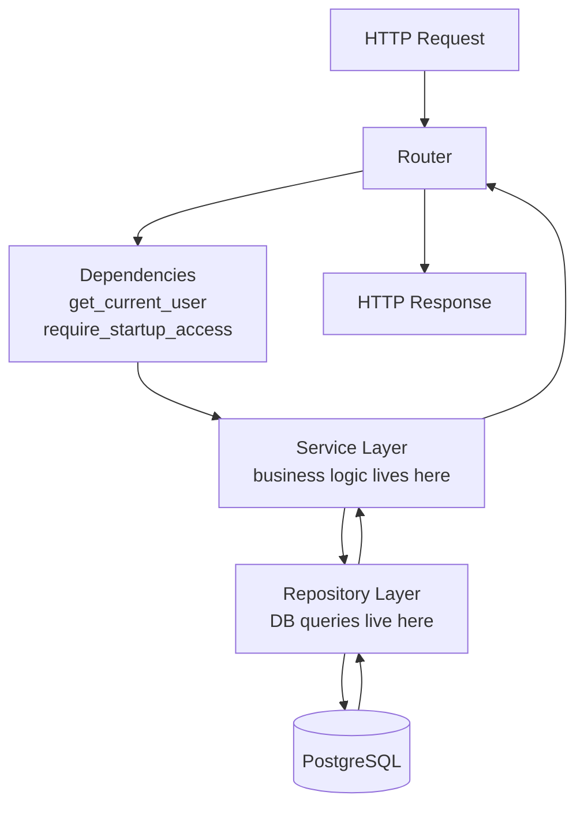
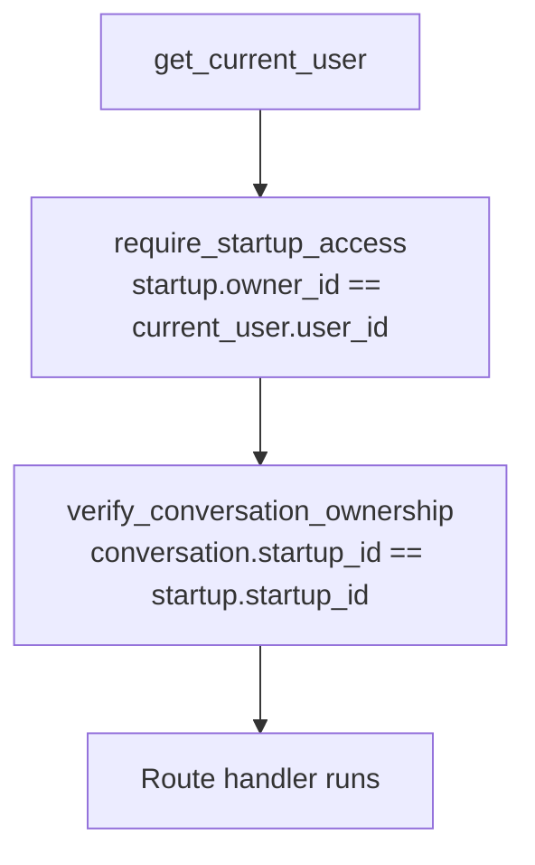
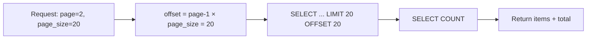
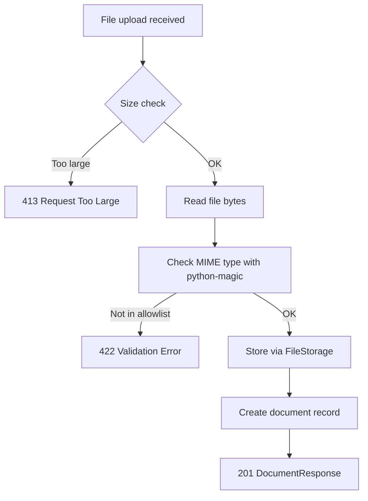

# SP-04 — Core Resource APIs
## Startups · Conversations · Messages · Memories · Documents

**Status:** Not started  
**Duration:** 15 hours (Days 6–9)  
**Depends on:** SP-01 (all tables), SP-02 (config, storage), SP-03 (auth, dependencies)  
**Enables:** SP-05 (memory + RAG), SP-06 (orchestration)  

---

## ⚠️ DESIGN DECISION REQUIRED — Documents Table

**The conflict:**  
SP-04 scope requires a Documents API with upload, list, get, delete, and document status (`UPLOADED → PROCESSING → READY / FAILED`). SP-05 expects to read document status to trigger background processing. However, SP-01 only created 5 tables — `users, startups, conversations, messages, memories`. There is no `documents` table.

**Your options:**

| Option | Action | Effort |
|---|---|---|
| A | Create a `documents` table migration now in SP-04 before building the API | ~2 hours extra |
| B | Skip the documents API entirely — store PDFs with no DB tracking, process immediately on upload | Saves 2 hours, loses status tracking |
| C | Store document metadata in the `startups` table as a JSON column | Avoids new table but is poor design |

**Recommended: Option A.**  
Document status tracking (`UPLOADED → PROCESSING → READY / FAILED`) is an AI engineering signal — it shows you understand async processing pipelines. Create the table now.

**Documents table to add (migration 003):**

| Column | Type | Required | Default | Purpose |
|---|---|---|---|---|
| document_id | UUID PK | YES | gen_random_uuid() | Identifier |
| startup_id | UUID FK → startups | YES | — | Owner |
| filename | VARCHAR(255) | YES | — | Display name only, never used as path |
| storage_reference | TEXT | YES | — | Server path from FileStorage |
| file_type | VARCHAR(50) | YES | — | MIME type |
| status | VARCHAR(20) | YES | UPLOADED | UPLOADED/PROCESSING/READY/FAILED |
| created_at | TIMESTAMPTZ | YES | now() | — |
| updated_at | TIMESTAMPTZ | YES | now() | — |

CASCADE: deleting a startup deletes its documents.

**Make this decision before starting SP-04 implementation.**

---

## START HERE

**Before touching any file, answer these:**
1. Why does cross-user access return 404 and not 403?
2. What is the difference between a service and a repository?
3. Why are messages append-only?

**First concept to understand:** Layered architecture — Section 1  
**First existing file to inspect:** `src/repositories/startup_repository.py` (SP-01 output)  
**First file to create:** `alembic/versions/003_documents.py` (if Option A chosen)  
**First implementation decision:** Resolve the Design Decision above  
**First verification:** `GET /api/v1/startups` with valid token returns paginated response

**Recommended implementation order:**
```
003_documents migration → documents model + repository →
startup schemas + service + router →
conversation schemas + service + router →
message schemas + service + router →
memory schemas + service + router →
document schemas + service + router →
API key rotation rewire → tests
```

---

## CONCEPTS TO UNDERSTAND

🟢 **BASIC — Layered Architecture**  
Routes receive requests and return responses. Services contain business logic. Repositories talk to the database. Never skip a layer.

🟡 **INTERMEDIATE — Ownership Authorization**  
Every resource is owned by a user through a startup. Before returning or modifying any resource, verify the chain: user → startup → resource. See Section 3.

🟡 **INTERMEDIATE — Offset Pagination**  
See Section 4. Simple to implement, sufficient for this scope.

🟡 **INTERMEDIATE — MIME Type Validation**  
See Section 6. File extension alone is not sufficient — read the actual bytes.

🔴 **ADVANCED — Message Sequence Numbers Under Concurrency**  
Already covered in SP-01 Section 5. The `MessageRepository.append()` with `SELECT FOR UPDATE` must be used here at the API level too. This is a reminder, not new content.

🟢 **BASIC — Pydantic Schema Separation**  
Every resource has three schemas: Create (request body for POST), Update (request body for PATCH, all fields optional), Response (what the API returns). Server-controlled fields — IDs, timestamps, sequence numbers, roles — never appear in Create or Update schemas.

---

## 1. Layered Architecture



**Why business logic does not belong in routes:**  
Routes are request/response translators. They should extract input, call a service, and return a response. If you put business logic in routes, you cannot test that logic without an HTTP client. Services are plain Python — they can be unit tested without FastAPI. Repositories are plain Python — they can be tested with just a DB session. Keep each layer's responsibility narrow.

**The rule:** Routes call services. Services call repositories. Repositories call the database. Nobody skips a layer.

---

## 2. Complete Route Table

| Method | Path | Auth | Description |
|---|---|---|---|
| POST | `/api/v1/startups` | Bearer | Create startup |
| GET | `/api/v1/startups` | Bearer | List user's startups (paginated) |
| GET | `/api/v1/startups/{startup_id}` | Bearer + ownership | Get startup by id |
| PATCH | `/api/v1/startups/{startup_id}` | Bearer + ownership | Update startup |
| DELETE | `/api/v1/startups/{startup_id}` | Bearer + ownership | Delete startup (cascades) |
| POST | `/api/v1/startups/{startup_id}/conversations` | Bearer + ownership | Create conversation |
| GET | `/api/v1/startups/{startup_id}/conversations` | Bearer + ownership | List conversations (paginated) |
| GET | `/api/v1/startups/{startup_id}/conversations/{conversation_id}` | Bearer + ownership | Get conversation |
| PATCH | `/api/v1/startups/{startup_id}/conversations/{conversation_id}` | Bearer + ownership | Update conversation title |
| DELETE | `/api/v1/startups/{startup_id}/conversations/{conversation_id}` | Bearer + ownership | Delete conversation (cascades messages) |
| POST | `/api/v1/startups/{startup_id}/conversations/{conversation_id}/messages` | Bearer + ownership | Append message |
| GET | `/api/v1/startups/{startup_id}/conversations/{conversation_id}/messages` | Bearer + ownership | List messages (paginated, ASC) |
| GET | `/api/v1/startups/{startup_id}/memories` | Bearer + ownership | List memories (paginated) |
| DELETE | `/api/v1/startups/{startup_id}/memories/{memory_id}` | Bearer + ownership | Delete memory |
| POST | `/api/v1/startups/{startup_id}/documents` | Bearer + ownership | Upload PDF |
| GET | `/api/v1/startups/{startup_id}/documents` | Bearer + ownership | List documents (paginated) |
| GET | `/api/v1/startups/{startup_id}/documents/{document_id}` | Bearer + ownership | Get document metadata |
| DELETE | `/api/v1/startups/{startup_id}/documents/{document_id}` | Bearer + ownership | Delete document (soft) |

---

## 3. Authorization Architecture

### Why 404 not 403

🔴 **SECURITY CRITICAL**

Returning 403 (Forbidden) confirms that the resource exists but the user cannot access it. This leaks information — an attacker can enumerate valid resource IDs by observing 403 vs 404 responses.

Returning 404 (Not Found) reveals nothing. The resource may not exist, or may exist but belong to someone else. The attacker cannot distinguish the two cases.

**Rule:** When a resource exists but does not belong to the requesting user, return 404.

### Ownership dependency chain



`require_startup_access` is a FastAPI dependency that:
1. Reads `startup_id` from the URL path
2. Queries `StartupRepository.get_by_id_and_owner(startup_id, current_user.user_id)`
3. If None → raises `ResourceNotFound` (404)
4. If found → returns the Startup object to the route

Nested resources (conversations, messages) verify their own ownership against the already-verified startup.

**Rule:** Knowing a UUID is never proof of access. Always resolve ownership through the database.

---

## 4. Pagination

### Offset pagination



**How it works:**  
Page 1 returns rows 0–19 (offset 0). Page 2 returns rows 20–39 (offset 20). Page 3 returns rows 40–59 (offset 40). Formula: `offset = (page - 1) * page_size`.

**Standard pagination envelope:**
```
{
  "items": [...],
  "page": 2,
  "page_size": 20,
  "total": 87
}
```

**Rules:**
- Default page_size: 20
- Maximum page_size: 100
- Minimum page: 1
- Requesting a page beyond total returns empty items list, not an error
- `total` is always the full count regardless of current page

**Validation:**  
`page_size > 100` → 422 validation error. `page < 1` → 422 validation error. Use Pydantic `Query` parameters with `ge=1` and `le=100` constraints.

---

## 5. Resource Contracts

### 5.1 Startups

**Create schema (POST body):**
```
name: string, required, max 255 chars
description: string, optional
stage: enum optional, default IDEA (IDEA | MVP | TRACTION | GROWTH)
```

**Update schema (PATCH body — all optional):**
```
name: string, optional
description: string, optional
stage: enum, optional
```

**Response schema:**
```
startup_id: UUID
owner_id: UUID
name: string
description: string or null
stage: string
created_at: datetime
updated_at: datetime
```

**Service responsibility:** Assign `owner_id` from `current_user.user_id`. Never accept owner_id from client.  
**Repository responsibility:** CRUD + `get_by_id_and_owner` for auth.  
**Authorization:** ownership dependency on every route except POST (POST creates, so no pre-existing ownership to check).  
**Pagination:** `list_by_owner` returns paginated results ordered by `created_at DESC`.  
**Error cases:** Startup not found → 404. Name missing → 422.  
**Cascade behavior:** DELETE triggers PostgreSQL cascade → all conversations, messages, memories, documents deleted automatically.

---

### 5.2 Conversations

**Create schema:**
```
title: string, required, max 255 chars
```

**Update schema:**
```
title: string, optional
```

**Response schema:**
```
conversation_id: UUID
startup_id: UUID
title: string
created_at: datetime
updated_at: datetime
```

**Service responsibility:** Assign `startup_id` from URL path, verified by ownership dependency.  
**Repository responsibility:** CRUD + `list_by_startup` paginated.  
**Authorization:** `require_startup_access` on all routes.  
**Pagination:** ordered by `created_at DESC`.  
**Error cases:** Startup not found → 404. Conversation not found → 404. Title missing → 422.  
**Cascade behavior:** DELETE cascades to all messages via PostgreSQL FK.

---

### 5.3 Messages

**Create schema:**
```
content: string, required, max 32768 chars
```

**No update schema** — messages are append-only. No PATCH or DELETE on individual messages.

**Response schema:**
```
message_id: UUID
conversation_id: UUID
role: string (USER | ASSISTANT | SYSTEM)
content: string
sequence_number: integer
created_at: datetime
```

**Service responsibility:** Assign `role = "USER"` — client never sets role. Never accept role from client.  
**Repository responsibility:** `append()` with SELECT FOR UPDATE for sequence number safety. `list_by_conversation()` paginated ASC.  
**Authorization:** `require_startup_access` + conversation ownership verification.  
**Pagination:** ordered by `sequence_number ASC` — conversation history must be chronological.  
**Error cases:** Content missing → 422. Conversation not found → 404.  
**Why append-only:** Conversation history is an audit trail. Editing or deleting messages would corrupt the memory extraction pipeline in SP-05, which reads message history to extract facts.

---

### 5.4 Memories

**No Create schema** — memories are created internally by the memory extraction pipeline in SP-05, never by the client directly.

**Response schema:**
```
memory_id: UUID
startup_id: UUID
memory_type: string
content: string
importance: float
created_at: datetime
```

**Service responsibility:** List and delete only. No creation at API level.  
**Repository responsibility:** `list_by_startup()` paginated. `delete()`.  
**Authorization:** `require_startup_access` on all routes.  
**Pagination:** ordered by `created_at DESC`.  
**Error cases:** Memory not found → 404. Memory belongs to different startup → 404.

---

### 5.5 Documents

> Note: This resource requires the `documents` table from the Design Decision at the top of this document. Confirm migration 003 is applied before implementing this section.

**Create schema:** No JSON body — document upload uses `multipart/form-data`.  
**Update schema:** None. Document metadata is not editable.

**Response schema:**
```
document_id: UUID
startup_id: UUID
filename: string
file_type: string
status: string (UPLOADED | PROCESSING | READY | FAILED)
created_at: datetime
updated_at: datetime
```

**Service responsibility:**
1. Validate file type against MIME allowlist
2. Validate file size against `MAX_FILE_SIZE_BYTES`
3. Create document record in PostgreSQL (status = UPLOADED)
4. Store file via FileStorage → receive storage_reference
5. Update document record with storage_reference
6. Return DocumentResponse

**Repository responsibility:** CRUD + `list_by_startup()` paginated. Soft delete (set `status = "DELETED"` or add `deleted_at` column).

> **DESIGN DECISION REQUIRED — Soft Delete Implementation:**  
> Your redesign says "soft delete" for documents but your SP-01 schema has no `deleted_at` column on the documents table defined above. Options:  
> Option A: Add `deleted_at TIMESTAMPTZ nullable` column to documents table in migration 003.  
> Option B: Use `status = "DELETED"` as a soft delete marker — simpler, no extra column.  
> **Recommended: Option B** — status field already exists, no additional migration column needed. Filter `status != "DELETED"` on all list queries.

**Authorization:** `require_startup_access` on all routes.  
**Pagination:** ordered by `created_at DESC`.  
**Error cases:** Invalid MIME type → 422. File too large → 413. Document not found → 404.

---

## 6. MIME Validation and File Handling

🟡 **INTERMEDIATE — MIME Type Validation**

**Why file extension is not sufficient:**  
A user renames `malware.exe` to `document.pdf`. Extension check passes. File is stored. Problem.

**What MIME validation does:**  
Read the first few bytes of the file content. File types have magic bytes — PDF files start with `%PDF`, ZIP files start with `PK`, etc. The `python-magic` library reads these bytes and returns the actual MIME type.

**Allowed MIME types for this project:**

| Extension | MIME type |
|---|---|
| .pdf | application/pdf |
| .txt | text/plain |
| .md | text/markdown |

**Validation flow:**


**Server-controlled storage:**  
The user's filename is stored in the DB for display only. The actual filesystem path is constructed from server-controlled UUIDs. See SP-02 Section 4 for details. This was already implemented in SP-02 — the document service calls `FileStorage.store()` and receives a `storage_reference`.

**Dependency to add:** `python-magic` requires the system library `libmagic`.

🔴 **CRITICAL — system dependency, not just pip:**  
`pip install python-magic` alone is not enough. You also need the system library:
- Ubuntu/Debian: `sudo apt-get install libmagic1`
- macOS: `brew install libmagic`
- Windows: download DLL separately (document in README)

Add this to your README setup section. Without `libmagic`, `python-magic` raises `ImportError` on first use — silently if not tested.

---

## 7. API Key Rotation Rewire

Phase 5 `key_rotator.py` works but may initialize clients at module level or use `os.getenv()` directly. In Phase 6, all provider clients must initialize inside functions and read from `settings`.

**What to check in `src/core/key_rotator.py`:**
- Does it call `os.getenv()` directly? → Replace with `settings.openrouter_api_key` etc.
- Does it initialize any client at module level? → Move inside constructor or function

**Important:** Do not change rotation logic. Only change where config is read from. Test that Phase 5 agents still work after this change. This is a high-risk modification — make it carefully.

---

## 8. Pydantic Schema Architecture

```
src/api/schemas/
├── common.py          → PaginatedResponse[T] generic, ErrorResponse
├── startup.py         → StartupCreate, StartupUpdate, StartupResponse
├── conversation.py    → ConversationCreate, ConversationUpdate, ConversationResponse
├── message.py         → MessageCreate, MessageResponse (no update)
├── memory.py          → MemoryResponse (no create, no update)
└── document.py        → DocumentResponse (no create body — multipart)
```

**Generic pagination:**  
`PaginatedResponse[T]` uses Python generics. `T` is the item type. `PaginatedResponse[StartupResponse]` gives you a typed paginated response for startups.

**Server-controlled field rule:**  
Never include in Create or Update schemas: `user_id`, `owner_id`, any `_id` field, `created_at`, `updated_at`, `sequence_number`, `role`, `status`. These are assigned by the server.

---

## 9. File Map

| Order | File | Status | Action | Responsibility | Depends On |
|---|---|---|---|---|---|
| 1 | `alembic/versions/003_documents.py` | NEW | Generate | Documents table migration | migrations 001, 002 |
| 2 | `src/repositories/models/document.py` | NEW | Create | Document SQLAlchemy model | base.py |
| 3 | `src/repositories/document_repository.py` | NEW | Create | Document DB operations | model, session |
| 4 | `src/api/schemas/common.py` | NEW | Create | PaginatedResponse, ErrorResponse | Nothing |
| 5 | `src/api/schemas/startup.py` | NEW | Create | Startup schemas | Nothing |
| 6 | `src/api/schemas/conversation.py` | NEW | Create | Conversation schemas | Nothing |
| 7 | `src/api/schemas/message.py` | NEW | Create | Message schemas | Nothing |
| 8 | `src/api/schemas/memory.py` | NEW | Create | Memory schemas | Nothing |
| 9 | `src/api/schemas/document.py` | NEW | Create | Document schemas | Nothing |
| 10 | `src/services/startup_service.py` | NEW | Create | Startup business logic | startup_repo |
| 11 | `src/services/conversation_service.py` | NEW | Create | Conversation business logic | conversation_repo |
| 12 | `src/services/message_service.py` | NEW | Create | Message business logic | message_repo |
| 13 | `src/services/memory_service.py` | NEW | Create | Memory business logic | memory_repo |
| 14 | `src/services/document_service.py` | NEW | Create | Upload + storage + status | document_repo, file_storage |
| 15 | `src/api/dependencies/auth.py` | MODIFY | Add all ownership dependencies | Ownership chain | startup_repo, conversation_repo |
| 16 | `src/api/routers/startups.py` | NEW | Create | Startup routes | startup_service, schemas |
| 17 | `src/api/routers/conversations.py` | NEW | Create | Conversation routes | conversation_service |
| 18 | `src/api/routers/messages.py` | NEW | Create | Message routes | message_service |
| 19 | `src/api/routers/memories.py` | NEW | Create | Memory routes | memory_service |
| 20 | `src/api/routers/documents.py` | NEW | Create | Document routes | document_service |
| 21 | `src/app.py` | MODIFY | Include new routers | Register all resource routers | all routers |
| 22 | `src/core/key_rotator.py` | MODIFY | Rewire to settings | Replace os.getenv calls | config.py |
| 23 | `tests/integration/test_resources.py` | NEW | Create | All resource tests | app, test client |

---

### Authorization Dependencies — Complete List

All three dependencies live in `src/api/dependencies/auth.py`. All three must be implemented in SP-04 before conversation and message routes can work.

**`require_startup_access(startup_id, current_user, db)`**
- Reads `startup_id` from URL path
- Queries `StartupRepository.get_by_id_and_owner(startup_id, current_user.user_id)`
- Returns Startup if found, raises `ResourceNotFound` (404) if not

**`require_conversation_access(conversation_id, startup, db)`**
- Reads `conversation_id` from URL path
- Queries `ConversationRepository.get_by_id(conversation_id)`
- Checks `conversation.startup_id == startup.startup_id`
- Returns Conversation if match, raises `ResourceNotFound` (404) if not
- Depends on `require_startup_access` — startup must be verified first

**`require_document_access(document_id, startup, db)`**
- Reads `document_id` from URL path
- Queries `DocumentRepository.get_by_id(document_id)`
- Checks `document.startup_id == startup.startup_id` and `document.status != "DELETED"`
- Returns Document if match, raises `ResourceNotFound` (404) if not

**New dependencies to add to requirements.txt:**
```
python-magic>=0.4.27
```

**Phase 5 files — DO NOT MODIFY:**
```
src/agents/        → untouched
src/tools/         → untouched (except key_rotator.py above)
src/rag/           → untouched until SP-05
workflow_state.py  → untouched
```

---

## 10. Testing

| Test | Action | Expected result |
|---|---|---|
| Create startup | POST valid body with valid token | 201, startup_id returned |
| List startups | GET with valid token, 0 startups | 200, items=[], total=0 |
| List startups | GET after creating 3 | 200, total=3 |
| Get startup | GET by id, own startup | 200, startup data |
| Get startup — wrong user | GET another user's startup_id | 404 |
| Update startup | PATCH name field | 200, name updated |
| Delete startup | DELETE own startup | 204 |
| Delete startup — cascade | DELETE startup with conversations | Conversations + messages gone |
| Create conversation | POST valid title | 201, conversation_id |
| Append message | POST content to conversation | 201, sequence_number=1 |
| Append second message | POST again | 201, sequence_number=2 |
| Concurrent messages | 10 simultaneous POSTs | All 201, sequence 1–10 no gaps |
| List messages | GET conversation messages | Ordered by sequence_number ASC |
| Message PATCH | Attempt PATCH on message | 405 Method Not Allowed |
| Message DELETE | Attempt DELETE on message | 405 Method Not Allowed |
| List memories | GET before any extraction | 200, items=[], total=0 |
| Delete memory | DELETE existing memory | 204 |
| Delete memory — wrong startup | DELETE memory from different startup | 404 |
| Upload PDF | POST valid PDF file | 201, status=UPLOADED |
| Upload non-PDF | POST .exe file | 422 validation error |
| Upload oversized file | POST file > MAX_FILE_SIZE_BYTES | 413 |
| List documents | GET startup's documents | 200, paginated |
| Get document | GET by id | 200, document metadata |
| Delete document | DELETE document | 204, status=DELETED |
| Pagination default | GET startups no page params | page=1, page_size=20 in response |
| Pagination page 2 | GET startups with page=2 | Correct offset applied |
| Pagination max size | GET with page_size=101 | 422 validation error |
| Cross-user startup | GET other user's startup | 404 |
| Cross-startup conversation | GET conversation from different startup | 404 |
| No token | GET /startups with no header | 401 |

---

## NOT IN THIS SUBPHASE

- Memory extraction logic (automatic LLM call) — SP-05
- RAG queries — SP-05
- ChromaDB indexing of documents — SP-05
- Document processing pipeline (PROCESSING → READY) — SP-05
- Agent execution — SP-06
- Workflow submission — SP-06
- Streaming — not in scope

---

## DO NOT CHANGE

```
src/agents/              → all 17 Phase 5 agents
src/rag/                 → Phase 5 RAG pipeline
src/config/settings.py   → Phase 5 config (still used by agents)
workflow_state.py         → Phase 5 state contract
src/prompts/             → all Phase 5 prompts
```

---

## SUBPHASE VALIDATION GATE

**Required decisions resolved:**
- [ ] Documents table design decision made and migration 003 created
- [ ] Soft delete strategy for documents decided

**Required files completed:**
- [ ] Migration 003 applied cleanly
- [ ] Document model + repository
- [ ] All 5 schema files
- [ ] All 5 service files
- [ ] All 5 router files
- [ ] `require_startup_access` dependency
- [ ] API key rotation rewired to settings
- [ ] All routers registered in `app.py`

**Required behavior:**
- [ ] All routes require valid Bearer token
- [ ] Cross-user startup access returns 404
- [ ] Messages append-only (PATCH/DELETE return 405)
- [ ] Message sequence numbers unique under concurrent inserts
- [ ] Document upload validates MIME type
- [ ] Pagination envelope present on all list endpoints
- [ ] Cascade delete: startup deleted → all nested resources gone

**Required tests passing:**
- [ ] All 30 tests from Section 10 pass
- [ ] SP-01, SP-02, SP-03 tests still green

**Failure conditions:**
- Cross-user access returns 403 instead of 404 → security fix required
- Message sequence numbers have gaps or duplicates → fix SELECT FOR UPDATE
- File upload accepts wrong MIME type → fix MIME validation
- Any route accesses DB directly without repository → architecture violation

**Freeze criteria:**  
All checkboxes checked. All tests green. Both design decisions resolved.  
PASS → freeze SP-04 → move to SP-05.
