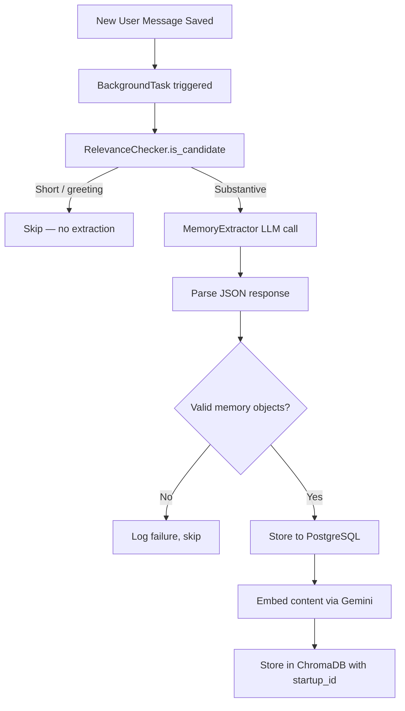
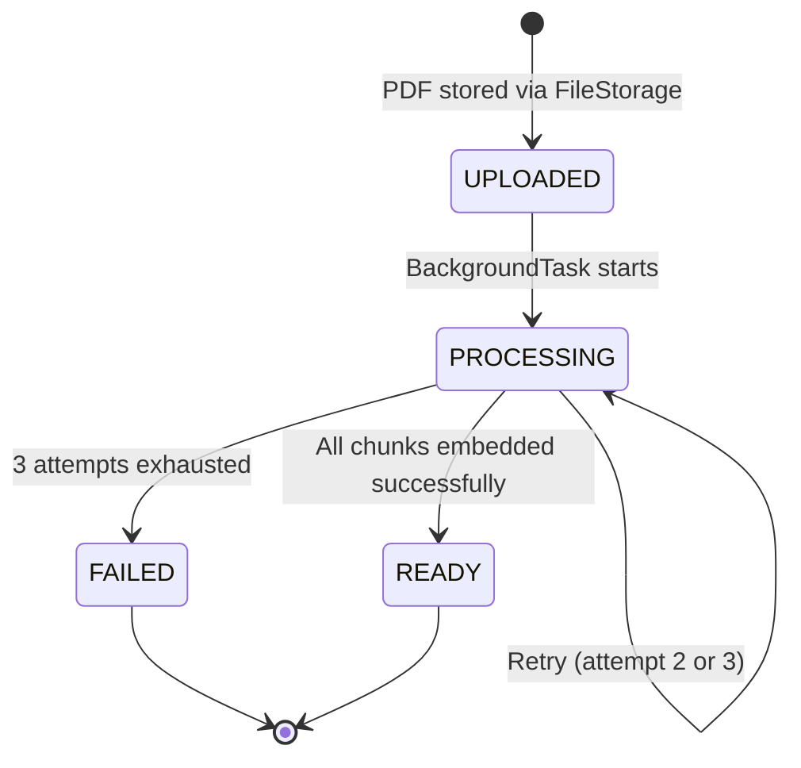
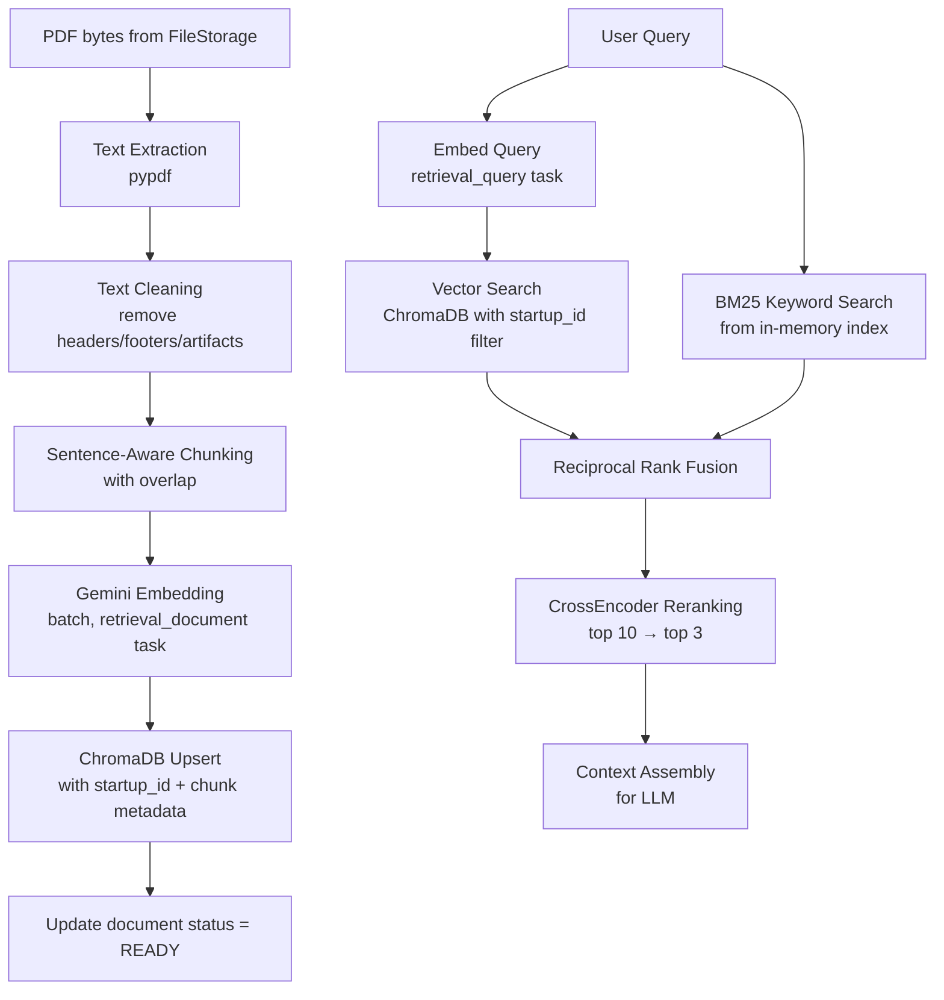
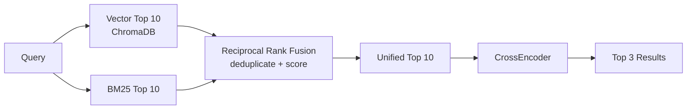

# SP-05 — Memory System + RAG Polish
## Memory Extraction · ChromaDB · BM25 · Hybrid Retrieval · Document Processing

**Status:** Not started  
**Duration:** 15 hours (Days 9–12)  
**Depends on:** SP-02 (ChromaDB, embedder, file storage), SP-04 (messages API, documents API)  
**Enables:** SP-06 (orchestration injects memory + RAG context into agents)  

---

## START HERE

**Before touching any file, answer these:**
1. What is the difference between vector similarity and BM25 retrieval?
2. Why must every ChromaDB write include `startup_id` in metadata?
3. What triggers memory extraction — the route or the service?

If you cannot answer all three, read Sections 1 and 5 first.

**First concept to understand:** Memory extraction trigger — Section 1.1  
**First existing file to inspect:** `src/rag/rag.py` — your Phase 5 RAG pipeline  
**First file to create:** `src/memory/relevance_checker.py`  
**First implementation decision:** Where does memory extraction trigger?

> **DESIGN DECISION REQUIRED — Memory Extraction Trigger**  
> The redesign says "automatic LLM memory extraction after every user message" but does not specify exactly where this trigger lives. Options:  
> Option A: Inside `MessageService.append()` — after saving the message, call memory extraction.  
> Option B: Inside the message route handler — after calling the service.  
> Option C: As a FastAPI `BackgroundTask` — non-blocking, fires after response is sent.  
> **Recommended: Option C (BackgroundTask).** Memory extraction takes 1–3 seconds (LLM call). Blocking the message response on this would make the API feel slow. BackgroundTask sends the HTTP 201 response immediately, then runs extraction. Decide this before implementing.

> **DESIGN DECISION REQUIRED — Document Background Processing**  
> The redesign specifies `UPLOADED → PROCESSING → READY / FAILED` with retry, but does not specify the execution mechanism. Options:  
> Option A: FastAPI `BackgroundTask` — simple, no new dependencies, runs in same process.  
> Option B: Celery or similar task queue — separate worker process, more complex.  
> **Recommended: Option A (BackgroundTask)** — no new infrastructure, fits portfolio scope. On upload, send 201 immediately, kick off background processing. If the server restarts mid-process, documents stuck in PROCESSING can be retried manually. Document this limitation in your README.

**First verification:** A substantive user message → at least one memory record created in PostgreSQL.

**Recommended implementation order:**
```
relevance_checker → extractor → memory_storage → 
memory_retrieval → context_assembler →
pdf_extractor → chunker → rag_pipeline (polish) → 
document_processor → integration tests
```

---

## CONCEPTS TO UNDERSTAND

🟢 **BASIC — Why Persistent Memory**  
Phase 5 lost all context when the process stopped. Phase 6 memory means the system remembers what was discussed about a startup across sessions. User says "my target is college students" — next week it still knows this without asking again.

🟡 **INTERMEDIATE — Memory Extraction**  
Not every message is worth remembering. "Thanks" is not worth an LLM call. "Our target market is female entrepreneurs aged 25–35 in tier-2 cities" is. A lightweight rule-based check filters first, then a full LLM call extracts structured memory only for substantive messages.

🟡 **INTERMEDIATE — BM25 vs Vector Similarity**  
See Section 5.1. Two fundamentally different search approaches. Hybrid uses both.

🔴 **ADVANCED — ChromaDB Metadata Filtering**  
See Section 5.3. If you forget the `where` clause, you get everyone's data. This was covered in SP-02 but applies here with full implementation context.

🔴 **ADVANCED — CrossEncoder Reranking**  
See Section 5.5. The most computationally expensive step. Understand why it improves results.

🟡 **INTERMEDIATE — Sentence-Aware Chunking**  
See Section 4.2. Splitting in the middle of a sentence loses context. Phase 5 had this — SP-05 polishes it.

---

## PART A — MEMORY SYSTEM

## 1. Memory Pipeline



### 1.1 Relevance Checker

**Purpose:** Rule-based filter. Runs on every message. Zero LLM cost. Prevents wasting API calls on greetings, single words, acknowledgements.

**Skip conditions:**
- Message length < 30 characters
- Matches greeting patterns: hi, hello, hey, thanks, ok, yes, no, sure, got it
- Role is not USER (system/assistant messages are not extracted)

**Implementation hint:**  
Use `re.match()` with a pattern list. Return `False` immediately on any match. Only return `True` if no skip condition applies.

**Common mistake:** Checking `len(message)` after stripping vs before. Always strip whitespace before length check.

### 1.2 Memory Extractor

**Purpose:** LLM call that reads the message and extracts structured memories.

**What the LLM must return — JSON array:**
```
[
  {
    "content": "target market is female entrepreneurs aged 25-35",
    "memory_type": "startup_fact",
    "importance": 0.8,
    "reasoning": "explicit market definition stated"
  }
]
```

**Memory types (enum):**

| Type | When to extract |
|---|---|
| startup_fact | Factual statements about the startup |
| preference | How the user wants to work or what they value |
| decision | A decision that was made |
| goal | An objective or target |
| constraint | A limitation or boundary |

**Importance scale:** 0.0 (trivial) to 1.0 (critical). LLM assigns this.

**Prompt engineering rules:**
- Instruct the LLM to return ONLY valid JSON — no markdown, no prose, no code fences
- Include the startup context in the prompt so the LLM knows what domain it's extracting for
- If no memories are worth extracting, return an empty array `[]`
- Maximum 3 memories per message — prevent noise

**MEMORY_EXTRACTION_PROMPT — add to `src/prompts/prompts.py`:**

```
MEMORY_EXTRACTION_PROMPT = """You are a memory extraction system for a startup analysis platform.

Given a user message about a startup, extract any facts, decisions, goals, preferences, or constraints worth remembering for future conversations.

Startup context:
Name: {startup_name}
Stage: {startup_stage}
Description: {startup_description}

User message:
{message_content}

Return a JSON array of extracted memories. Each memory must have:
- content: the fact or insight to remember (concise, self-contained sentence)
- memory_type: one of: startup_fact, preference, decision, goal, constraint
- importance: float between 0.0 (trivial) and 1.0 (critical)
- reasoning: brief explanation of why this is worth remembering

Rules:
- Return raw JSON array only. No markdown. No code fences. No prose.
- If nothing is worth remembering, return an empty array: []
- Maximum 3 memories per message
- Each content must be a complete, self-contained fact (no pronouns without referents)

Example output:
[
  {{"content": "target market is college students aged 18-24 in tier-1 cities", "memory_type": "startup_fact", "importance": 0.9, "reasoning": "explicitly defined target market"}}
]"""
```

**Common mistake:** LLM returns JSON wrapped in ```json ... ``` fences. Strip with `.replace("```json", "").replace("```", "").strip()` before parsing. Add explicit instruction in prompt: "Return raw JSON array only. No markdown formatting."

**Failure handling:** If JSON parsing fails, log the raw response and skip — do not crash. Memory extraction failure must never break the message API.

### 1.3 Memory Storage

**PostgreSQL:** Insert one row per extracted memory with `startup_id` from the parent startup.

**ChromaDB:**
- Embed `memory.content` using Gemini `retrieval_document` task type
- Store with metadata: `startup_id`, `memory_id`, `memory_type`, `importance`
- Collection: same `cofoundr_documents` collection as RAG chunks — differentiate with metadata field `record_type = "memory"` vs `record_type = "document_chunk"`

> **DESIGN DECISION REQUIRED — Shared vs Separate ChromaDB Collections**  
> You can store memories and document chunks in the same collection (filter by `record_type`) or in separate collections (`cofoundr_documents` + `cofoundr_memories`). Options:  
> Option A: Same collection, filtered by `record_type` — simpler, one collection to manage.  
> Option B: Separate collections — cleaner isolation, separate `n_results` budgets.  
> **Recommended: Option B** — separate collections avoid accidentally mixing memory and document results in retrieval. Decide before implementing.

### 1.4 Memory Retrieval

**When it runs:** Before every agent execution in SP-06. The orchestrator retrieves relevant memories and injects them into `TaskContext`.

**Retrieval process:**
1. Embed the user's current query/goal with `retrieval_query` task type
2. Query ChromaDB memories collection with `where={"startup_id": str(startup_id)}`
3. Return top 5 results
4. Format as context string for LLM injection

**No BM25 for memories** — memory content is short and semantic search is sufficient. BM25 is used only for document chunks (longer text where keyword matching adds value).

### 1.5 Memory Context Assembly

**Output format for LLM injection:**
```
## Relevant Context from Memory

- [startup_fact] target market is female entrepreneurs aged 25-35
- [goal] reach 1000 users in first 3 months
- [decision] will use subscription pricing model
```

Sorted by importance descending. Top 5 memories maximum. Include `memory_type` label so the LLM understands the nature of each fact.

---

## PART B — RAG PIPELINE

## 2. Document Processing Pipeline

### 2.1 Lifecycle State Machine



**Status transitions:**
- Upload endpoint creates record with `status = UPLOADED`
- BackgroundTask immediately sets `status = PROCESSING`
- On success: set `status = READY`
- On failure: retry up to 3 times with exponential backoff (2s, 4s)
- After 3 failures: set `status = FAILED`

**Retry implementation hint:**  
Use a `for attempt in range(1, 4)` loop with `asyncio.sleep(2 ** attempt)` on failure. On the third failure, set FAILED and break.

**Limitation to document in README:**  
If the server restarts while a document is `PROCESSING`, it stays stuck in that state permanently. For portfolio scope, this is acceptable. A production system would use a proper task queue with recovery.

### 2.2 Complete RAG Data Flow



## 3. PDF Processing

### 3.1 Text Extraction

**Library:** `pypdf` (pure Python, no system dependencies)

**What it does:** Opens the PDF, reads each page, extracts text with page numbers preserved.

**Cleaning steps after extraction:**
- Strip leading/trailing whitespace per page
- Replace multiple consecutive newlines with single newline
- Remove common header/footer patterns (page numbers, document titles repeated on every page)
- Skip pages with fewer than 50 characters (likely empty or image-only)

**Common mistake:** `pypdf` returns empty strings for scanned PDFs (image-only). Always check if extracted text is empty. If so, set document status to FAILED with reason "scanned PDF not supported."

### 3.2 Sentence-Aware Chunking

🟡 **INTERMEDIATE**

**Why not split on `\n\n` alone:**  
Phase 5 used `\n\n` paragraph splitting. A dense technical PDF with long paragraphs produces only 2–3 chunks — terrible for retrieval. A short paragraph produces a 10-word chunk — too small for context.

**Target chunk size:** ~512 tokens (approximately 2000 characters as a proxy).  
**Overlap:** ~64 tokens (approximately 250 characters). Overlap ensures a concept split across a chunk boundary appears in both chunks.

**Sentence splitting library — pick one:**

| Option | Library | Install | Notes |
|---|---|---|---|
| A | Simple regex | built-in | Split on `. `, `! `, `? ` — fast, imperfect |
| B | `nltk` | `pip install nltk` + `nltk.download('punkt')` | Better sentence boundaries, extra setup |

**Recommended: Option A (regex)** — sufficient for portfolio scope, no extra downloads. Use pattern: split on `(?<=[.!?]) +` to keep punctuation with the sentence. Decide before implementing.

**Sentence-aware chunking logic (conceptual):**
1. Split text into sentences using chosen method
2. Accumulate sentences into a chunk until character count approaches 2000
3. When threshold reached, save chunk with overlap from previous chunk
4. Continue from the overlap point

**Chunk metadata to store:**

| Field | Value | Purpose |
|---|---|---|
| startup_id | UUID string | Isolation |
| document_id | UUID string | Source tracking |
| filename | original filename | Citation |
| page_number | integer | Citation |
| chunk_index | integer | Ordering |
| record_type | "document_chunk" | Distinguish from memories |
| is_active | True | Set False when document deleted |

**Chunk ID:** Use `f"{document_id}_{chunk_index}"` as deterministic ID. Re-ingesting the same document with the same ID updates existing chunks (upsert) rather than duplicating.

## 4. Embedding

**Model:** Gemini embedding API (already configured in SP-02)

**Two task types — always use the correct one:**

| Operation | task_type | Why |
|---|---|---|
| Indexing chunks | `retrieval_document` | Optimized for document-side embedding |
| Querying | `retrieval_query` | Optimized for query-side embedding |

**Mismatching task types degrades retrieval quality.** Always verify the task type in each call.

**Batching:**  
Embed in batches of 20–50 chunks. Add `asyncio.sleep(1)` between batches in development to avoid rate limits.

## 5. Retrieval Pipeline

### 5.1 BM25 vs Vector Similarity

🟡 **INTERMEDIATE — Critical Concept**

| Aspect | Vector Search | BM25 |
|---|---|---|
| Basis | Semantic meaning | Keyword frequency |
| Strength | "startup for gig workers" finds "freelancer platform" | Exact term matching |
| Weakness | Misses exact keywords | Misses synonyms |
| Speed | ChromaDB handles | In-memory, very fast |
| Best for | Concept retrieval | Specific term retrieval |

**Why hybrid:** Neither alone is optimal. A query for "NPS score" should match both "customer satisfaction metrics" (vector) and chunks literally containing "NPS" (BM25). Combining both covers both cases.

**Phase 5 already has BM25** (`src/tools/bm25_tool.py`). SP-05 polishes and integrates it with startup_id isolation.

**BM25 + startup_id isolation:**  
BM25 indexes are in-memory. They have no native metadata filtering. Solution: maintain one BM25 index per startup in a dict keyed by startup_id, OR filter BM25 results post-retrieval by checking document_id against documents belonging to that startup.

> **DESIGN DECISION REQUIRED — BM25 Isolation Strategy**  
> Option A: One BM25 index per startup in memory (dict keyed by startup_id) — clean isolation, higher memory use.  
> Option B: Single BM25 index, post-filter results by checking document ownership — simpler, slight performance hit.  
> **Recommended: Option B** for portfolio scope — simpler to implement and test. Decide before implementing.

**BM25 index rebuild trigger:**

🟡 **INTERMEDIATE — When and how BM25 gets updated**

The BM25 index is built from chunk texts. When a new document is processed and its chunks are stored in ChromaDB, the BM25 index must be rebuilt to include those new chunks. Without this, BM25 searches will miss newly uploaded documents.

**When to trigger rebuild:**
- After `DocumentProcessor` successfully stores all chunks in ChromaDB
- After document status is set to `READY`
- Never during a query — rebuild on write, not on read

**How rebuild works (conceptual):**
1. Document processor finishes embedding all chunks
2. Calls `BM25Tool.rebuild_index_for_startup(startup_id)`
3. This method fetches all active chunks for that startup from ChromaDB (`where={"startup_id": str(startup_id), "is_active": True}`)
4. Rebuilds the BM25 index from their texts
5. Persists the updated index to disk (Phase 5 already has `.save()` / `.load()` logic)

**Process restart behavior:**  
Phase 5 persists the BM25 index to disk. On restart, the index is loaded from disk. If a document was processed before restart, its chunks are in the persisted index. If the server restarts mid-processing (document stuck in PROCESSING), the index will not have those chunks — they will be added on the next successful processing run.

**Common mistake:** Rebuilding the index inside the query path. This is expensive. Always rebuild on document write completion, not on query.

### 5.2 Reciprocal Rank Fusion

**Purpose:** Combine vector search results and BM25 results into one ranked list.

**How it works (conceptual):**
- Vector search returns results ranked 1–10
- BM25 returns results ranked 1–10
- For each result, compute: `score = 1 / (rank + 60)` (60 is a standard constant)
- Sum scores for results that appear in both lists
- Sort by combined score descending
- Take top 10 for reranking

**Why 60:** It dampens the influence of very high ranks. A rank-1 result from one source and rank-1 from the other doesn't dominate too aggressively.

**Common mistake:** Deduplicating results by chunk text vs by chunk ID. Use chunk ID as the deduplication key.

### 5.3 ChromaDB Metadata Filtering

🔴 **ADVANCED / CRITICAL**

Already explained in SP-02. This is the enforcement point in SP-05.

**Every ChromaDB query in this subphase must include:**
```
where = {
  "startup_id": str(startup_id),
  "record_type": "document_chunk",
  "is_active": True
}
```

Missing any of these means:
- Missing `startup_id` → cross-user data leak
- Missing `record_type` → memories mixed with document chunks
- Missing `is_active` → deleted document chunks appear in results

**Verify after every query implementation:** Write chunks for startup A, query for startup B → zero results.

### 5.4 Hybrid Fusion Flow



### 5.5 CrossEncoder Reranking

🔴 **ADVANCED**

**What it means:**  
Vector search and BM25 rank candidates based on individual scores. CrossEncoder takes the query AND each candidate together and scores their relevance as a pair. This is more accurate but slower.

**Why this project needs it:**  
Bi-encoder (vector) embeddings encode query and document separately — they're fast but lose some precision. CrossEncoder sees both at once and makes a better relevance judgment. Phase 5 already has this (`src/rag/reranker.py`, `src/tools/reranker_tool.py`). SP-05 polishes integration.

**Model:** `BAAI/bge-reranker-v2-m3` (already in Phase 5)

**What you need to understand:**  
- Input: query string + list of candidate texts
- Output: relevance score per candidate
- Sort candidates by score descending
- Return top 3

**Implementation hint:**  
CrossEncoder runs locally via `sentence-transformers`. It's synchronous. Wrap in `asyncio.to_thread()` to avoid blocking the event loop.

**Common mistake:**  
Running CrossEncoder on the full initial result set (20+ chunks). Always use it only on the post-fusion top 10. Running it on 50 chunks would be too slow.

## 6. Context Assembly

**RAG context for LLM injection:**
```
## Document Evidence

[Source: pitch_deck.pdf, Page 3]
The target demographic consists of working professionals aged 28-40 
who spend 3+ hours daily commuting...

[Source: market_research.pdf, Page 7]
The gig economy platform market is projected to reach $455B by 2027...

[Source: pitch_deck.pdf, Page 8]
Current MVP includes ride-sharing, food delivery, and grocery...
```

Include source filename and page number with every chunk. This enables the agents to cite their sources — a key quality signal from Phase 5.

---

## 7. File Map

| Order | File | Status | Action | Responsibility | Depends On |
|---|---|---|---|---|---|
| 1 | `src/memory/relevance_checker.py` | NEW | Create | Rule-based message filter | Nothing |
| 2 | `src/memory/extractor.py` | NEW | Create | LLM extraction + JSON parsing | config, prompts |
| 3 | `src/memory/storage.py` | NEW | Create | PostgreSQL + ChromaDB memory write | memory_repo, embedder, chroma |
| 4 | `src/memory/retrieval.py` | NEW | Create | ChromaDB vector search for memories | embedder, chroma |
| 5 | `src/memory/context_assembler.py` | NEW | Create | Format memories for LLM | Nothing |
| 6 | `src/documents/extractor.py` | NEW | Create | PDF text extraction via pypdf | Nothing |
| 7 | `src/documents/chunker.py` | NEW | Create | Sentence-aware chunking with overlap | Nothing |
| 8 | `src/documents/processor.py` | NEW | Create | Full pipeline + retry + status updates | extractor, chunker, embedder, chroma, document_repo |
| 9 | `src/rag/rag.py` | MODIFY | Polish + rewire | Hybrid retrieval with startup_id isolation | bm25_tool, chroma, embedder, reranker |
| 10 | `src/rag/reranker.py` | MODIFY | Polish + asyncio.to_thread | CrossEncoder scoring | sentence-transformers |
| 11 | `src/tools/bm25_tool.py` | MODIFY | Add startup isolation | BM25 index with startup filtering | Nothing |
| 12 | `src/services/message_service.py` | MODIFY | Add BackgroundTask trigger | Fire memory extraction after append | memory pipeline |
| 13 | `src/services/document_service.py` | MODIFY | Add BackgroundTask trigger | Fire processor after upload | document processor |
| 14 | `src/prompts/prompts.py` | MODIFY | Add memory extraction prompt | MEMORY_EXTRACTION_PROMPT | Nothing |
| 15 | `tests/integration/test_memory.py` | NEW | Create | Memory pipeline tests | memory pipeline |
| 16 | `tests/integration/test_rag.py` | NEW | Create | RAG pipeline tests | rag pipeline |

**Phase 5 files — preserve logic, polish code only:**
```
src/rag/rag.py           → preserve hybrid logic, add startup_id isolation
src/rag/reranker.py      → preserve CrossEncoder logic, add async wrapping
src/tools/bm25_tool.py   → preserve BM25 logic, add startup filtering
src/tools/chroma_tool.py → may need startup_id isolation added
```

**DO NOT MODIFY:**
```
src/agents/              → all 17 Phase 5 agents untouched
workflow_state.py        → untouched until SP-06
src/core/key_rotator.py  → already rewired in SP-04
```

---

## 8. Testing

| Test | Action | Expected result |
|---|---|---|
| Relevance — greeting | Pass "hi" to relevance checker | Returns False (skip) |
| Relevance — short | Pass "ok thanks" | Returns False |
| Relevance — substantive | Pass 50+ char market statement | Returns True |
| Relevance — system role | Pass substantive system message | Returns False (role check) |
| Memory extraction | Pass substantive message with startup context | Returns ≥1 structured memory object |
| Memory extraction — greeting | Pass greeting through full pipeline | No memory created in PostgreSQL |
| Memory JSON parse failure | LLM returns malformed JSON | Exception caught, logged, no crash |
| Memory PostgreSQL storage | Extract memory → check DB | Row exists with correct startup_id |
| Memory ChromaDB storage | Extract memory → query ChromaDB | Vector exists with correct startup_id metadata |
| Memory retrieval | Store 3 memories → query relevant topic | Top results match topic |
| Memory isolation | Store memories for startup A → query as startup B | Zero results returned |
| PDF extraction — valid | Extract text from test PDF | Non-empty string returned |
| PDF extraction — scanned | Extract from image-only PDF | Empty string detected, FAILED status set |
| Chunking — small doc | Chunk 500-char text | Single chunk produced |
| Chunking — large doc | Chunk 10000-char text | Multiple chunks with overlap |
| Chunk overlap | Inspect adjacent chunks | Last sentences of chunk N appear at start of chunk N+1 |
| Embedding — document | Embed chunk text | List of floats, non-empty |
| Embedding — query | Embed query string | Same dimensions as document embedding |
| ChromaDB storage | Upload PDF → process → query ChromaDB | Chunks present with startup_id metadata |
| ChromaDB isolation | Upload for startup A → query as startup B | Zero results |
| BM25 retrieval | Index chunk containing "NPS" → query "NPS score" | Chunk in top results |
| Vector retrieval | Index chunk about "customer satisfaction" → query "happy users" | Chunk retrieved (semantic match) |
| Hybrid fusion | Query returning different top results from BM25 and vector | Combined list deduplicates correctly |
| CrossEncoder reranking | Pass 10 candidates → rerank | Returns 3 results sorted by relevance score |
| Document pipeline — success | Upload PDF → wait for background | Status = READY, chunks in ChromaDB |
| Document pipeline — failure | Force embedding to fail | Retry 3 times, status = FAILED |
| Document pipeline — retry | Fail once, succeed on retry | Status = READY after second attempt |
| Context assembly — memory | Pass 3 memory objects | Correctly formatted string with types |
| Context assembly — RAG | Pass 3 chunk results with metadata | Source citations included |
| Cross-startup RAG | Process doc for startup A → query as startup B | Zero chunks returned |

---

## 9. Learning Section

### BM25 — What it actually measures

BM25 (Best Match 25) scores documents based on how often query terms appear in the document, adjusted for document length. Longer documents are penalized so term frequency is normalized.

- A chunk containing "startup" 5 times scores higher for query "startup" than one containing it once
- A 10-word chunk with "startup" once scores higher than a 100-word chunk with "startup" once (length normalization)
- Terms not in the query contribute zero score

**What Phase 5 already has:** `bm25s` library — a fast Python BM25 implementation. The corpus is built from chunk texts. SP-05 adds startup isolation.

### Vector Similarity — What it actually measures

Cosine similarity between query embedding and chunk embeddings. Values range from -1 to 1; higher is more similar. With cosine similarity:

- "gig workers" and "freelancers" score high similarity (same concept)
- "startup" and "NPS" score low similarity (different concepts)
- Exact keyword matching is irrelevant — meaning is what matters

### CrossEncoder — Why it's better than bi-encoder for final ranking

Bi-encoder (what ChromaDB uses): embed query separately, embed document separately, compare vectors. Fast, scalable, good enough for candidate retrieval.

CrossEncoder: feed `[query, document]` together into the model. The model sees both simultaneously and scores relevance as a pair. Slower (cannot pre-compute), but more accurate for final ranking.

**The workflow:**  
Use bi-encoder (ChromaDB + BM25) to retrieve 10 candidates fast → use CrossEncoder to rerank 10 candidates accurately → return top 3. Best of both worlds.

### Memory Extraction — Why LLM, not rules

Rule-based extraction would require you to enumerate all possible factual patterns: "our target is X", "we plan to Y", "the market for Z is...". Impossible to enumerate. An LLM can read the message and understand what is worth remembering, then structure it — this is the appropriate use of an LLM.

---

## NOT IN THIS SUBPHASE

- Agent orchestration — SP-06
- Workflow submission API — SP-06
- TaskContext / AgentResult contracts — SP-06
- LLM Judge — SP-06
- Any new database tables beyond documents
- WebSocket/streaming — not in scope
- Redis caching of RAG results — not in scope

---

## SUBPHASE VALIDATION GATE

**Required design decisions resolved:**
- [ ] Memory extraction trigger mechanism decided (BackgroundTask recommended)
- [ ] Document background processing mechanism decided (BackgroundTask recommended)
- [ ] ChromaDB collection strategy decided (separate collections recommended)
- [ ] BM25 isolation strategy decided

**Required files completed:**
- [ ] All memory pipeline files (relevance_checker, extractor, storage, retrieval, context_assembler)
- [ ] All document processing files (extractor, chunker, processor)
- [ ] RAG pipeline polished with startup_id isolation
- [ ] CrossEncoder wrapped in asyncio.to_thread
- [ ] BackgroundTask triggers wired in message_service and document_service
- [ ] MEMORY_EXTRACTION_PROMPT added to prompts.py

**Required behavior:**
- [ ] Substantive message → memory extracted → PostgreSQL record created
- [ ] Greeting message → no memory extraction triggered
- [ ] Memory ChromaDB query with startup B returns zero results for startup A data
- [ ] PDF upload → background processing → status = READY
- [ ] Document ChromaDB chunks isolated by startup_id
- [ ] CrossEncoder reranks 10 candidates to top 3
- [ ] Source citations (filename + page) included in RAG context

**Required tests passing:**
- [ ] All 30 tests from Section 8 pass
- [ ] SP-01 through SP-04 tests still green

**Failure conditions:**
- Memory extraction crashes the message API → fix BackgroundTask isolation
- ChromaDB returns cross-startup data → critical fix before SP-06
- Document stuck in PROCESSING permanently → document retry logic fix
- CrossEncoder blocks event loop → fix asyncio.to_thread wrapping

**Freeze criteria:**  
All checkboxes checked. All tests green. All design decisions documented.  
PASS → freeze SP-05 → move to SP-06.
