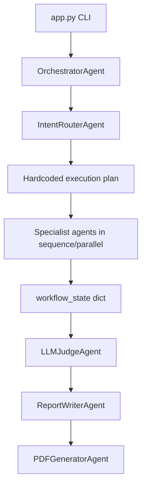
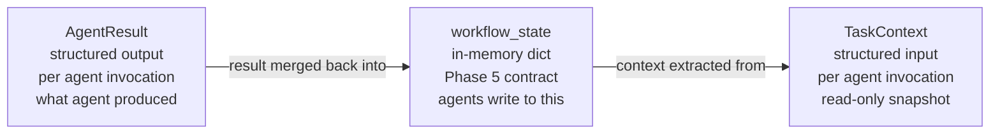
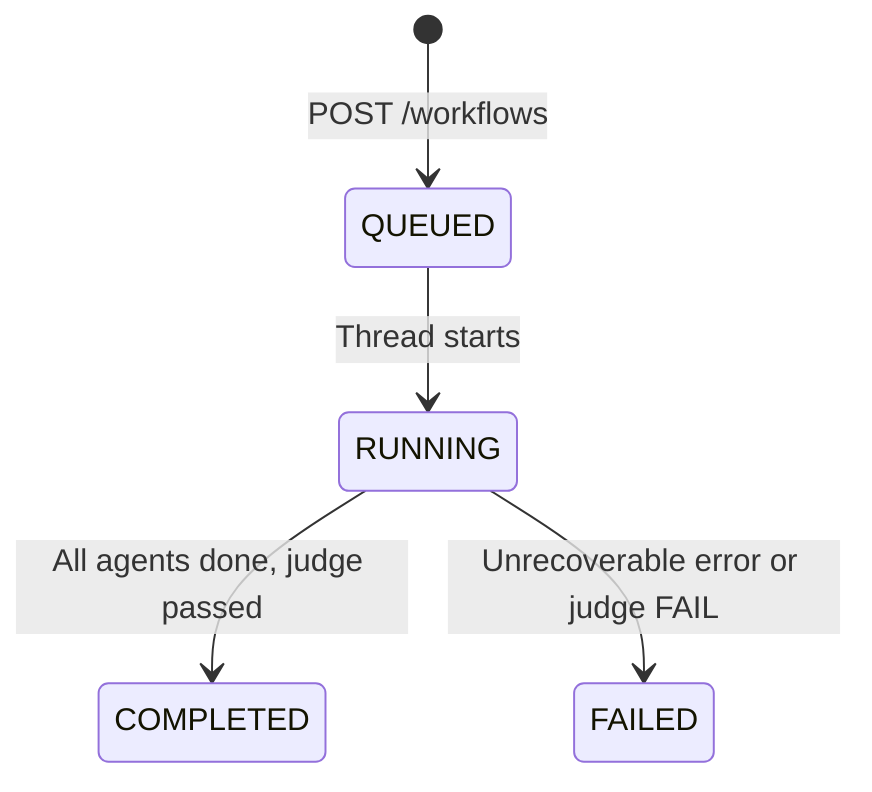
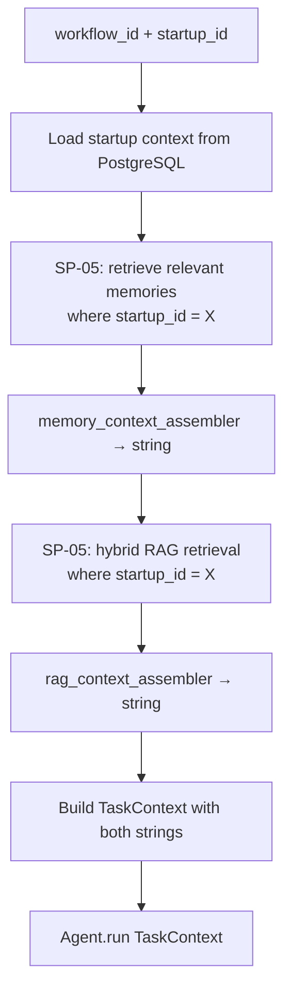
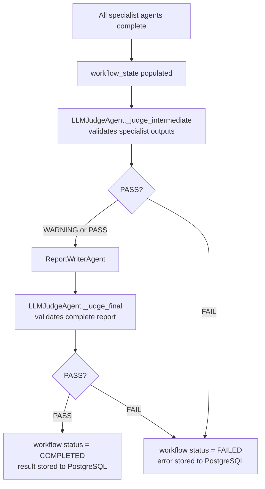

# SP-06 — Orchestration + Agent Wiring
## TaskContext · AgentResult · FastAPI Workflow · Memory Injection · LLM Judge

**Status:** Not started  
**Duration:** 10 hours (Days 12–14)  
**Depends on:** SP-01 through SP-05 (all previous subphases complete)  
**Enables:** Polish + Frontend phase  

---

## START HERE

**Before touching any file, answer these:**
1. What is the difference between `workflow_state` and `TaskContext`?
2. Why does Phase 5 use `ThreadPoolExecutor` and why does this matter in a FastAPI app?
3. What does the LLM Judge validate — inputs or outputs?

If you cannot answer all three, read Sections 2 and 4 first.

**First concept to understand:** The relationship between workflow_state, TaskContext, and AgentResult — Section 4  
**First existing file to inspect:** `src/agents/orchestrator_agent.py` — Phase 5 orchestrator  
**Second file to inspect:** `src/agents/base_agent.py` — Phase 5 base class  
**First file to create:** `src/agents/schemas/task_context.py`  
**First implementation decision:** Resolve the workflow_state ambiguity — Section 4

**⚠️ Critical rule before starting:**  
Run the Phase 5 7/7 intent suite **before making any changes**. Record all pass/fail results. This is your baseline. After every agent modification, re-run. If any test breaks, fix it before continuing. Do not proceed to the next agent until the regression suite is green again.

**Recommended implementation order:**
```
TaskContext + AgentResult schemas → BaseAgent update →
15 adapter wrappers (research agents first) →
OrchestratorAgent modification →
LLMJudgeAgent extension →
Workflow service + API route →
Context builder (memory + RAG injection) →
Integration tests → Phase 5 regression suite
```

---

## CONCEPTS TO UNDERSTAND

🟢 **BASIC — Adapter Pattern**  
You are not rewriting agents. You are wrapping them. Phase 5 internal logic stays exactly as is. The wrapper converts the new interface (TaskContext in, AgentResult out) to/from the old interface. Like a power adapter — same electricity, different plug.

🟡 **INTERMEDIATE — TaskContext vs workflow_state**  
See Section 4. This is the most important conceptual distinction in SP-06.

🟡 **INTERMEDIATE — Abstract Base Class**  
`BaseAgent` becomes an abstract class with an abstract `run()` method. Every agent must implement it. Python raises `TypeError` at import time if an agent class does not implement the required method. This is enforced, not just documented.

🔴 **ADVANCED — Async FastAPI + Threaded Agents**  
See Section 6. Phase 5 uses `ThreadPoolExecutor`. FastAPI uses async. These interact in non-obvious ways.

🟡 **INTERMEDIATE — LLM Judge**  
Phase 5 already has this. SP-06 keeps it exactly as is and calls it in the right place in the new workflow lifecycle.

---

## 1. Phase 5 Architecture — What Exists

Phase 5 is a verified, working multi-agent system. Before changing anything, understand what you have.

**Phase 5 execution flow:**


**What Phase 5 does well:**
- 7/7 intent workflows verified passing
- Shared workflow_state carries all context between agents
- LLM Judge validates output quality
- Provider abstraction (OpenRouter, Gemini, Groq) all working
- Key rotation working

**What Phase 5 lacks:**
- No HTTP API — CLI only
- No persistent memory across sessions
- No user context — single-user
- Input/output contracts are loose dicts, not typed schemas

**SP-06 adds:**
- FastAPI workflow submission endpoint
- Typed TaskContext and AgentResult contracts
- Memory context injected per execution
- RAG context injected per execution
- startup_id scoping for multi-user execution

---

## 2. What Remains Unchanged

🔴 **CRITICAL — Read this before touching any file**

| Component | Status | Reason |
|---|---|---|
| All 17 agents' internal `_` methods | PRESERVE | This is the AI reasoning — do not touch |
| `workflow_state` structure | PRESERVE | Still the inter-agent communication contract |
| Provider tools (Gemini, OpenRouter, Groq, Tavily) | PRESERVE | Working, tested, do not break |
| `key_rotator.py` | PRESERVE (already rewired in SP-04) | Working |
| `prompts.py` | PRESERVE | All prompts stay as is |
| LLM Judge logic | PRESERVE | Keep both `_judge_intermediate` and `_judge_final` |
| Phase 5 7/7 intent suite | MUST PASS AFTER ALL CHANGES | This is your regression gate |

**The rule:** If a Phase 5 test breaks after your SP-06 change, you introduced a regression. Roll back that specific change, diagnose, fix.

---

## 3. Agent Migration Table

| Agent | Existing Responsibility | Phase 6 Change | Input Change | Output Change | Internal Logic |
|---|---|---|---|---|---|
| `IntentRouterAgent` | Classify user intent, select workflow | Add `run(TaskContext)` wrapper | TaskContext.user_goal | AgentResult with intent in output dict | PRESERVE |
| `OrchestratorAgent` | Coordinate agent sequence | MAJOR MODIFY — add `dispatch_task()`, remove hardcoded pipeline | TaskContext per task | AgentResult from dispatched agent | Helpers PRESERVE |
| `WebSearchAgent` | External web research via Tavily | Add `run(TaskContext)` wrapper | TaskContext.task_objective | AgentResult with search results | PRESERVE |
| `MarketResearchAgent` | Market + competitor research | Add `run(TaskContext)` wrapper | TaskContext + startup_context | AgentResult with market findings | PRESERVE |
| `RAGAgent` | Document-grounded retrieval | Add `run(TaskContext)` wrapper + use SP-05 polished RAG | TaskContext.relevant_documents | AgentResult with retrieved evidence | PRESERVE, use new RAG |
| `MVPAdvisorAgent` | MVP scope and prioritization | Add `run(TaskContext)` wrapper | TaskContext + dependency_outputs | AgentResult with MVP recommendations | PRESERVE |
| `TechAdvisorAgent` | Tech stack and architecture advice | Add `run(TaskContext)` wrapper | TaskContext + dependency_outputs | AgentResult with tech recommendations | PRESERVE |
| `RiskAnalystAgent` | Risk identification and analysis | Add `run(TaskContext)` wrapper | TaskContext + dependency_outputs | AgentResult with risk analysis | PRESERVE |
| `StartupScorerAgent` | Startup viability scoring | Add `run(TaskContext)` wrapper — keep existing scoring output | TaskContext with all evidence | AgentResult with existing score format | PRESERVE |
| `RecommendationAgent` | Evidence-based recommendations | Add `run(TaskContext)` wrapper | TaskContext + dependency_outputs | AgentResult with recommendations | PRESERVE |
| `IdeaGenerationAgent` | Startup idea exploration | Add `run(TaskContext)` wrapper | TaskContext.user_goal | AgentResult with ideas | PRESERVE |
| `NurturingAgent` | Startup improvement guidance | Add `run(TaskContext)` wrapper | TaskContext + startup_context | AgentResult with guidance | PRESERVE |
| `AdvancementAgent` | Growth and advancement analysis | Add `run(TaskContext)` wrapper | TaskContext + startup_context | AgentResult with advancement plan | PRESERVE |
| `GeneralChatAgent` | General conversational requests | Add `run(TaskContext)` wrapper | TaskContext.user_goal | AgentResult with response | PRESERVE |
| `LLMJudgeAgent` | Workflow quality validation | MODIFY — called at workflow end in new lifecycle | TaskContext with workflow outputs | AgentResult with PASS/WARNING/FAIL | PRESERVE both judge methods |
| `ReportWriterAgent` | Final report assembly | Add `run(TaskContext)` wrapper | TaskContext with validated outputs | AgentResult with report content | PRESERVE |
| `PDFGeneratorAgent` | PDF artifact generation | Add `run(TaskContext)` wrapper | TaskContext with report content | AgentResult with PDF path | PRESERVE |

**Note on OrchestratorAgent:** This is the only MAJOR MODIFY. All others are thin wrapper additions only.

---

### OrchestratorAgent — What to inspect before modifying

🔴 **CRITICAL — Understand the existing code before touching it**

Before modifying `src/agents/orchestrator_agent.py`, open it and locate:

1. **The hardcoded sequence** — look for a list or sequential calls like:
   ```
   intent_router → market_research → web_search → rag → mvp → tech → risk → scorer → recommendation → judge → writer → pdf
   ```
   This sequence is what gets replaced by `dispatch_task()`. Map it out on paper first.

2. **The parallel execution block** — Phase 5 uses `ThreadPoolExecutor` for some agents. Identify which agents run in parallel vs sequential. Your `dispatch_task()` must preserve this behavior.

3. **Helper methods** — methods like `_build_workflow_state()`, `_handle_provider_error()`, etc. These are PRESERVED. Only the pipeline-sequencing logic changes.

4. **The `run()` or `execute()` entry point** — this is what `WorkflowService` will call via `asyncio.to_thread()`. Identify its exact signature.

**Do this inspection as your very first action in SP-06.** Document what you find before writing a single line of new code.

---

## 4. The Critical Relationship: workflow_state vs TaskContext vs AgentResult

> **DESIGN DECISION REQUIRED — workflow_state persistence**  
> Phase 5's `workflow_state` is an in-memory dict that dies when the process stops. Phase 6 has PostgreSQL. The redesign says "better orchestration" but does not specify whether `workflow_state` should be persisted to PostgreSQL per workflow execution or kept in-memory during a single workflow run.  
>  
> Options:  
> Option A: Keep `workflow_state` in-memory during execution (Phase 5 behavior). Store only the final result to PostgreSQL when done. Simplest.  
> Option B: Persist `workflow_state` to PostgreSQL at each agent completion. Enables recovery if process crashes mid-workflow.  
>  
> **Recommended: Option A** for Phase 6 scope — persisting workflow_state mid-execution adds significant complexity. The workflow result (report) gets stored to PostgreSQL at the end. Decide this before implementing.

### Conceptual separation



**workflow_state:** The shared mutable dict that all agents write to. It accumulates outputs across the entire workflow run. This is Phase 5's existing communication contract. It lives for the duration of one workflow execution.

**TaskContext:** A structured snapshot of what one specific agent needs to do its job. Created by the orchestrator before calling each agent. Read-only from the agent's perspective. Contains: goal, objective, startup context, memory context (from SP-05), RAG context (from SP-05), and outputs from any predecessor agents.

**AgentResult:** What the agent returns after completing its work. Contains: status (SUCCESS/FAILURE/PARTIAL), structured output dict, evidence list, citations list, optional error message.

**The flow per agent:**
```
workflow_state (accumulated so far)
    ↓
Orchestrator builds TaskContext (snapshot for this agent)
    ↓
Agent.run(TaskContext) → AgentResult
    ↓
Orchestrator merges AgentResult back into workflow_state
    ↓
Next agent's TaskContext is built from updated workflow_state
```

**Why this matters:** Agents continue writing to `workflow_state` exactly as in Phase 5. TaskContext and AgentResult are the new interface boundary — the orchestrator converts between them and workflow_state. Agents do not need to understand TaskContext internals beyond accepting it as input.

---

## 5. Contract Schemas

### TaskContext

A Python `dataclass` (not Pydantic — no HTTP boundary, used internally).

| Field | Type | Purpose |
|---|---|---|
| workflow_id | str | Identifies the current workflow run |
| startup_id | str | Which startup this execution is for |
| user_goal | str | The original user request |
| task_objective | str | What this specific agent must accomplish |
| startup_context | dict | Name, stage, description from PostgreSQL |
| relevant_memory | str | Assembled memory string from SP-05 retrieval |
| relevant_documents | str | RAG context from SP-05 hybrid retrieval |
| dependency_outputs | dict | Outputs from predecessor agents (keyed by agent name) |
| execution_metadata | dict | Optional — judge_mode, attempt_number, etc. |

**Key rule:** `relevant_memory` and `relevant_documents` are pre-assembled strings by the time TaskContext is created. Agents consume them as LLM context — they do not call SP-05 retrieval themselves.

### AgentResult

A Python `dataclass`.

| Field | Type | Purpose |
|---|---|---|
| status | str | "success" / "failure" / "partial" |
| output | dict | Agent-specific structured output |
| evidence | list[dict] | Supporting evidence items |
| citations | list[str] | Source references (URLs, filenames) |
| metadata | dict | Optional additional data |
| error | str or None | Set when status == "failure" |

---

## 6. 🔴 ADVANCED — Async FastAPI + Threaded Agents

**The problem:**  
FastAPI is async — it uses an event loop. Phase 5 agents use `ThreadPoolExecutor` for parallel tool execution. These two concurrency models interact.

**What this means:**
- FastAPI routes are `async def` — they run on the event loop
- Phase 5 agent methods may be synchronous (`def`, not `async def`)
- Calling a synchronous blocking function directly from an async route blocks the event loop — no other requests can be served during that time

**The correct pattern:**  
Wrap the entire workflow execution in `asyncio.to_thread()` or `loop.run_in_executor()`. This runs the synchronous orchestrator in a thread pool, freeing the event loop to handle other requests while the workflow runs.

**What you need to understand:**
- `asyncio.to_thread(sync_function, *args)` runs a sync function in a thread without blocking the event loop
- The workflow endpoint returns 202 immediately while the workflow runs in a thread
- Results are stored to PostgreSQL when the workflow completes
- The status endpoint reads from PostgreSQL to report progress

**Common mistake:**  
Making the workflow endpoint `async def` and `await`-ing the synchronous orchestrator directly. This works for one user but freezes FastAPI for all other requests during execution.

**Verification:** Submit two workflows simultaneously. Both should start and eventually complete without one blocking the other.

---

## 7. Workflow API

### Submission

```
POST /api/v1/startups/{startup_id}/workflows
Auth: Bearer token + startup ownership
Body: { "message": "Analyze my startup against competitors." }
Response: 202 Accepted
{
  "workflow_id": "uuid",
  "startup_id": "uuid",
  "status": "QUEUED",
  "created_at": "timestamp"
}
```

**What happens after 202:**
1. WorkflowService creates a workflow record in PostgreSQL (status = QUEUED)
2. Launches `asyncio.to_thread(orchestrator.execute, workflow_id)` — non-blocking
3. Returns 202 immediately

**Execution in thread:**
1. Retrieve startup context from PostgreSQL
2. Retrieve relevant memories from SP-05
3. Retrieve RAG context from SP-05
4. Build initial workflow_state
5. Run Phase 5 orchestrator (IntentRouter → specialists → Judge → Report)
6. Store final report and status to PostgreSQL
7. Update workflow status to COMPLETED or FAILED

### Status + Result

```
GET /api/v1/workflows/{workflow_id}
Auth: Bearer token + ownership
Response 200:
{
  "workflow_id": "uuid",
  "startup_id": "uuid",
  "status": "QUEUED | RUNNING | COMPLETED | FAILED",
  "result": null or { "report": "...", "pdf_path": "..." },
  "error": null or "error message",
  "created_at": "timestamp",
  "updated_at": "timestamp"
}
```

**Workflow status lifecycle:**


> **DESIGN DECISION REQUIRED — Workflows Table**  
> The workflow API requires storing workflow records in PostgreSQL (status, result, error). SP-01 did not create a workflows table — only users, startups, conversations, messages, memories. You need to decide:  
> Option A: Create a `workflows` table via a new Alembic migration (004) in SP-06.  
> Option B: Store workflow results as a special message type in the conversations table — simpler but hacky.  
>  
> **Recommended: Option A.** Workflows are a distinct concept. Create migration 004 with columns: workflow_id (UUID PK), startup_id (FK), status (VARCHAR), request (TEXT), result (TEXT nullable), error (TEXT nullable), created_at, updated_at. CASCADE from startup.  
> Make this decision before starting SP-06 implementation.

---

## 8. Memory + RAG Injection

The orchestrator builds TaskContext before calling each agent. Context building:



**What gets injected into TaskContext:**
- `relevant_memory`: assembled memory string from SP-05 memory retrieval (top 5 memories by relevance to the current task objective)
- `relevant_documents`: assembled RAG context from SP-05 hybrid retrieval (top 3 chunks by relevance to the current task objective)

**The query used for both retrieval calls:** `task_context.task_objective` — the specific thing this agent is trying to accomplish, not the entire user goal.

**Why per-task, not per-workflow:** Different agents have different objectives. MarketResearchAgent's objective ("research competitor landscape") retrieves different memories than RiskAnalystAgent's objective ("identify key risks"). Each agent gets context most relevant to its specific task.

---

## 9. LLM Judge Integration

Phase 5 already has `_judge_intermediate()` and `_judge_final()`. Both are preserved exactly.

**Where judge runs in Phase 6 workflow:**


**What changes in SP-06:** The judge results now determine workflow status stored in PostgreSQL. Phase 5 recorded them in workflow_state but nothing persisted. Now a FAIL means the workflow record gets `status = FAILED` and the error reason stored.

---

## 10. Error Propagation

Phase 5's `@handle_errors` decorator captures agent failures into `workflow_state["errors"]`. This behavior is preserved.

**What SP-06 adds:**
- If `workflow_state["errors"]` is non-empty when execution ends, log them but do not automatically fail the workflow — partial results may still be useful
- If the LLM Judge returns FAIL, set workflow status to FAILED
- If the orchestrator itself raises an unhandled exception, catch it at the workflow service level, set status to FAILED, store the error message to PostgreSQL

**Rule:** Agent failure must never crash the FastAPI process. All exceptions from workflow execution are caught at the workflow service boundary.

---

## 11. File Map

| Order | File | Status | Action | Responsibility | Depends On |
|---|---|---|---|---|---|
| 1 | `alembic/versions/004_workflows.py` | NEW | Generate | Workflows table | migrations 001–003 |
| 2 | `src/repositories/models/workflow.py` | NEW | Create | Workflow SQLAlchemy model | base.py |
| 3 | `src/repositories/workflow_repository.py` | NEW | Create | Workflow CRUD + status updates | model, session |
| 4 | `src/agents/schemas/task_context.py` | NEW | Create | TaskContext dataclass | Nothing |
| 5 | `src/agents/schemas/agent_result.py` | NEW | Create | AgentResult dataclass | Nothing |
| 6 | `src/agents/base_agent.py` | MODIFY | Add abstract run() | Abstract interface | task_context, agent_result |
| 7 | `src/agents/intent_router_agent.py` | MODIFY | Add run() wrapper | Thin adapter only | base_agent |
| 8 | `src/agents/orchestrator_agent.py` | MAJOR MODIFY | Add dispatch_task(), remove hardcoded sequence | Dispatch + coordination | all agents |
| 9 | `src/agents/web_search_agent.py` | MODIFY | Add run() wrapper | Thin adapter only | base_agent |
| 10 | `src/agents/market_research_agent.py` | MODIFY | Add run() wrapper | Thin adapter only | base_agent |
| 11 | `src/agents/rag_agent.py` | MODIFY | Add run() wrapper + use SP-05 RAG | Thin adapter only | base_agent, SP-05 RAG |
| 12 | `src/agents/mvp_advisor_agent.py` | MODIFY | Add run() wrapper | Thin adapter only | base_agent |
| 13 | `src/agents/tech_advisor_agent.py` | MODIFY | Add run() wrapper | Thin adapter only | base_agent |
| 14 | `src/agents/risk_analyst_agent.py` | MODIFY | Add run() wrapper | Thin adapter only | base_agent |
| 15 | `src/agents/startup_scorer_agent.py` | MODIFY | Add run() wrapper | Preserve existing scoring | base_agent |
| 16 | `src/agents/recommendation_agent.py` | MODIFY | Add run() wrapper | Thin adapter only | base_agent |
| 17 | `src/agents/idea_generation_agent.py` | MODIFY | Add run() wrapper | Thin adapter only | base_agent |
| 18 | `src/agents/nurturing_agent.py` | MODIFY | Add run() wrapper | Thin adapter only | base_agent |
| 19 | `src/agents/advancement_agent.py` | MODIFY | Add run() wrapper | Thin adapter only | base_agent |
| 20 | `src/agents/general_chat_agent.py` | MODIFY | Add run() wrapper | Thin adapter only | base_agent |
| 21 | `src/agents/llm_judge_agent.py` | MODIFY | Wire into workflow lifecycle | Keep existing judge logic | base_agent |
| 22 | `src/agents/report_writer_agent.py` | MODIFY | Add run() wrapper | Thin adapter only | base_agent |
| 23 | `src/agents/pdf_generator_agent.py` | MODIFY | Add run() wrapper | Thin adapter only | base_agent |
| 24 | `src/services/workflow_service.py` | NEW | Create | Workflow lifecycle management | orchestrator, repos, SP-05 |
| 25 | `src/orchestrator/context_builder.py` | NEW | Create | Build TaskContext with memory + RAG | SP-05 retrieval |
| 26 | `src/api/schemas/workflow.py` | NEW | Create | WorkflowCreate, WorkflowResponse | Nothing |
| 27 | `src/api/routers/workflows.py` | NEW | Create | POST + GET routes | workflow_service, schemas |
| 28 | `src/app.py` | MODIFY | Register workflow router | Include workflow routes | workflow router |
| 29 | `ARCHITECTURE_DECISIONS.md` | MODIFY | Record design decisions | Document workflow_state decision | Nothing |
| 30 | `tests/unit/test_agent_contracts.py` | NEW | Create | 17 adapter tests | all modified agents |
| 31 | `tests/integration/test_workflow.py` | NEW | Create | Workflow API + end-to-end | app, workflow service |

---

## 12. Testing

### Agent contract tests (17 tests)

For each agent: construct a mock `TaskContext` → call `agent.run(context)` → verify `AgentResult` returned with `status="success"`.

| Test | Agent | Mock input | Expected output |
|---|---|---|---|
| IntentRouter contract | IntentRouterAgent | TaskContext with user_goal | AgentResult, output contains intent key |
| WebSearch contract | WebSearchAgent | TaskContext with task_objective | AgentResult, output contains search_results key |
| MarketResearch contract | MarketResearchAgent | TaskContext with startup_context | AgentResult, status = success |
| RAGAgent contract | RAGAgent | TaskContext with relevant_documents | AgentResult, status = success |
| MVPAdvisor contract | MVPAdvisorAgent | TaskContext with dependency_outputs | AgentResult, status = success |
| TechAdvisor contract | TechAdvisorAgent | TaskContext with dependency_outputs | AgentResult, status = success |
| RiskAnalyst contract | RiskAnalystAgent | TaskContext with dependency_outputs | AgentResult, status = success |
| StartupScorer contract | StartupScorerAgent | TaskContext with all outputs | AgentResult, output contains score |
| Recommendation contract | RecommendationAgent | TaskContext with all outputs | AgentResult, status = success |
| IdeaGeneration contract | IdeaGenerationAgent | TaskContext with user_goal | AgentResult, status = success |
| Nurturing contract | NurturingAgent | TaskContext with startup_context | AgentResult, status = success |
| Advancement contract | AdvancementAgent | TaskContext with startup_context | AgentResult, status = success |
| GeneralChat contract | GeneralChatAgent | TaskContext with user_goal | AgentResult, status = success |
| LLMJudge contract | LLMJudgeAgent | TaskContext with workflow outputs | AgentResult, output contains judgment key |
| ReportWriter contract | ReportWriterAgent | TaskContext with validated outputs | AgentResult, output contains report key |
| PDFGenerator contract | PDFGeneratorAgent | TaskContext with report content | AgentResult, status = success |
| OrchestratorAgent dispatch | OrchestratorAgent.dispatch_task | task_spec + mock_context | Calls correct agent, returns AgentResult |

### Phase 5 regression suite

Run `python app.py --test <intent>` for all 7 intents after every agent modification:

| Test | Command | Expected |
|---|---|---|
| general_chat | `--test general_chat` | ✅ PASS, Errors: 0 |
| full_analysis | `--test full_analysis` | ✅ PASS, Errors: 0 |
| partial_idea | `--test partial_idea` | ✅ PASS, Errors: 0 |
| idea_exploration | `--test idea_exploration` | ✅ PASS, Errors: 0 |
| nurturing | `--test nurturing` | ✅ PASS, Errors: 0 |
| advancement | `--test advancement` | ✅ PASS, Errors: 0 |
| pdf_request | `--test pdf_request` | ✅ PASS, Errors: 0 |

**If any test breaks after a modification:** Stop. Roll back the specific change. Diagnose. Fix. Do not continue to next agent.

### Integration tests

| Test | Action | Expected result |
|---|---|---|
| Memory injection | Submit workflow for startup with 3 stored memories | TaskContext.relevant_memory contains memory content |
| RAG injection | Submit workflow for startup with processed document | TaskContext.relevant_documents contains chunk content |
| RAG isolation | Submit workflow for startup with no documents | TaskContext.relevant_documents is empty string |
| Workflow submission | POST valid workflow | 202, workflow_id returned, status = QUEUED |
| Workflow status — queued | GET workflow immediately after POST | status = QUEUED or RUNNING |
| Workflow status — completed | GET workflow after completion | status = COMPLETED, result present |
| Workflow status — wrong user | GET another user's workflow | 404 |
| LLM Judge pass | Submit simple chat workflow | status = COMPLETED |
| LLM Judge fail | Force judge to FAIL via mock | status = FAILED, error stored |
| Agent failure isolation | Force one specialist to raise exception | Workflow continues, error in workflow_state["errors"] |
| Concurrent workflows | Submit 2 simultaneous workflows | Both complete independently, no cross-contamination |
| End-to-end | Register → create startup → upload PDF → wait READY → submit workflow → poll until COMPLETED | Final result contains report referencing document content |

---

## NOT IN THIS SUBPHASE

- Autonomous planning or goal decomposition — not in scope
- DAG validation or cycle detection — not in scope
- Replanning or change evaluation — not in scope
- New agent reasoning logic — not in scope
- Rewriting any Phase 5 agent's `_` methods — explicitly forbidden
- Streaming workflow events — not in scope
- WebSocket — not in scope

---

## DO NOT CHANGE (internal agent logic)

```
Every agent's _existing_ methods starting with _ → untouched
src/tools/                → all provider tools (key_rotator already done in SP-04)
src/prompts/prompts.py    → all existing Phase 5 prompts
src/core/decorators.py    → Phase 5 error handling decorators
workflow_state structure  → existing keys preserved, new keys may be added
```

---

### When to delete src/config/settings.py

Phase 5's `src/config/settings.py` has been kept alive through SP-01 to SP-05 because agents import from it. SP-06 is when all agents get their adapter wrappers.

**Deletion sequence:**
1. All 17 agent wrappers complete
2. Run Phase 5 7/7 regression suite — all PASS
3. Check no remaining import of `src/config/settings.py` anywhere in the codebase (`grep -r "from src.config.settings" .`)
4. If zero imports found → delete `src/config/settings.py`
5. Re-run Phase 5 7/7 regression suite — must still pass
6. If any import found → that file still needs updating before deletion

**Do not delete it before step 3.** Deleting too early causes `ImportError` in agents that still reference the old path.

---

## SUBPHASE VALIDATION GATE

**Required design decisions resolved:**
- [ ] workflow_state persistence strategy decided (Option A recommended)
- [ ] Workflows table migration decided and created

**Required files completed:**
- [ ] `task_context.py` and `agent_result.py` schemas
- [ ] `base_agent.py` updated with abstract `run()` method
- [ ] All 17 agents have `run(TaskContext) → AgentResult` wrapper
- [ ] `OrchestratorAgent.dispatch_task()` implemented, hardcoded sequence removed
- [ ] `context_builder.py` builds TaskContext with memory + RAG injection
- [ ] `workflow_service.py` manages lifecycle
- [ ] Workflow API routes (POST + GET) registered

**Required behavior:**
- [ ] Phase 5 7/7 intent suite still passes after all agent modifications
- [ ] POST /workflows → 202 with workflow_id
- [ ] GET /workflows/{id} → returns current status
- [ ] TaskContext.relevant_memory contains startup's memory context
- [ ] TaskContext.relevant_documents contains startup-scoped RAG context
- [ ] LLM Judge result determines final workflow status in PostgreSQL
- [ ] Agent failure stored in workflow_state["errors"] but does not crash the process

**Required tests passing:**
- [ ] All 17 agent contract tests pass
- [ ] Phase 5 7/7 regression suite: all PASS, all Errors: 0
- [ ] All integration tests from Section 12 pass
- [ ] SP-01 through SP-05 tests still green

**Failure conditions:**
- Any Phase 5 regression test fails → stop, diagnose, fix before declaring SP-06 complete
- Workflow endpoint blocks FastAPI event loop → fix asyncio.to_thread wrapping
- TaskContext or AgentResult breaks any existing agent import → fix adapter pattern
- Cross-user workflow access not returning 404 → fix authorization

**Freeze criteria:**  
All checkboxes checked. Phase 5 7/7 suite green. All integration tests green.  
PASS → freeze SP-06 → move to Polish + Frontend phase.
