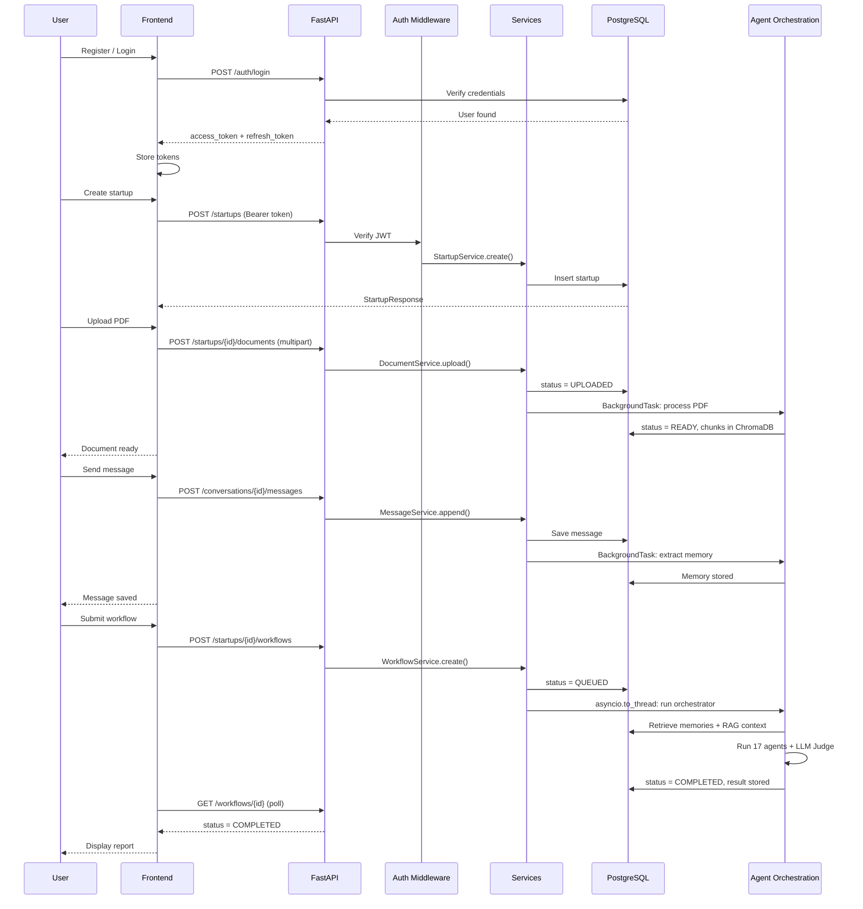

# 07 — Frontend + Final Polish
## Integration · Documentation · Portfolio Readiness · Phase 6 Freeze

**Status:** Not started  
**Duration:** 5 hours (Day 15)  
**Depends on:** SP-01 through SP-06 (all complete and validated)  
**Enables:** v6.0.0 release tag  

---

## START HERE

**This is not a new subphase. This is final integration.**

Before touching anything on Day 15, run this sequence:

```
1. Run full test suite: pytest tests/ -v — must be 100% green
2. Run Phase 5 7/7 regression: all PASS, all Errors: 0
3. Check all 6 subphase validation gates are checked off
4. Only then: start frontend + documentation
```

If any test is failing, Day 15 is a fix day, not a frontend day.

**First action:** Full test suite run — record results  
**Second action:** README update (while tests run)  
**Third action:** Frontend scaffold with AI-generated UI  
**Fourth action:** Connect frontend to FastAPI endpoints  
**Fifth action:** Final checklist verification → git tag  

**What successful completion looks like:**  
A recruiter can clone the repo, follow README setup, start the server, open the frontend, register, create a startup, upload a PDF, send a message, submit a workflow, and see a report — all without reading the code.

---

### Development ports and CORS

**FastAPI runs on:** `http://localhost:8000` (uvicorn default)  
**Frontend runs on:** `http://localhost:3000` (most JS frameworks default)

Your `settings.cors_origins` must include `http://localhost:3000` for the frontend to communicate with the API. Verify this in your `.env`:
```
CORS_ORIGINS=["http://localhost:3000"]
```

FastAPI auto-docs available at `http://localhost:8000/docs` — useful for testing endpoints before connecting the frontend.

---

### Frontend repository location

**Where to put frontend code:**
```
cofoundr-ai/
├── src/           ← backend Python code
├── frontend/      ← frontend code lives here
│   ├── index.html
│   ├── src/
│   └── package.json (if JS framework)
├── tests/
├── alembic/
└── README.md
```

Keep frontend in a `frontend/` subdirectory of the same repo. This keeps it as one portfolio project, not two.

**`.gitignore` additions required:**
```
frontend/node_modules/
frontend/dist/
frontend/.env
frontend/build/
```

Add these before running `npm install` — `node_modules` must never be committed.

---

## CONCEPTS TO UNDERSTAND

🟢 **BASIC — Frontend Responsibility**  
The frontend exists to demonstrate the backend and AI system. It is not the portfolio piece. The AI orchestration is. Build just enough UI to show the system working.

🟡 **INTERMEDIATE — CORS in practice**  
You configured CORS in SP-03. Now you verify it works. The frontend origin must be in `settings.cors_origins`. If the frontend runs on port 3000 and your CORS config allows `http://localhost:3000`, it works. If not, you'll see CORS errors in the browser console.

🟢 **BASIC — Token storage**  
The access token and refresh token returned from login must be stored in the frontend. Options: `localStorage` or JavaScript variables. For demo purposes, `localStorage` is fine — note the security tradeoff in your README.

---

## 1. Frontend Responsibility

**What the frontend must do:**
- Allow user to register and log in
- Store tokens and send `Authorization: Bearer <token>` on every request
- Create and list startups
- Create and list conversations
- Send messages and display conversation history
- Upload PDF documents
- Submit workflows and poll for completion
- Display the completed report

**What the frontend does NOT need:**
- Complex state management (Redux etc.)
- Mobile responsiveness beyond basic usability
- Real-time updates (polling is sufficient)
- Any frontend-only business logic
- Custom styling beyond readable UI

**Recommended approach:** Use Antigravity or a similar AI-generated UI tool. Generate the UI from the API contracts documented in SP-03 through SP-06. Connect it manually to your FastAPI endpoints.

**Technology constraint:** Whatever framework the AI-generated UI produces is acceptable. It must be able to make HTTP requests with custom headers (`Authorization: Bearer`).

---

## 2. Backend-to-Frontend Flow



---

## 3. Frontend Implementation Pages

### Page 1 — Auth (Register / Login)

**Fields:** email, password  
**On login success:** store `access_token` and `refresh_token`, redirect to dashboard  
**On 401:** show "Invalid credentials"  
**On 409 (register):** show "Email already registered"  
**Token refresh:** when any request returns 401, attempt `POST /auth/refresh` with stored refresh_token, retry original request with new access_token

---

### Page 2 — Dashboard (Startup List)

**Shows:** list of user's startups, create new startup button  
**Create startup form:** name (required), description (optional), stage dropdown  
**On create:** optimistically add to list or refetch  
**Delete:** confirmation dialog → DELETE request → remove from list

---

### Page 3 — Startup Detail

**Tabs or sections:**
- Conversations
- Documents
- Workflows

**Documents section:**
- File picker accepting PDF/TXT/MD
- Upload button → POST multipart
- Show document status (UPLOADED / PROCESSING / READY / FAILED)
- Poll document status every 3 seconds until READY or FAILED

---

### Page 4 — Conversation

**Shows:** message history in chronological order  
**Input:** text area + send button  
**On send:** POST message → append to local list → clear input  
**Roles:** USER messages right-aligned (or labeled), ASSISTANT messages left-aligned  
**Workflow submit button:** triggers POST workflow for this startup

---

### Page 5 — Workflow Result

**Shows:** workflow status (QUEUED / RUNNING / COMPLETED / FAILED)  
**Polling:** GET /workflows/{id} every 3 seconds until terminal status  
**On COMPLETED:** render the report text  
**On FAILED:** show error message  
**Loading state:** spinner or progress indicator during RUNNING

---

## 4. API Integration Map

| Frontend action | API call | Auth required | Notes |
|---|---|---|---|
| Register | POST /auth/register | No | |
| Login | POST /auth/login | No | Store tokens |
| Refresh token | POST /auth/refresh | No | Use refresh_token |
| Logout | POST /auth/logout | Yes | Clear stored tokens |
| List startups | GET /startups | Yes | Paginated |
| Create startup | POST /startups | Yes | |
| Get startup | GET /startups/{id} | Yes | |
| Update startup | PATCH /startups/{id} | Yes | |
| Delete startup | DELETE /startups/{id} | Yes | |
| List conversations | GET /startups/{id}/conversations | Yes | |
| Create conversation | POST /startups/{id}/conversations | Yes | |
| List messages | GET /startups/{id}/conversations/{id}/messages | Yes | ASC order |
| Send message | POST /startups/{id}/conversations/{id}/messages | Yes | |
| List documents | GET /startups/{id}/documents | Yes | |
| Upload document | POST /startups/{id}/documents | Yes | multipart/form-data |
| Get document | GET /startups/{id}/documents/{id} | Yes | For status polling |
| Delete document | DELETE /startups/{id}/documents/{id} | Yes | |
| Submit workflow | POST /startups/{id}/workflows | Yes | Returns 202 |
| Get workflow | GET /workflows/{id} | Yes | For status polling |

---

## 5. Error Handling in Frontend

All API errors return the standard envelope:
```
{ "error": { "code": "...", "message": "...", "request_id": "..." } }
```

**Frontend must:**
- Read `error.message` and display it to the user
- Never show raw HTTP status codes to users
- On 401 with code `TOKEN_EXPIRED`: attempt refresh, retry once
- On 401 after refresh fails: redirect to login
- On 404: show "Not found" or redirect to dashboard
- On 422: show field validation errors if available
- On 500: show "Something went wrong. Please try again."

---

## 6. Integration Verification

Run these manually after frontend is connected. Not automated tests — visual verification.

| Scenario | Steps | Expected result |
|---|---|---|
| Register flow | Open frontend, register new user | Account created, redirected to dashboard |
| Login flow | Login with valid credentials | Tokens stored, dashboard visible |
| Invalid login | Login with wrong password | Error message shown, no redirect |
| Token persistence | Login, close tab, reopen | Still logged in (tokens in localStorage) |
| Token expiry | Wait 15 min, perform action | Auto-refresh triggers, action succeeds |
| Create startup | Fill form, submit | Startup appears in list |
| Upload PDF | Select valid PDF, upload | Status shows UPLOADED then READY |
| Upload invalid file | Upload .exe file | Error message about file type |
| Send message | Type and send | Message appears in conversation |
| Submit workflow | Click submit, wait | Status updates QUEUED → RUNNING → COMPLETED |
| View report | After COMPLETED | Report text rendered on page |
| CORS | Frontend on :3000, API on :8000 | No CORS errors in browser console |
| RAG isolation | Upload PDF for startup A, submit workflow for startup B | Startup B report does not reference startup A's document |
| Memory persistence | Send message, restart server, submit workflow | Workflow has context from previous message |
| Auth on API | Call /startups without token (Postman) | 401 AUTHENTICATION_REQUIRED |
| Full end-to-end | Register → startup → PDF → conversation → workflow | Completed report references uploaded document |

---

## 7. Documentation Updates

### README — Required sections

| Section | Content |
|---|---|
| What it is | One paragraph — CoFoundr AI purpose and the "built from first principles" story |
| Phase history | Table: Phase 1–6 with one-line description each |
| Architecture | Updated diagram showing FastAPI + DB + memory + agents |
| Tech stack | Complete table: FastAPI, PostgreSQL, Alembic, ChromaDB, Gemini, OpenRouter, Groq, Tavily, BM25, CrossEncoder |
| Setup | Step-by-step: clone → install Python deps → install system deps (libmagic) → copy `.env.example` to `.env` → fill required variables → `createdb cofoundr_dev` → `alembic upgrade head` → `uvicorn src.app:app --reload` → open `http://localhost:8000/docs` |
| API overview | Link to /docs (FastAPI auto-docs) |
| Phase 6 capabilities | What Phase 6 added beyond Phase 5 |
| Known limitations | Document: scanned PDFs not supported, documents stuck in PROCESSING after restart, no real-time streaming |
| License | MIT |

### CHANGELOG — Required entry

```
## [v6.0.0] — YYYY-MM-DD — Phase 6 Complete

### Added
- FastAPI REST API layer
- PostgreSQL persistence (5 tables + refresh_tokens + workflows + documents)
- Alembic migrations
- JWT authentication + refresh tokens
- CRUD APIs: startups, conversations, messages, memories, documents
- Automatic LLM memory extraction per user message
- Persistent memory retrieval via ChromaDB + startup_id isolation
- RAG pipeline polished: sentence-aware chunking, hybrid BM25+vector retrieval, CrossEncoder reranking
- startup_id isolation across all ChromaDB operations
- PDF processing pipeline (UPLOADED → PROCESSING → READY)
- TaskContext + AgentResult structured contracts on all 17 agents
- Workflow submission API (POST + status polling)
- Memory + RAG context injection into every agent execution
- LLM Judge wired into workflow lifecycle
- Basic frontend connecting all Phase 6 capabilities

### Changed
- API key rotation rewired to centralised config
- OrchestratorAgent refactored: dispatch_task() added, hardcoded sequence removed
- All 17 Phase 5 agents wrapped with Phase 6 interface (internal logic preserved)
- ChromaDB collection reset with startup_id isolation metadata

### Preserved
- Phase 5 7/7 intent suite: all PASS, all Errors: 0
- All 17 agent reasoning logic untouched
```

### LEARNING_LOG — Required entries

Add entries covering:
- Alembic migration workflow learned
- AsyncSession per-request lifecycle
- JWT + refresh token pattern
- Pydantic-settings pattern
- startup_id isolation design decision and why
- asyncio.to_thread for Phase 5 agents in FastAPI
- BackgroundTask for memory extraction and document processing
- Lesson from any bugs encountered during SP-01 through SP-06

### ARCHITECTURE_DECISIONS.md — Required entries

Document every design decision marked in SP-01 through SP-06 documents with final resolution. Minimum entries:
- Documents table added in SP-04 (not SP-01)
- Workflows table added in SP-06
- workflow_state kept in-memory during execution (Option A)
- Memory extraction via FastAPI BackgroundTask
- Document processing via FastAPI BackgroundTask
- ChromaDB separate collections for memories vs document chunks (whichever you chose)
- BM25 isolation strategy chosen

---

## 8. Final Phase 6 Acceptance Checklist

### Database
- [ ] 5 core tables created and migrated (users, startups, conversations, messages, memories)
- [ ] refresh_tokens table migrated
- [ ] documents table migrated
- [ ] workflows table migrated
- [ ] All migrations have working downgrade()
- [ ] CASCADE DELETE verified end-to-end
- [ ] Message sequence numbers unique under concurrent inserts

### Infrastructure
- [ ] Centralised config via pydantic-settings
- [ ] No os.getenv() outside config.py
- [ ] ChromaDB persistent client operational
- [ ] startup_id isolation enforced on all ChromaDB writes and queries
- [ ] Local file storage with server-controlled paths
- [ ] Path traversal protection verified
- [ ] Gemini embedding client wired under new config

### Authentication
- [ ] Register → 201 with user created
- [ ] Duplicate email → 409
- [ ] Login → access + refresh tokens
- [ ] Wrong credentials → 401 (same message for wrong email and wrong password)
- [ ] Refresh token stored as SHA-256 hash only
- [ ] Expired access token → 401 TOKEN_EXPIRED
- [ ] Refresh flow → new access token
- [ ] Logout → refresh token revoked
- [ ] Stack traces never in error responses

### APIs
- [ ] Startup CRUD fully operational
- [ ] Conversation CRUD fully operational
- [ ] Messages append-only, sequence numbered, paginated ASC
- [ ] Memory list + delete operational
- [ ] Document upload with MIME validation
- [ ] Document processing pipeline (UPLOADED → READY)
- [ ] Pagination on all list endpoints
- [ ] Standard error envelope on all errors
- [ ] Request ID propagated through all responses

### Authorization
- [ ] Cross-user startup access returns 404
- [ ] Cross-user workflow access returns 404
- [ ] All resource routes require valid Bearer token
- [ ] Ownership verified via DB lookup, not URL alone

### Memory System
- [ ] Substantive message → memory extracted automatically
- [ ] Greeting message → no extraction triggered
- [ ] Memory stored in PostgreSQL with startup_id
- [ ] Memory embedded and stored in ChromaDB with startup_id
- [ ] Memory retrieval returns startup-scoped results only
- [ ] Memory context injected into TaskContext before every agent call

### RAG Pipeline
- [ ] PDF upload → processing → READY status
- [ ] Sentence-aware chunking with overlap
- [ ] Chunks embedded with retrieval_document task type
- [ ] ChromaDB chunks have startup_id in metadata
- [ ] Vector retrieval filtered by startup_id
- [ ] BM25 retrieval isolated by startup
- [ ] Hybrid fusion (RRF) combining both
- [ ] CrossEncoder reranks to top 3
- [ ] RAG context injected into TaskContext
- [ ] Cross-startup RAG isolation verified

### Agent Orchestration
- [ ] All 17 agents have run(TaskContext) → AgentResult wrapper
- [ ] Phase 5 internal agent logic untouched
- [ ] Phase 5 7/7 regression suite: all PASS, all Errors: 0
- [ ] OrchestratorAgent.dispatch_task() operational
- [ ] Hardcoded Phase 5 pipeline sequence removed from OrchestratorAgent
- [ ] TaskContext built with memory + RAG context per execution
- [ ] AgentResult merged back into workflow_state correctly
- [ ] Workflow executes in asyncio.to_thread (non-blocking)

### LLM Judge
- [ ] LLM Judge called after specialist agents complete
- [ ] PASS → workflow continues to report writing
- [ ] FAIL → workflow status set to FAILED in PostgreSQL
- [ ] Final judge validates completed report

### Workflow API
- [ ] POST /workflows → 202
- [ ] Workflow status stored and queryable
- [ ] COMPLETED status has result
- [ ] FAILED status has error message

### Frontend
- [ ] Register and login functional
- [ ] Token stored and sent on every request
- [ ] Token refresh working
- [ ] Startup creation and listing
- [ ] Conversation and message flow
- [ ] PDF upload with status display
- [ ] Workflow submission and status polling
- [ ] Report displayed on completion
- [ ] Error messages shown to user

### Testing
- [ ] All integration tests green (SP-01 through SP-06)
- [ ] All 17 agent contract tests pass
- [ ] Phase 5 7/7 regression suite green
- [ ] Full end-to-end manual verification completed
- [ ] Cross-startup isolation verified for both memory and RAG

### Security
- [ ] Passwords stored as Argon2id hashes only
- [ ] Refresh tokens stored as SHA-256 hashes only
- [ ] JWT secret never logged
- [ ] Stack traces never in API responses
- [ ] File uploads use server-controlled paths
- [ ] CORS configured with allowlist (not wildcard)

### Documentation
- [ ] README updated with Phase 6 setup instructions
- [ ] CHANGELOG entry for v6.0.0 complete
- [ ] LEARNING_LOG updated with Phase 6 lessons
- [ ] ARCHITECTURE_DECISIONS.md has all design decisions documented
- [ ] Known limitations documented in README
- [ ] .env.example committed with all required variables

### Git / Release
- [ ] All changes committed with conventional commit messages
- [ ] No API keys or .env files committed
- [ ] All tests passing on current branch
- [ ] `git tag v6.0.0` created
- [ ] Tag pushed to GitHub

---

## 9. Portfolio Readiness

### Actually Implemented

These are things you built and can demonstrate running:

- Multi-agent orchestration from first principles — 17 agents, no LangChain
- Intent routing — system classifies request and selects correct workflow
- Hybrid RAG — BM25 + vector search + CrossEncoder reranking
- Persistent memory — LLM extracts and stores facts across sessions
- Multi-user isolation — startup_id scoping in ChromaDB
- FastAPI REST API with full authentication
- JWT + refresh token auth with hash-based token storage
- Async document processing pipeline with status tracking
- Provider abstraction — OpenRouter, Gemini, Groq, Tavily behind tool layer
- PostgreSQL persistence with Alembic migrations
- Structured agent contracts (TaskContext, AgentResult)

### Demonstrated (visible in code, not always in UI)

- Separation of responsibility: one agent, one responsibility
- State as contract: workflow_state as the inter-agent communication boundary
- Provider isolation: SDK details never in agent code
- Error propagation: failed agents visible in workflow_state, not silently dropped
- Evaluation-driven development: Phase 5 7/7 regression suite preserved through Phase 6

### Deferred (not built, documented honestly)

| Feature | Why Deferred |
|---|---|
| Real-time streaming (WebSocket) | Not needed for portfolio demo |
| Circuit breakers + retry storms | Production concern |
| Crash recovery for stuck workflows | Task queue required |
| Autonomous planning / DAG | SaaS-level complexity, not the story |
| Redis caching | Backend plumbing, low AI signal |
| OpenTelemetry / Prometheus | Deployment concern |
| OCR for scanned PDFs | Out of scope |
| Multi-region / distributed | Out of scope |

**Note for README:** Be honest about deferred features. Listing them as "future work" is more credible than pretending they exist.

---

## 10. Final Freeze Criteria

### PHASE 6 IS COMPLETE when ALL of the following are true:

```text
[ ] Final acceptance checklist (Section 8): every box checked
[ ] pytest tests/ -v: zero failures
[ ] Phase 5 7/7 regression: all PASS, all Errors: 0
[ ] Full end-to-end manual flow works:
    Register → create startup → upload PDF → wait READY →
    create conversation → send message → submit workflow →
    poll until COMPLETED → view report
[ ] README setup instructions work on a clean clone
[ ] CHANGELOG, LEARNING_LOG, ARCHITECTURE_DECISIONS.md updated
[ ] git tag v6.0.0 created and pushed
[ ] No API keys committed to repo
```

### PHASE 6 IS NOT COMPLETE if:

- Any integration test is failing
- Phase 5 regression has any FAIL or nonzero Errors
- The end-to-end manual flow breaks at any step
- README setup fails on a clean environment
- Any API key is committed to the repository

---

## One Final Reminder

The portfolio signal of this project is:

> "Built AI orchestration, multi-agent pipelines, RAG, and persistent memory from first principles — without LangChain or any agent framework. Understands what happens inside frameworks because built those primitives himself."

Every feature you shipped serves this sentence. Everything you deferred is honest and documented.

**v6.0.0 tag = Phase 6 complete.**
